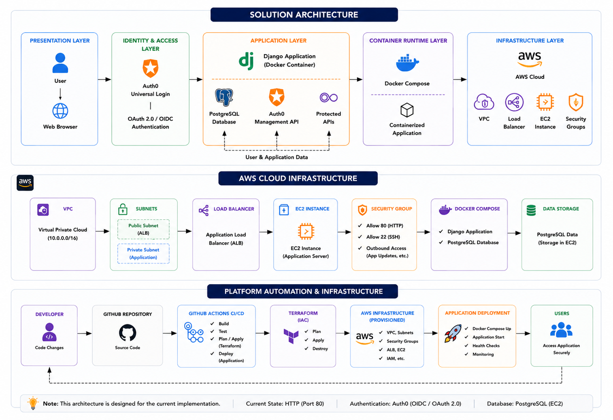
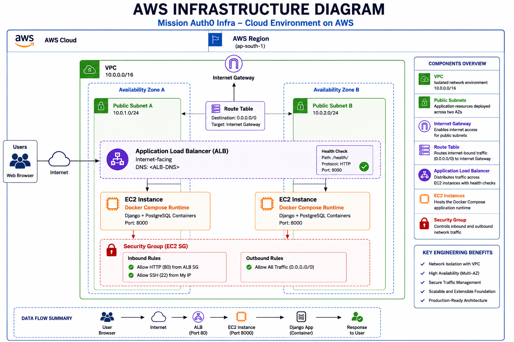
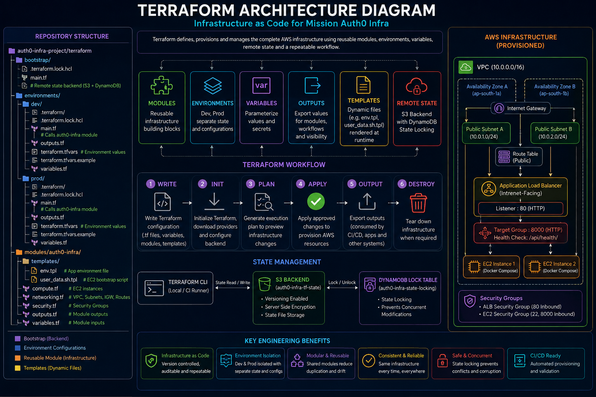
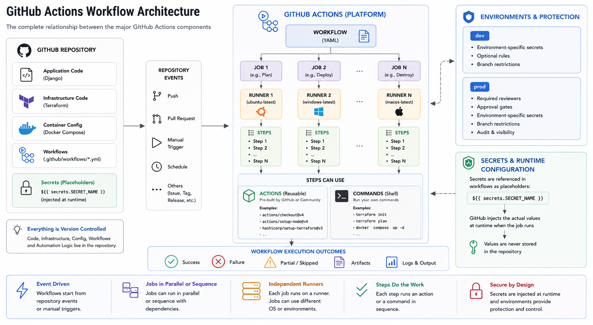
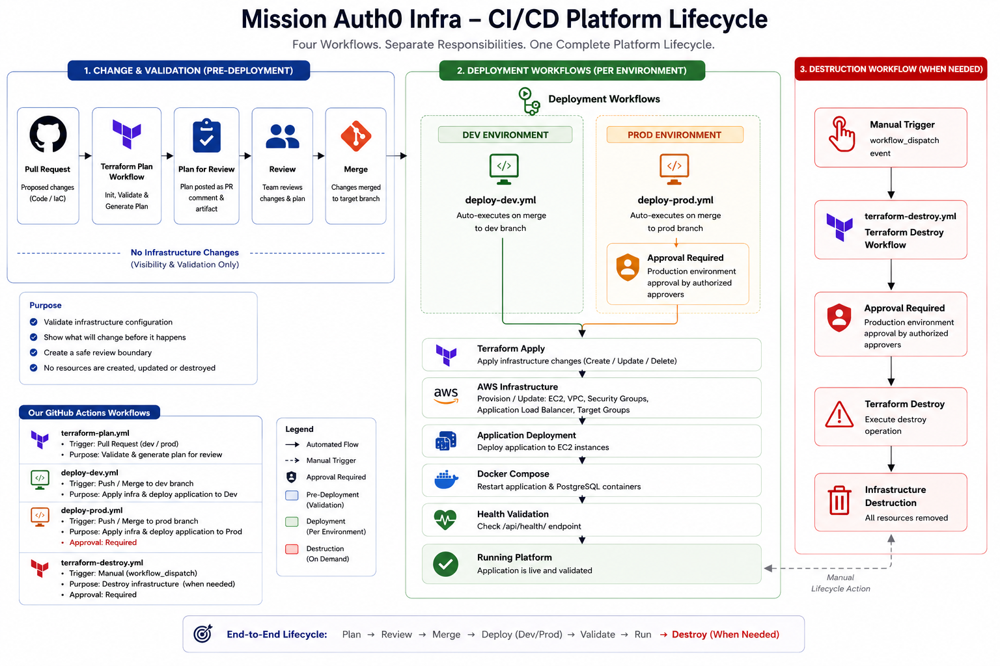
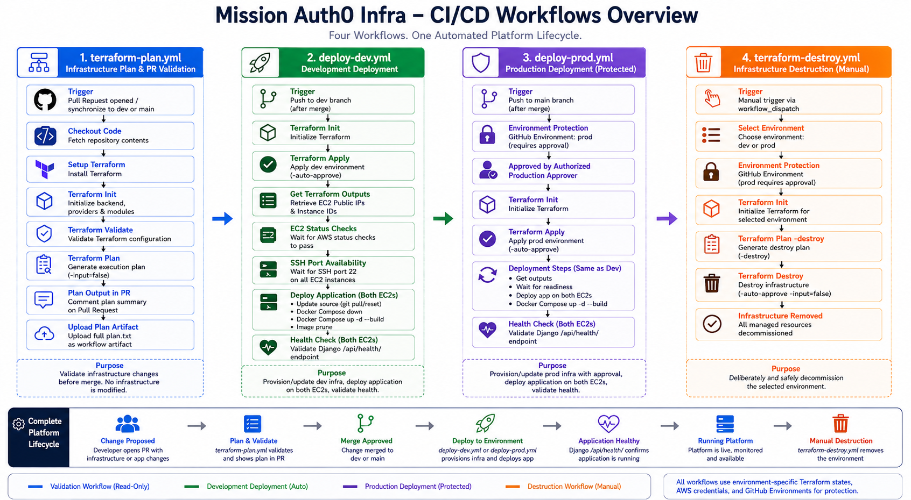
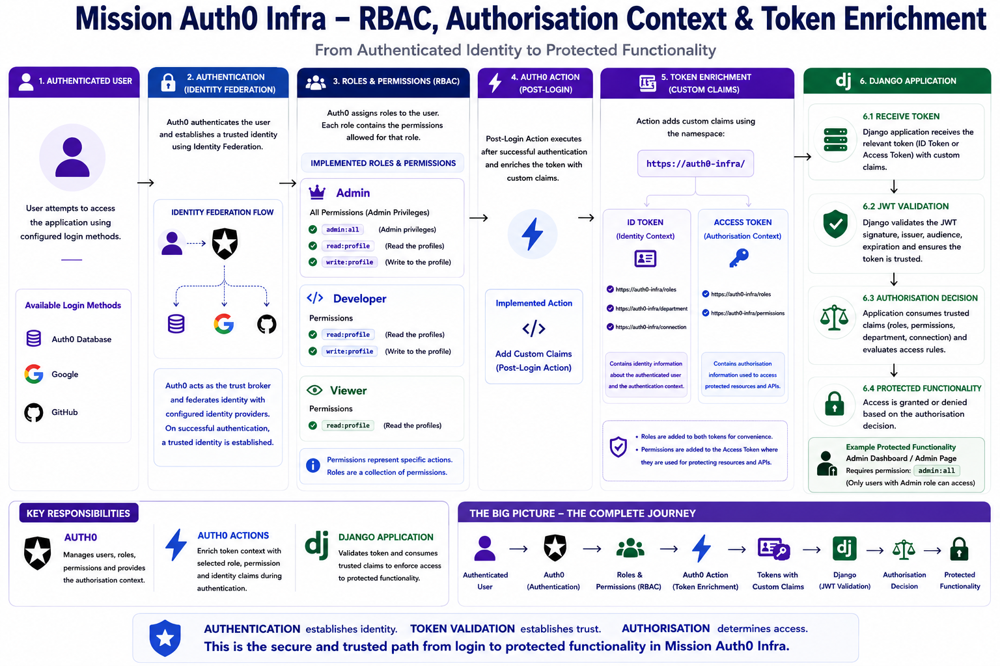
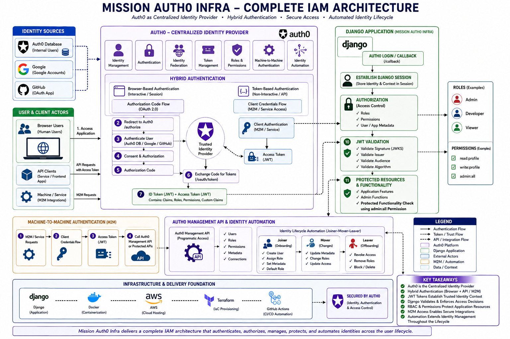

# 🚀 Mission Auth0 Infra

<p align="center">

  

</p>

## Cloud & IAM Engineering Case Study


</p>

## 1. Project Overview

### 1.1 What Is Mission Auth0 Infra?

Mission Auth0 Infra is a cloud-native engineering platform that brings together **application development, containerized runtime, cloud infrastructure, Infrastructure as Code, CI/CD automation, and Identity & Access Management** into a single implementation.

The application layer is built with **Django and PostgreSQL**, with **Docker and Docker Compose** defining the application runtime, **AWS** providing the cloud infrastructure, **Terraform** managing infrastructure as code, **GitHub Actions** automating infrastructure and application workflows, and **Auth0** providing centralized identity and access management.

The project focuses on how these technologies work together across the application lifecycle, with each layer implemented as part of the same engineering system.

The resulting platform connects application development, runtime packaging, cloud infrastructure, infrastructure automation, delivery workflows, identity integration, deployment validation, environment management, and controlled infrastructure lifecycle operations.

---

### 1.2 Why Mission Auth0 Infra Exists

Mission Auth0 Infra exists to provide a practical environment for learning, implementing, and demonstrating how modern cloud and identity engineering practices come together in a complete application platform.

The project serves three primary purposes:

- **Cloud-native engineering portfolio** — demonstrate practical implementation across application development, cloud infrastructure, Infrastructure as Code, CI/CD, containerization, and Identity & Access Management.
- **Structured technical learning resource** — provide a practical environment for understanding engineering concepts through implementation, validation, and documented technical decisions.
- **Reusable engineering foundation** — establish a foundation that can be extended and reused for future platform engineering projects and experiments.

The project was created with the vision of learning cloud and identity engineering through practical implementation instead of isolated theoretical study.

Application development, authentication, infrastructure, automation, and deployment are implemented as connected engineering capabilities within one platform. Each capability can be designed, implemented, tested, automated, and documented in the context of the complete system.

The project aims to serve as a practical engineering reference for understanding how secure cloud applications are designed, deployed, automated, and operated across their lifecycle.

---

### 1.3 Engineering Problems

A working application is only one part of operating a cloud platform.

As Mission Auth0 Infra evolved, several engineering problems emerged:

- The application required a reproducible runtime that could be recreated consistently across environments.
- Cloud deployment introduced networking, security, load balancing, and compute requirements.
- Manually created infrastructure became difficult to reproduce and manage consistently.
- Infrastructure needed to be represented as version-controlled configuration with predictable lifecycle operations.
- Terraform made infrastructure reproducible, but infrastructure operations still required execution and coordination.
- Infrastructure automation alone did not provide application deployment automation.
- Automated deployment introduced the need for validation and controlled lifecycle workflows.
- The deployed application required reliable health validation after infrastructure and application changes.
- The application required centralized authentication and authorization once it became accessible as a deployed service.
- Identity operations required controlled integration with the identity platform and administrative capabilities.

These problems shaped the engineering capabilities implemented throughout the project.

---

### 1.4 Engineering Approach

Mission Auth0 Infra follows an iterative engineering approach in which each requirement is translated into an implementation, validated, and used to identify the next engineering requirement.

The engineering cycle is:

    ┌──────────────────────────┐
    │   Identify Requirement   │
    └────────────┬─────────────┘
                 │
                 ▼
    ┌──────────────────────────┐
    │ Understand the Problem   │
    └────────────┬─────────────┘
                 │
                 ▼
    ┌──────────────────────────┐
    │     Design Solution      │
    └────────────┬─────────────┘
                 │
                 ▼
    ┌──────────────────────────┐
    │     Implement Change     │
    └────────────┬─────────────┘
                 │
                 ▼
    ┌──────────────────────────┐
    │     Validate Behaviour   │
    └────────────┬─────────────┘
                 │
                 ▼
    ┌──────────────────────────┐
    │ Automate Repeatable Work │
    └────────────┬─────────────┘
                 │
                 ▼
    ┌──────────────────────────┐
    │ Document Decisions       │
    └────────────┬─────────────┘
                 │
                 ▼
          Next Requirement

The approach keeps implementation connected to a concrete engineering requirement.

A capability is first understood in isolation, then integrated into the platform and validated as part of the complete system. Repeatable operations are automated after their behaviour is understood, and the resulting engineering decisions are documented alongside the implementation.

This approach allows the platform to grow through connected engineering decisions while keeping application, infrastructure, runtime, delivery, and identity responsibilities clearly defined.

---

### 1.5 Project Highlights

| Engineering Domains | Implementation |
|---|---|
| 🐍 **Application Development** | Django web application and REST APIs |
| 🗄️ **Database** | PostgreSQL |
| 🐳 **Containerized Runtime** | Docker and Docker Compose |
| ☁️ **Cloud Infrastructure** | AWS VPC, networking, EC2, Application Load Balancer, target groups, and health checks |
| 🏗️ **Infrastructure as Code** | Terraform modules, environment configuration, remote state, and lifecycle management |
| 🔄 **CI/CD Automation** | GitHub Actions workflows for validation, infrastucture planning, approval, deployment, and lifecycle operations |
| 🚀 **Deployment Lifecycle** | Infrastructure provisioning, application deployment, health validation, and controlled destruction |
| 🔐 **Identity & Access Management** | Auth0, OAuth 2.0, OpenID Connect, JWT, RBAC, permissions, custom claims, and Management API |

---

### 1.6 Technology Stack

| Category | Technologies |
|---|---|
| 🐍 **Language** | Python |
| 🌐 **Application Framework** | Django, Django REST Framework |
| 🗄️ **Database** | PostgreSQL |
| 🐳 **Containerization** | Docker, Docker Compose |
| ☁️ **Cloud Platform** | AWS |
| 🏗️ **AWS Services** | VPC, Subnets, Internet Gateway, Route Tables, Security Groups, EC2, Application Load Balancer, Target Groups |
| 🏗️ **Infrastructure as Code** | Terraform |
| 💾 **Terraform State** | Amazon S3, DynamoDB |
| 📦 **Source Control** | Git, GitHub |
| 🔄 **CI/CD** | GitHub Actions |
| 🛠️ **Development & API Tools** | VS Code, Postman |
| 🔐 **Identity & Access Management** | Auth0 |
| 🔑 **Authentication Protocols** | OAuth 2.0, OpenID Connect |
| 🛡️ **Authorization & Token Security** | JWT, JWKS, RBAC, Permissions, Custom Claims |
| 👤 **Identity Automation** | Auth0 Management API |

---

### 1.7 Engineering Principles

Mission Auth0 Infra follows a set of engineering principles that guide how the platform is designed, implemented, and operated.

- **Separation of Responsibilities** — application logic, runtime configuration, infrastructure, delivery automation, and identity operations have defined responsibilities.

- **Configuration as Code** — infrastructure and deployment configuration are represented through version-controlled code and configuration files.

- **Reusable Components** — reusable modules and application capabilities are structured to support consistent implementation across environments and workflows.

- **Environment Separation** — environment-specific configuration is separated from reusable implementation logic.

- **Automation of Repeatable Operations** — repeatable infrastructure, deployment, and operational tasks are automated through defined workflows.

- **Explicit Lifecycle Management** — infrastructure and application operations follow identifiable lifecycle stages such as validation, planning, provisioning, deployment, validation, and controlled destruction.

- **Secure Boundaries** — authentication, authorization, network access, secrets, and administrative operations are handled through explicit security boundaries.

- **Validation Before Change** — configuration and proposed infrastructure changes are validated before execution, and deployed application behaviour is verified after changes.

- **Operational Validation** — application responses, infrastructure health checks, workflow results, and deployment outcomes are used to verify system behaviour.

- **Incremental Evolution** — each platform capability is introduced in response to an engineering requirement exposed during the implementation of the preceding layer.
  
These principles guide the architecture and implementation decisions documented throughout the project.

> **Mission Auth0 Infra brings together application development, runtime packaging, cloud infrastructure, infrastructure automation, delivery workflows, and identity management as one connected engineering system**.

The following section presents the architecture that connects these layers and defines their responsibilities within the platform.

---

## 2.1 Architecture Overview

Mission Auth0 Infra is organized as a set of connected engineering layers, with each layer responsible for a distinct part of the application lifecycle.

The **Django application** provides the application and API layer, while **Docker and Docker Compose** define its runtime. **AWS** provides the cloud infrastructure that hosts and exposes the application. **Terraform** manages that infrastructure as code, and **GitHub Actions** automates infrastructure and application delivery workflows. **Auth0** provides centralized authentication and authorization for application access.

These layers communicate through defined boundaries: user application traffic enters through the AWS load balancer, the containerized runtime executes the Django application, Django communicates with PostgreSQL for application data and Auth0 for identity operations, while GitHub Actions coordinates Terraform and application deployment workflows.

The architecture below presents these relationships and the responsibilities of each layer within the implemented platform.



---

### 2.2 Engineering Layers

Mission Auth0 Infra is organized into distinct engineering layers, with each layer owning a specific responsibility within the platform.

| Engineering Layer | Primary Responsibility |
|---|---|
| 🌐 **Presentation Layer** | Provides the browser-based interface through which users access the application. |
| ⚙️ **Application Layer** | Implements application logic, REST APIs, session handling, application workflows, and protected resources through Django. |
| 🐳 **Container Runtime Layer** | Packages and runs the Django application and PostgreSQL database using Docker and Docker Compose. |
| ☁️ **Cloud Infrastructure Layer** | Provides networking, compute, load balancing, security controls, and supporting AWS resources required to run the application. |
| 🏗️ **Infrastructure as Code Layer** | Defines and manages AWS infrastructure through Terraform configuration and lifecycle operations. |
| 🔄 **Platform Automation Layer** | Automates infrastructure and application workflows through GitHub Actions CI/CD. |
| 🔐 **Identity & Access Layer** | Provides centralized authentication, token-based identity, roles, permissions, and identity administration through Auth0. |

These layers are connected through defined interfaces and responsibilities rather than operating as isolated components. The application consumes the runtime and infrastructure beneath it, delivery automation manages changes across those layers, and the identity layer provides the authentication and authorization context required by protected application functionality.

---

### 2.3 Application Layer

The application layer contains the **Django application** that implements the platform's user-facing functionality, API endpoints, application workflows, session handling, and protected resources.

The application runs inside the containerized runtime and uses PostgreSQL for persistent application data. It also integrates with Auth0 for authentication, authorization, and identity administration.

The application layer therefore acts as the primary integration point between the platform's runtime, persistent data, and identity services.

At the architectural level, its main interactions are:

| Interaction | Responsibility |
|---|---|
| 🐳 **Docker Runtime** | Provides the execution environment for the Django application. |
| 🗄️ **PostgreSQL** | Stores persistent application data used by the application. |
| 🔐 **Auth0** | Provides authentication, authorization context, and identity management capabilities. |
| ☁️ **AWS Infrastructure** | Provides the network and compute environment in which the containerized application runs. |
| 👤 **Users** | Access application functionality through the web interface and protected endpoints. |

> **The application layer depends on a consistent runtime environment to execute the application and its supporting services.**

---

### 2.4 Container Runtime Layer

The container runtime layer packages and runs the application and its supporting services using **Docker and Docker Compose**.

Docker provides the containerized execution environment for the Django application, while Docker Compose defines the application services, their configuration, networking, and persistent storage relationships.

At the architectural level, the container runtime provides the boundary between the application and the underlying cloud infrastructure.

| Interaction | Responsibility |
|---|---|
| ⚙️ **Django Application** | Runs as the primary application container. |
| 🗄️ **PostgreSQL** | Runs as the database container and provides persistent application data storage. |
| 🌐 **Container Network** | Enables communication between the application and database services. |
| 💾 **Persistent Volume** | Preserves PostgreSQL data across container lifecycle operations. |
| ☁️ **AWS Infrastructure** | Provides the compute environment in which the containerized services run. |

> **The containerized application and database services require cloud infrastructure to host, expose, and protect their runtime.**

---

### 2.5 Cloud Infrastructure Layer

The cloud infrastructure layer provides the **AWS resources** required to host the containerized application and make it accessible to users.

The implemented AWS environment provides the networking, compute, load balancing, security controls, and supporting resources required for the application runtime.

| AWS Component | Responsibility |
|---|---|
| 🌐 **VPC & Subnets** | Provide the network boundary and subnet structure for the deployed environment. |
| ⚖️ **Application Load Balancer** | Receives HTTP application traffic and routes requests to the application instances. |
| 💻 **EC2 Instances** | Provides the compute environment where Docker Compose runs the application and PostgreSQL services. |
| 🛡️ **Security Groups** | Control inbound and outbound network access to the deployed resources. |
| 🧭 **Route Tables & Internet Gateway** | Provide routing between the application environment and external networks. |
| ❤️ **Health Checks** | Allow the load balancer to determine whether registered application targets are healthy enough to receive traffic. |

The resulting AWS environment provides the network and compute foundation required for the containerized application to operate and receive user traffic.

> **The cloud resources now provide the required application environment, but provisioning and managing them manually does not provide the reproducibility, consistency, and control required for repeatable infrastructure operations.**

---

### 2.6 Infrastructure as Code Layer

The Infrastructure as Code layer uses **Terraform** to define and manage the AWS infrastructure through version-controlled configuration.

Terraform represents the required infrastructure as declarative configuration, allowing the relationships between networking, security, compute, load balancing, and supporting resources to be managed as a single infrastructure definition.

| Terraform Component | Responsibility |
|---|---|
| 📄 **Configuration** | Defines the desired AWS infrastructure and its relationships. |
| 🧩 **Modules** | Organize reusable infrastructure components. |
| 🌍 **Environment Configuration** | Supplies environment-specific values to the reusable infrastructure definitions. |
| 🗂️ **Terraform State** | Tracks the relationship between the Terraform configuration and managed infrastructure resources. |
| 🔒 **Remote State & Locking** | Provides centralized state management and coordinates Terraform operations. |
| 🔄 **Lifecycle Operations** | Supports validation, planning, provisioning, updating, and controlled destruction of managed infrastructure. |

Terraform therefore turns the AWS environment into a version-controlled infrastructure definition that can be reviewed, planned, and executed consistently.

> **However, having infrastructure represented as code still leaves the execution of Terraform operations as a workflow that must be coordinated with application changes and deployment activities.**

---

### 2.7 Platform Automation Layer

The platform automation layer uses **GitHub Actions** to coordinate infrastructure and application delivery workflows from the GitHub repository.

GitHub Actions provides the execution layer between version-controlled changes and the platform operations that apply those changes. It orchestrates Terraform operations for infrastructure and executes the application deployment workflow for the containerized application.

| Platform Component | Responsibility |
|---|---|
| 📦 **GitHub Repository** | Stores application source code, Terraform configuration, workflows, and version-controlled changes. |
| 🔄 **GitHub Actions** | Executes automated infrastructure and application workflows. |
| 🏗️ **Terraform Workflow** | Validates, plans, and applies infrastructure changes through controlled workflow stages. |
| 🚀 **Application Deployment Workflow** | Deploys the latest application to the Docker runtime hosted on AWS, including rebuilding the application containers when required. |
| 🔍 **Deployment Validation** | Verifies the resulting infrastructure and application state after deployment operations. |
| 🗑️ **Destroy Workflow** | Provides a controlled workflow for intentionally removing Terraform-managed infrastructure. |

The platform automation layer connects source changes to infrastructure and application lifecycle operations, creating a repeatable execution path from the repository to the deployed environment.

> **The platform can now provision infrastructure and deploy the application through automated workflows, but the deployed application still needs a trusted mechanism to establish user identity and enforce access to protected functionality.**

---

### 2.8 Identity & Access Layer

The identity and access layer provides the authentication and authorization capabilities required to control access to the application.

**Auth0** acts as the centralized identity platform for the Django application. It handles user authentication through Universal Login and provides the identity and authorization context consumed by the application.

The application integrates with Auth0 through standard identity protocols and uses the resulting authentication and authorization information when processing protected application functionality.

| Identity Component | Responsibility |
|---|---|
| 🔐 **Auth0** | Provides centralized identity and access management for the application. |
| 🌐 **Universal Login** | Provides the authentication interface through which users authenticate. |
| 🔑 **OAuth 2.0 / OpenID Connect** | Defines the authentication and authorization protocol flow between the application and Auth0. |
| 🎫 **Tokens** | Carry authenticated identity and authorization information between the identity platform and application. |
| 👥 **Roles & Permissions** | Provide authorization context used to control access to protected functionality. |
| 🧩 **Custom Claims** | Enrich token information with application-specific identity context. |
| ⚙️ **Management API** | Provides controlled application-to-Auth0 administrative identity operations. |

The identity layer completes the platform architecture by establishing the identity context required by the application while keeping identity management responsibilities centralized within Auth0.

> **The architecture establishes how the major engineering layers connect to form the Mission Auth0 Infra platform. The following sections examine each layer individually, beginning with application development.**

---

## 🐍 3. Application Development

### 3.1 Application Development Overview

The application layer provides the functional workload of Mission Auth0 Infra. It receives user requests, executes application logic, exposes application and API functionality, manages application state, and integrates with the external services required by the platform.

Mission Auth0 Infra uses **Django**, a Python web framework, as the application framework. Django provides the structure required to build the web application, process HTTP requests, manage sessions, connect application logic with persistent data, and integrate with external services.

The application is the functional core of the platform. It provides the user-facing dashboard, API functionality, authentication and authorization integration, identity operations, and supporting application workflows.

The implemented application responsibilities are:

| Application Responsibility | Implementation |
|---|---|
| 🌐 **Web Application** | Django-based web application and user-facing functionality |
| 🔌 **API Functionality** | Application APIs exposed through the Django application |
| 🔐 **Authentication** | Auth0 integration for user authentication |
| 🛡️ **Authorization** | Role and permission based protection for application access |
| 👤 **Identity Operations** | Application integration with Auth0 identity administration |
| 📊 **Dashboard** | Authenticated dashboard and application views |
| ⚙️ **Automation** | Application-level automation and Auth0 identity administration operations |
| 🗄️ **Persistent Data** | Database-backed application state |
| 🎨 **User Interface** | Django templates and application styling |

The application layer consumes the runtime and infrastructure provided by the surrounding platform while integrating with PostgreSQL for persistence and Auth0 for identity and access management.

---

### 3.2 Django Application Structure

The Django application is organized into focused components that separate API functionality, authentication, identity automation, dashboard behaviour, supporting laboratory functionality, and presentation resources.

The application-related repository structure is:

    auth0-infra-project/
    │
    ├── api/
    ├── auth0_lab/
    ├── authentication/
    ├── automation/
    ├── dashboard/
    ├── sample_data/
    ├── static/
    │   └── css/
    ├── templates/
    │
    ├── manage.py
    ├── requirements.txt
    └── .env.example

Each component has a distinct responsibility within the application:

| Component | Responsibility |
|---|---|
| 🔌 **api/** | Contains the application's API functionality and protected API operations. |
| 🧪 **auth0_lab/** | Contains application functionality used to exercise and demonstrate Auth0-related capabilities within the platform. |
| 🔐 **authentication/** | Contains the application's authentication integration and authentication-related functionality. |
| ⚙️ **automation/** | Contains application-level automation and identity operation functionality. |
| 📊 **dashboard/** | Contains the authenticated dashboard and related application views. |
| 🧪 **sample_data/** | Contains sample data used by the application and its implementation workflows. |
| 🎨 **templates/** | Contains Django templates used to render the application's web interface. |
| 🖌️ **static/css/** | Contains styling resources used by the application's user interface. |
| ⚙️ **manage.py** | Provides the Django command-line entry point for application administration and development operations. |
| 📦 **requirements.txt** | Defines the Python dependencies required by the application. |
| 🔧 **.env.example** | Provides the environment-variable structure required to configure the application without storing environment-specific values in source control. |

The structure keeps application functionality, presentation resources, supporting data, dependencies, and configuration identifiable within the repository while leaving runtime and infrastructure concerns to their respective platform layers.

---

### 3.3 Application Dependencies

The application's Python dependencies are maintained in `requirements.txt`, which serves as the dependency definition for the Django application.

The file keeps the required application libraries explicitly defined so that the same dependency set can be installed when the application environment is recreated.

When application dependencies are added or changed, the dependency definition is updated accordingly. The dependency file is then consumed by the application runtime during image creation, allowing the application code and its required Python packages to be packaged together.

This keeps the application's dependency requirements version-controlled and provides a consistent input to the containerized runtime.

---

### 3.4 Application Configuration & Environment

The Django application separates application configuration from application source code by using environment variables for values that vary between environments or should not be embedded directly in the codebase.

The configuration is represented through the repository's `.env.example` file, while the actual environment-specific values are supplied through `.env` during local and deployed execution.

The implemented configuration covers the main settings required by the application:

| Configuration Area | Purpose |
|---|---|
| 🔐 **Application Security** | Supplies the Django secret key used by the application. |
| 🌐 **Application Environment** | Defines application-level settings such as debug behaviour and allowed hosts. |
| 🔑 **Auth0 Application** | Provides the Auth0 client configuration, domain, callback URL, and API audience required by the authentication integration. |
| ⚙️ **Auth0 Management API** | Provides the configuration required for application-to-Auth0 administrative identity operations. |
| 🗄️ **Database Connection** | Supplies the database host used by the Django application to connect to PostgreSQL. |
| 🌍 **Application URL** | Defines the base URL used by the application for environment-specific application access. |

The application loads these values at runtime rather than requiring environment-specific values to be embedded in the application source.

The `.env.example` file documents the configuration structure expected by the application without storing the actual environment values in the repository. This allows the same application configuration model to be reproduced across environments while keeping environment-specific values separate from the source code.

> **Configuration therefore becomes an input to the application runtime rather than a hard-coded part of the application implementation.**

---

### 3.5 Application Data & PostgreSQL

The application requires a relational database to persist data beyond the lifetime of individual application requests or runtime processes.

Mission Auth0 Infra uses **PostgreSQL**, an open-source relational database, as the application's persistent data store. PostgreSQL provides structured relational storage and integrates cleanly with Django's database layer, allowing the application to work with persistent data through Django's application models and database operations.

The application-to-database relationship is:

    Django Application
           │
           │ Database Operations
           ▼
       PostgreSQL
           │
           ▼
    Persistent Data

The application runtime establishes a dependency on database readiness. PostgreSQL is checked for readiness before the Django application becomes available, ensuring that the application runtime does not proceed while its required database service is unavailable.

    PostgreSQL
         │
         │ Readiness Check
         ▼
    Database Ready
         │
         ▼
    Django Application
         │
         ▼
    Database Operations

Once PostgreSQL is ready, Django establishes the configured database connection and can perform the operations required by the application.

This provides both the **persistent storage layer** and the **runtime dependency required for database-backed application functionality**.

---

### 3.6 Application Views & APIs

The Django application exposes functionality through web views and API endpoints, providing the interfaces through which users and clients interact with the platform.

The implemented application separates browser-oriented functionality from API operations while keeping both within the same Django application.

| Interface | Responsibility |
|---|---|
| 🌐 **Web Views** | Handle browser requests and render the application's user-facing pages. |
| 📊 **Dashboard Views** | Provide authenticated dashboard functionality and display application and identity information. |
| 🔌 **API Endpoints** | Expose application operations through HTTP-based API endpoints. |
| 🛡️ **Protected APIs** | Apply authentication and authorization requirements to operations that require an authenticated or authorized identity. |

Browser requests are processed through Django views and return rendered application pages, while API requests are handled through the application's API layer and return API responses.

The application therefore supports both interactive browser-based access and programmatic API access through clearly defined HTTP interfaces.

---

### 3.7 Authentication & Application Sessions

The application uses **Auth0** to authenticate users before providing access to authenticated functionality.

The implemented authentication flow integrates Django with Auth0 through **OAuth 2.0 and OpenID Connect**. When authentication is required, the application redirects the user to Auth0 Universal Login. After successful authentication, the application receives the authentication result and establishes the authenticated application context.

The application maintains its own session context after authentication, allowing subsequent browser requests to be associated with the authenticated user without requiring the user to authenticate again for every request.

The application-side authentication flow is:

            User
            │
            ▼
      Django Application
            │
            │ Authentication Request
            ▼
    Auth0 Universal Login
            │
            │ Authentication Result
            ▼
     Django Application
            │
            ▼
    Authenticated Session
            │
            ▼
    Protected Application

The application therefore separates **identity authentication** from **application session management**: Auth0 establishes the user's identity, while Django maintains the authenticated session used by the application.

---

### 3.8 Authorization & Protected Functionality

The application applies authorization controls to determine whether an authenticated user can access protected functionality.

Authorization is enforced using the roles and permissions associated with the authenticated user's identity. Django evaluates the authorization context before allowing access to protected application operations.

The implemented authorization model distinguishes access according to the user's assigned role and permissions.

| Authorization Element | Application Responsibility |
|---|---|
| 👤 **Authenticated Identity** | Establishes the user requesting the protected operation. |
| 🎭 **Roles** | Represent the user's assigned authorization context. |
| 🔑 **Permissions** | Define the specific operations the user is allowed to perform. |
| 🛡️ **Protected Endpoints** | Require the appropriate authorization context before processing the request. |
| 🚫 **Access Denied** | Prevents users without the required authorization from accessing protected functionality. |

The application validates authorization before executing protected operations, allowing authorized users to proceed while denying requests that do not satisfy the required access conditions.

> **Authorization behaviour is explicitly validated using users with different authorization contexts to confirm that protected functionality is accessible only when the required permissions are present**.

---

### 3.9 Application Validation

The Django application was validated by running the implemented application and exercising its primary application, authentication, authorization, and API functionality.

Validation covered the main application paths required for the implemented system:

| Validation Area | What Was Verified |
|---|---|
| 🌐 **Application Access** | The Django application could be reached and its implemented pages rendered correctly. |
| 👤 **Authentication** | Users could authenticate through the configured identity flow and establish an application session. |
| 🛡️ **Authorization** | Users with different authorization contexts received the expected access or denial behaviour for protected functionality. |
| 🔌 **API Operations** | Implemented API endpoints could be invoked and returned the expected application responses. |
| 🔐 **Protected Functionality** | Application functionality requiring authentication or authorization enforced the expected access controls. |
| 🗄️ **Database Connectivity** | The application could communicate with PostgreSQL for database-backed operations. |

Application behaviour was validated through direct interaction with the running application and API requests during development.

**The application layer has now been implemented and validated across its web interface, APIs, persistent data access, authentication, authorization, and supporting functionality. The next step is to introduce a dedicated application-level health signal that allows the surrounding infrastructure and deployment automation to verify application availability consistently.**

---

### 3.10 Health Check Endpoint

The application also exposes a dedicated **health check endpoint** that provides a lightweight mechanism for determining whether the Django application is responding successfully.

The implemented endpoint is:

```text
/api/health/
```

The endpoint returns a simple JSON response:

```json
{
    "status": "healthy"
}
```

A successful request therefore indicates that the Django application is **running and capable of responding to HTTP requests**.

The endpoint is intentionally lightweight because it is not intended to perform application business operations. Its purpose is to provide a reliable application-level signal that can be consumed by **infrastructure and deployment validation mechanisms**.

This creates an important distinction between **infrastructure availability** and **application availability**.

An EC2 instance may be running and passing its infrastructure-level checks while the Django application inside the runtime is unavailable. The health endpoint provides a way for downstream systems to validate the application itself.

The endpoint is therefore used later in the platform for:

- **Load balancer health checks** to determine whether an application target is capable of serving traffic.
- **Deployment validation** to verify that the application is responding successfully after a deployment.

The application therefore provides its own **application-level health signal**, which can be consumed by the infrastructure and automation layers without coupling those layers to internal Django application logic.

> **The Django application now exposes a dedicated health signal that can be consumed by the surrounding infrastructure and deployment automation. The next chapter packages this application into a consistent containerized runtime environment for deployment.**

---

## 🐳 4. Containerization & Runtime

### 4.1 Containerization & Runtime Overview

The application layer provides the functional workload of Mission Auth0 Infra, but running the Django application directly on a development machine creates dependencies on the local operating system, Python environment, installed packages, database configuration, and runtime setup.

To make the application **reproducible, portable, and independently executable**, Mission Auth0 Infra introduces a containerized runtime using **Docker and Docker Compose**.

**Docker** packages the Django application together with its required Python dependencies into a **consistent application runtime**, while **Docker Compose** defines the relationship between the application and PostgreSQL services.

The implemented containerized runtime therefore establishes a clear separation between the application and the underlying host environment.

The runtime consists of:

| Runtime Component | Responsibility |
|---|---|
| 🐳 **Docker Image** | Packages the Django application and its required runtime dependencies. |
| ⚙️ **Django Container** | Executes the application within the containerized environment. |
| 🗄️ **PostgreSQL Container** | Provides the application's persistent relational database service. |
| 🔗 **Docker Compose** | Defines and coordinates the application and database services. |
| 🌐 **Container Network** | Enables communication between the Django and PostgreSQL services. |
| 💾 **Persistent Volume** | Preserves PostgreSQL data independently of the database container lifecycle. |
| 🔧 **Environment Configuration** | Supplies runtime-specific configuration without embedding environment values into the application image. |

The resulting runtime relationship is:

                   Docker Compose
                         │
             ┌───────────┴───────────┐
             │                       │
             ▼                       ▼
      Django Container       PostgreSQL Container
             │                       │
             │   Container Network   │
             └───────────┬───────────┘
                         │
                         ▼
                  Persistent Volume

This approach allows the application and its database dependency to be started, stopped, recreated, and validated through a defined runtime configuration rather than relying on manually configured host environments.

The containerized runtime also establishes the foundation required for the next engineering layer: deploying the application into a cloud environment using reproducible infrastructure.

> **The application is now packaged as a reproducible runtime, with its web and database services defined as connected containers. The next step is to examine how the containerized application is built and how its runtime dependencies are defined.**

---

### 4.2 Application Containerization

The Django application is packaged into a Docker image using a project-specific `Dockerfile`.

The purpose of the **Dockerfile** is to convert the application source code and its runtime dependencies into a consistent, reproducible execution environment.

Instead of requiring the host machine to have the correct Python version, installed packages, working directory, and runtime configuration, these requirements are defined as part of the container build process.

The containerization flow is:

    Application Source Code
            │
            ▼
        Dockerfile
            │
            ├── Base Runtime
            ├── Python Dependencies
            ├── Working Directory
            ├── Application Source
            └── Runtime Configuration
                    │
                    ▼
              Docker Image
                    │
                    ▼
            Django Container
                    │
                    ▼
          Application Runtime

The Dockerfile therefore acts as the build definition for the Django runtime.

The resulting image contains the components required for the Django application to execute consistently, while the runtime-specific service configuration remains outside the image and is provided through the container orchestration layer.

This creates a clear separation between:

| Concern | Responsibility |
|---|---|
| 🐳 **Dockerfile** | Defines how the application image is built. |
| 📦 **Docker Image** | Contains the application and its runtime dependencies. |
| ⚙️ **Django Container** | Runs the application from the built image. |
| 🔗 **Docker Compose** | Defines how the application container operates with PostgreSQL and other runtime configuration. |

The resulting model is:

    Dockerfile
        │
        ▼
    Docker Image
        │
        ▼
    Django Container
        │
        ├── Application Code
        ├── Python Runtime
        └── Application Dependencies
                │
                ▼
          Django Application

This approach removes the dependency on manually preparing the host environment and provides a consistent runtime boundary for the application across different operating systems and host machines. It also addresses the common **"works on my machine"** problem by packaging the application and its runtime dependencies into a consistent containerized environment.

The same containerized application model can then be composed with PostgreSQL through Docker Compose, allowing the complete application stack to operate as a defined **multi-container runtime**.

> **The Django application is now packaged into a reproducible container image. The next step is to define how the application container and its PostgreSQL dependency are composed and orchestrated together.**

---

### 4.3 Docker Compose & Multi-Container Orchestration

Building the Django image provides a reproducible runtime for the application, but the application is not an isolated component. Django depends on **PostgreSQL** for **persistent application data**, which means both components must be started, configured, and connected consistently.

**Docker Compose** is introduced to define this **multi-container runtime** as a single configuration.

Instead of manually creating and configuring individual containers, Docker Compose allows the complete application stack to be described declaratively and managed as one unit.

The implemented runtime consists of two primary containers:

| Container | Responsibility |
|---|---|
| ⚙️ **Django Container** | Runs the application using the Docker image built from the project `Dockerfile`. |
| 🗄️ **PostgreSQL Container** | Provides the relational database required by the Django application. |

The Django container communicates with PostgreSQL through the **Docker network** rather than depending on a database installation running directly on the host machine.

This provides an important separation of responsibilities:

- The **Django container** is responsible for application execution.
- The **PostgreSQL container** is responsible for database execution.
- The **Docker network** provides communication between the services.
- The **persistent volume** preserves PostgreSQL data beyond the lifecycle of an individual database container.
- **Docker Compose** defines and orchestrates the complete runtime.

### Declarative Runtime Definition

The multi-container environment is defined through `docker-compose.yml`.

This configuration describes the **services, images, ports, environment variables, startup dependency order, networking, database connectivity health checks, and persistent storage** required by the application stack.

The runtime can therefore be created from a **single configuration** rather than through a sequence of manual container commands.

The operational model becomes:

                          docker-compose.yml
                                  │
                                  ▼
                           Docker Compose
                                  │
             ┌────────────────────┼────────────────────┐
             │                    │                    │
             ▼                    ▼                    ▼
     Django Container     PostgreSQL Container   Container Network
             │                    │                    │
             └────────────────────┼────────────────────┘
                                  │
                                  ▼
                          Persistent Volume

This approach also makes the environment reproducible across development machines. A new environment does not need to independently recreate the application runtime, install PostgreSQL, configure networking, or manually establish the relationship between the services.

### Runtime Lifecycle

Docker Compose also provides a consistent lifecycle for the complete application stack.

The environment can be:

- **Started** when development or testing begins.

- **Stopped** when the environment is no longer required.

- **Recreated** when configuration or images change.

- **Rebuilt** when application dependencies or the Docker image definition changes.

- **Validated** by testing communication between the Django and PostgreSQL containers.

This creates a repeatable development runtime while keeping the application, database, networking, and persistence concerns explicitly defined.

### Runtime Operations

The containerized runtime is operated through Docker Compose commands:

```bash
docker compose up -d
```

Starts the application stack in detached mode.

```bash
docker compose down
```

Stops and removes the application containers and network while preserving the named PostgreSQL volume by default.

```bash
docker compose up -d --build
```

Rebuilds the Django image and starts the updated application runtime.

```bash
docker compose ps
```

Displays the current status of the Compose services.

These commands provide the basic operational interface for the containerized runtime and are later used by the deployment workflow to update the application running on the EC2 instances.

> **Docker Compose now provides a declarative definition and lifecycle for the complete multi-container runtime. The next step is to examine how PostgreSQL is configured as a containerized dependency and how its data is preserved independently of the container lifecycle.**

---

### 4.4 Database Container, Health Check & Persistence

The Django application requires a **relational database to store and retrieve application data.** The application uses **PostgreSQL** as its database. 

**PostgreSQL** is an open-source relational database designed for reliability, extensibility, and standards-compliant data management, while its containerized nature allows the same database runtime to be used consistently across different environments.

Instead of depending on a PostgreSQL installation running directly on the host machine, PostgreSQL is introduced as a dedicated container within the Docker Compose runtime.

The **database container** uses the official **PostgreSQL** image and is configured independently from the Django application container.

This keeps the database runtime isolated while allowing the Django container to **communicate** with it through the **Docker network** established by Docker Compose.

### PostgreSQL Container Configuration

The PostgreSQL container is configured through environment variables supplied by the project `.env` file.

The configuration provides:

| Configuration | Responsibility |
|---|---|
| `POSTGRES_DB` | Defines the application database. |
| `POSTGRES_USER` | Defines the PostgreSQL user used by the application. |
| `POSTGRES_PASSWORD` | Provides the password for the configured PostgreSQL user. |
| `postgres_data` | Provides persistent storage for PostgreSQL data. |

Keeping these values outside the Compose configuration prevents environment-specific database credentials from being hardcoded into the application runtime definition.

### Database Connectivity Health Check

Starting a PostgreSQL container does not necessarily mean that the database is immediately ready to accept connections.

Therefore, the PostgreSQL service implements a Docker health check using PostgreSQL's `pg_isready` utility.

The health check verifies whether the configured database is ready to accept connections before the Django service attempts to start.

The health-check configuration defines:

- **Test** — Executes `pg_isready` against the configured PostgreSQL database.
- **Interval** — Checks the database every 5 seconds.
- **Timeout** — Allows up to 5 seconds for an individual health check.
- **Retries** — Allows multiple attempts before the service is considered unhealthy.
- **Start Period** — Provides PostgreSQL initial startup time before health evaluation begins.

This creates an explicit readiness signal for the database rather than assuming that a running container automatically represents a ready database service.

### Startup Dependency Control

The Django service uses Docker Compose's `depends_on` configuration with the `service_healthy` condition:

    Django Container
           │
           │ depends_on
           ▼
    PostgreSQL Container
           │
           ▼
      Health Check
           │
           ▼
    Database Healthy
           │
           ▼
    Django Startup

This ensures that the Django container waits for PostgreSQL to reach a healthy state before executing its startup sequence.

Once the database becomes healthy, Django performs its initialization workflow:

- Runs database migrations.
- Collects static files.
- Starts the Django development server.

This removes the need for the application container to implement its own database readiness polling and moves the startup dependency responsibility into the container orchestration layer.

### Persistent Database Storage

Containers are designed to be replaceable, which means data stored only inside a container's writable filesystem can be lost when that container is removed.

For PostgreSQL, losing the database contents when the container is recreated would make the containerized runtime unsuitable for persistent application development.

To address this, the Compose configuration defines a named Docker volume:

    postgres_data
          │
          ▼
    PostgreSQL Container
          │
          ▼
    /var/lib/postgresql/data

The `postgres_data` volume is mounted to PostgreSQL's data directory, allowing database data to exist independently from the lifecycle of the PostgreSQL container.

As a result, the database container can be recreated without automatically discarding the persisted PostgreSQL data stored in the named volume.

This establishes a clear separation between:

- **Container lifecycle** — PostgreSQL execution environment.
- **Data lifecycle** — Persistent PostgreSQL database contents.

### Resulting Runtime Behaviour

The completed startup sequence is therefore:

    Docker Compose
          │
          ▼
    PostgreSQL Container
          │
          ▼
      Health Check
          │
          ▼
    Database Healthy
          │
          ▼
     Django Container
          │
          ├── Run Migrations
          ├── Collect Static Files
          └── Start Django
          
At the same time, PostgreSQL data is maintained through the named persistent volume rather than being tied to the lifecycle of the database container.

> **PostgreSQL is now established as a containerized, readiness-validated and persistent dependency of the Django runtime. The next step is to examine how application and database configuration is supplied to the containers without embedding environment-specific values into the application image.**

---

### 4.5 Runtime Configuration & Environment Variables

Containerizing the application separates the runtime from the host machine, but the containers still require environment-specific configuration to operate correctly.

Database credentials, database names, application configuration, and other runtime values should not be hardcoded into the application source code or Docker image.

Mission Auth0 Infra therefore separates **application configuration** from the **container image** and supplies environment-specific values at runtime.

The implemented configuration model uses a project `.env` file together with Docker Compose's `env_file` and environment-variable substitution mechanisms.

> **A `.env.example` file is provided as a configuration template; when setting up the project, copy it to `.env` and add/replace the placeholder values with environment-specific values.**

### Environment Configuration

The `.env` file contains environment-specific values required by the containerized runtime.

For the database service, values such as:

- `POSTGRES_DB`
- `POSTGRES_USER`
- `POSTGRES_PASSWORD`

are supplied through environment variables rather than being directly embedded into `docker-compose.yml`.

This allows the same Compose configuration to be reused across environments while changing only the values supplied to the runtime.

The resulting separation is:

| Configuration Layer | Responsibility |
|---|---|
| `.env` | Stores environment-specific configuration values. |
| `docker-compose.yml` | Defines how those values are supplied to the containers. |
| Docker Image | Contains the application and runtime dependencies without environment-specific configuration. |
| Container Runtime | Receives the required configuration when the services start. |

### Configuration vs Application Code

The application code should remain independent of the environment in which it executes.

For example, the Django application should not contain database credentials such as:

    database_user = "postgres"
    database_password = "password123"

Instead, the application reads the required values from its runtime environment.

This creates a clean separation:

    Application Code
          │
          │ expects configuration
          ▼
    Environment Variables
          │
          ▼
    Container Runtime
          │
          ▼
    Environment-Specific Services

This approach makes the application easier to move between testing, development, production and future deployment environments without modifying the application source code for each environment.

### Runtime Configuration Lifecycle

The configuration therefore follows the same containerized lifecycle as the rest of the platform:

    Configuration Values
            │
            ▼
          .env
            │
            ▼
      Docker Compose
            │
            ▼
     Container Runtime
            │
            ├── Django Configuration
            │
            └── PostgreSQL Configuration

The configuration remains external to the image, while Docker Compose provides the mechanism for injecting the required values when the containers are created.

> **Because environment-specific configuration is supplied at runtime rather than baked into the Docker image, changing a configuration value does not require rebuilding the application image.**

### Security Consideration

Environment variables provide **separation between configuration and application code,** but they should not automatically be treated as a complete secrets-management solution.

Sensitive values such as database passwords should not be committed to source control.

The `.env` file should therefore remain outside version control through the project's `.gitignore` configuration, while a safe configuration template or documented variable list can be maintained for reproducibility.

This establishes an important principle for the platform:

> **Configuration belongs to the runtime environment, while application logic belongs to the application image.**

> **The containerized runtime now has a clear separation between application code, infrastructure configuration, persistent data, and environment-specific values. The next step is to validate the complete multi-container runtime and verify that the services operate correctly together.**

---

### 4.6 Containerized Runtime Validation

With the Django application, PostgreSQL database, Docker Compose orchestration, health checks, persistent storage, and runtime configuration defined, the complete containerized runtime was validated end-to-end.

The objective of validation was not only to confirm that the containers could start, but to verify that the individual components behaved correctly as a single application runtime.

### Runtime Build & Startup Validation

The containerized environment was built and started using Docker Compose.

The validation sequence was:

    Docker Compose
          │
          ▼
    Build Django Image
          │
          ▼
    Start PostgreSQL
          │
          ▼
    PostgreSQL Health Check
          │
          ▼
    Database Ready
          │
          ▼
    Start Django
          │
          ├── Run Migrations
          ├── Collect Static Files
          └── Start Application
          │
          ▼
    Application Available
          │
          ▼
    End-to-End Validation

The runtime was verified to ensure that:

- The Django image could be built successfully.
- The PostgreSQL container could be created and started.
- The PostgreSQL health check correctly determined database readiness.
- The Django container respected the PostgreSQL startup dependency.
- Django migrations executed successfully after database readiness.
- Static files were collected during application startup.
- The Django development server started successfully.
- The application was accessible through the exposed port.
- Django could communicate with PostgreSQL through the Docker network.
- PostgreSQL data was stored through the configured persistent volume.

### Runtime Troubleshooting

The containerization process also exposed practical runtime issues that would not have been visible from configuration alone.

**Issues** such as **container lifecycle conflicts, application path configuration, dependency installation, and database startup sequencing** were identified during implementation and resolved through iterative validation.

This reinforced an important engineering principle:

> **Building the Docker image only proves that the image can be created successfully. Containerization is complete only when the containers can run together, their dependencies and communication work correctly, and the complete application runtime has been validated.**

### Persistence Validation

The **PostgreSQL volume** was also validated **independently from the database container lifecycle.**

The purpose of this validation was to confirm that **database data belongs to the persistent storage layer** rather than the temporary lifecycle of the PostgreSQL container.

This establishes the expected relationship:

    PostgreSQL Container
            │
            ▼
      Persistent Volume
            │
            ▼
       Database Data

The database container can therefore be recreated while the persistent database contents remain associated with the named Docker volume.

### Result

The completed validation established a reproducible local runtime in which:

| Validation Area | Result |
|---|---|
| Django Image Build | Successful |
| PostgreSQL Container | Successful |
| Database Readiness | Validated |
| Startup Dependency | Validated |
| Database Connectivity | Validated |
| Django Migrations | Successful |
| Static File Collection | Successful |
| Application Availability | Validated |
| Persistent Database Storage | Validated |
| Multi-Container Runtime | Successfully Orchestrated |

The containerization layer therefore moved Mission Auth0 Infra from a locally configured application environment to a **reproducible, consistent, multi-container runtime with defined service dependencies, persistent storage, and environment-specific configuration**.

> **The application runtime is now reproducible and independently defined from the host environment. The next engineering requirement is to move beyond the local runtime and provision the cloud infrastructure required to host and operate these workloads.**

---

## ☁️ 5. Cloud Infrastructure

The containerized runtime established how Mission Auth0 Infra is packaged, configured, orchestrated, and validated on a local development environment.

However, a reproducible local runtime alone does not provide the **infrastructure** required to make the **application accessible, scalable, secure, and operationally manageable beyond the development machine.**

The next engineering layer therefore moves from **runtime definition** to **infrastructure provisioning**.

**Cloud infrastructure** provides the underlying **compute, networking, security, storage, and connectivity capabilities** required to host and operate application workloads without requiring the physical infrastructure to be designed, provisioned, and maintained directly by the application team.

For Mission Auth0 Infra, the containerized application runtime is therefore introduced into an **AWS Cloud Environment**, where the required infrastructure components are provisioned to provide a controlled and reproducible hosting environment.

### 5.1 Cloud Infrastructure Overview

Cloud infrastructure provides the foundation on which application workloads operate.

While Docker defines **how the application runs**, cloud infrastructure defines **where and under what infrastructure conditions the application runs**.

The distinction between the two layers is therefore:

| Engineering Layer | Responsibility |
|---|---|
| 🐳 **Containerization** | Packages and executes the application in a consistent runtime. |
| ☁️ **Cloud Infrastructure** | Provides the compute, networking, security, and connectivity required to host that runtime. |

The containerized application developed in the previous chapter can therefore be introduced into the cloud environment without changing the fundamental application runtime model.

The resulting engineering progression is:

    Django Application
           │
           ▼
    Docker Image
           │
           ▼
    Containerized Runtime
           │
           ▼
    AWS Infrastructure
           │
           ├── Network
           ├── Compute
           ├── Security
           ├── Traffic Management
           └── Connectivity
           │
           ▼
    Cloud Application Runtime

This separation is important because the application should not need to understand the underlying infrastructure implementation in order to execute.

>**The Docker image defines the application runtime, while AWS provides the infrastructure required to host that runtime and expose it to users in a controlled manner.**

### Why Cloud Infrastructure Is Required

Running the application directly on a development machine is sufficient for development and validation, but a cloud-hosted workload introduces additional engineering requirements.

The infrastructure must provide:

- **Network isolation** so that application resources operate within a controlled network boundary.
- **Compute capacity** to execute the containerized application.
- **Internet connectivity** where external access is required.
- **Traffic management** to distribute incoming requests to application instances.
- **Security controls** to restrict which traffic can reach infrastructure resources.
- **Availability** by allowing application workloads to operate across independent infrastructure locations.
- **Scalability** by providing the ability to add or remove application capacity as required.
- **Operational visibility** through infrastructure and application monitoring.

**Cloud infrastructure** therefore becomes the layer responsible for transforming the containerized application from a **local runtime** into an **operationally hosted workload**.

### From Local Runtime to Cloud Runtime

The previous chapter established a runtime in which Docker Compose coordinates the Django and PostgreSQL containers.

The **cloud infrastructure layer** now provides the environment in which the **application workload can operate beyond the local machine**.

The conceptual relationship become

    Local Development
          │
          ▼
    Docker Compose
          │
          ▼
    Containerized Application
          │
          ▼
    AWS Cloud Infrastructure
          │
          ▼
    Hosted Application

The important principle is that **containerization and cloud infrastructure solve different engineering problems**.

Docker provides runtime consistency and portability, while AWS provides the infrastructure foundation required for networking, compute, security, availability, and controlled access to the application.

### Infrastructure as an Engineering Layer

The cloud environment should not be treated as a collection of resources created manually through a cloud console.

As the platform evolves, the infrastructure itself becomes part of the engineering lifecycle and should be:

- **Defined** through explicit infrastructure configuration.
- **Provisioned** in a repeatable manner.
- **Configured** according to security and application requirements.
- **Validated** after deployment.
- **Version controlled** alongside the platform.
- **Changed** through controlled engineering workflows.

The cloud infrastructure therefore becomes another reproducible layer of Mission Auth0 Infra rather than an environment that exists only through manually configured cloud resources.

> **The containerized application now has a defined cloud environment in which it can operate. The next step is to examine the AWS architecture and understand how networking, availability zones, compute, traffic management, routing, and security controls work together to host the application.**

---

### 5.2 Cloud Architecture

The cloud environment provides the infrastructure required to **host and expose the containerized application outside the local development environment**.

The application runtime established by Docker Compose is deployed onto **Amazon Web Services (AWS)** within the **`ap-south-1` region**. The cloud architecture introduces the network, compute, traffic-management, and security boundaries required to run the application as a distributed runtime.

The architecture is built around an **AWS Virtual Private Cloud (VPC) - `10.0.0.0/16`**, which provides an **isolated network boundary for the application infrastructure**.

Within the VPC, the application is distributed across **two Availability Zones**, with one **public subnet in each zone**:

- **Availability Zone A → Public Subnet A (`10.0.1.0/24`)**
- **Availability Zone B → Public Subnet B (`10.0.2.0/24`)**

This **multi-AZ** arrangement provides the foundation for **application availability** by avoiding dependency on a single Availability Zone.

### Cloud Infrastructure

The complete **Cloud Infrastructure Architecture** is represented below.



The architecture shows how the cloud infrastructure surrounds and hosts the containerized runtime established by Docker Compose.

Internet-facing traffic enters through the **Application Load Balancer (ALB)** rather than reaching the application instances directly. The ALB **receives HTTP traffic on port `80`, performs health checks against the application, and distributes requests across the available EC2 instances.**

Each EC2 instance hosts the **Docker Compose application runtime**, containing the application and database containers defined in the containerization engineering layer.

The EC2 instances are protected by a **Security Group** that **controls network access** to the compute layer. **HTTP access** is permitted from the load-balancer security boundary, while **SSH access is currently permitted from the Internet as part of the lab CI/CD deployment implementation**.

The resulting architecture can therefore be understood through two complementary relationships.

**Infrastructure relationship:**

    AWS Region
        │
        ▼
       VPC
        │
        ├── Availability Zone A
        │       └── Public Subnet A
        │               └── EC2 Instance
        │                   └── Docker Compose Runtime
        │
        └── Availability Zone B
                └── Public Subnet B
                        └── EC2 Instance
                            └── Docker Compose Runtime

**Application traffic relationship:**

                  Internet
                      │
                      ▼
            Application Load Balancer
                      │
             ┌────────┴────────┐
             │                 │
             ▼                 ▼
       EC2 Instance A     EC2 Instance B
             │                 │
             ▼                 ▼
      Docker Compose      Docker Compose
         Runtime             Runtime
             │                 │
        ┌────┴────┐       ┌────┴────┐
        ▼         ▼       ▼         ▼
     Django   PostgreSQL Django   PostgreSQL
    Container Container  Container Container                 
              
The architecture combines **network isolation, multi-AZ compute, load balancing, health-based traffic distribution, containerized execution, and security controls** to provide a scalable foundation for hosting the application in AWS.

The following sections examine each infrastructure layer individually, beginning with the **VPC and network isolation** that establishes the boundary in which the application operates.

> **The cloud architecture now provides the infrastructure boundary around the containerized runtime. The next sections unbox each infrastructure layer and examine how the components work together. Once the architecture is understood, the challenge becomes managing this infrastructure reliably at scale — which leads to the next engineering layer: Infrastructure as Code with Terraform.**

---

### 5.3 VPC & Network Isolation

The AWS architecture requires a **network boundary** within which the application infrastructure can be created and controlled.

Mission Auth0 Infra therefore uses an **Amazon Virtual Private Cloud (VPC)** as the foundational network boundary for the cloud environment.

A **VPC** is a logically isolated virtual network within AWS that allows an organization to define the network space in which its cloud resources operate.

The VPC provides the foundation for controlling:

- **IP address ranges** used by the infrastructure.
- **Network segmentation** through subnets.
- **Routing** between network destinations.
- **Internet connectivity** through configured gateways.
- **Network access control** through Security Groups.
- **Placement of compute and traffic-management resources** within the defined network.

For Mission Auth0 Infra, the VPC is configured with the CIDR block:

    10.0.0.0/16

This VPC becomes the **network boundary** surrounding the application infrastructure.

The resulting relationship is:

    AWS Region: ap-south-1
             │
             ▼
            VPC
       10.0.0.0/16
             │
       ┌─────┴─────┐
       │           │
       ▼           ▼
      AZ A        AZ B
       │           │
       ▼           ▼
    Subnet A    Subnet B
       │           │
       ▼           ▼
      EC2        EC2

The VPC therefore provides the **top-level network boundary**, while the resources inside it are organized into smaller network segments and Availability Zones.

### VPC as the Application Network Boundary

The VPC is not itself responsible for running the application.

Instead, it provides the **network environment in which the application infrastructure operates**.

The infrastructure components introduced throughout the cloud architecture are therefore placed within or associated with this VPC:

    VPC
    10.0.0.0/16
       │
       ├── Public Subnet A
       │       │
       │       └── EC2 Instance
       │
       ├── Public Subnet B
       │       │
       │       └── EC2 Instance
       │
       ├── Application Load Balancer
       │
       ├── Route Tables
       │
       ├── Internet Gateway
       │
       └── Security Groups

This creates a clear boundary between the **AWS network used by Mission Auth0 Infra** and the broader AWS environment.

The VPC therefore acts as the **foundation on which the remaining network, compute, security, and traffic-management components are built**.

### Network Isolation

The primary purpose of introducing a VPC is to establish **controlled network isolation** for the application infrastructure.

Instead of placing cloud resources into an undefined shared network environment, the architecture defines:

- A specific **network address space**.
- Specific **subnet boundaries**.
- Specific **Availability Zone placement**.
- Specific **routing behaviour**.
- Specific **network-access rules**.

This allows the infrastructure to determine **where resources are placed, how traffic can move, and which network connections are permitted**.

The VPC therefore provides the **network foundation**, while the components introduced in the following sections provide the mechanisms required to organize, connect, and secure that network.

> **The VPC now establishes the network boundary for Mission Auth0 Infra. The next step is to divide this network into subnet-level segments and distribute them across Availability Zones, creating the network placement and availability model for the application infrastructure.**

---

### 5.4 Subnets & Availability Zones

The VPC establishes the overall network boundary for Mission Auth0 Infra, but a single large network range should not be treated as one undivided network segment.

The VPC address space is therefore divided into smaller **subnets**, with each subnet representing a dedicated IP address range within the VPC.

Before defining the subnets, it is important to understand the **CIDR notation** used to define their IP address ranges.

### CIDR & IP Address Ranges

**CIDR (Classless Inter-Domain Routing)** is a notation used to define a network and the range of IP addresses available within that network.

A CIDR block is written in the form:

    Network Address / Prefix Length

For example:

    10.0.0.0/16

The `/16` represents the **prefix length**, meaning the first 16 bits of the 32-bit IPv4 address identify the network portion. The remaining 16 bits are available for addresses within that network.

This gives the `10.0.0.0/16` VPC a total address space of:

    2^(32 - 16) = 65,536 IP addresses

Similarly, a subnet such as:

    10.0.1.0/24

uses 24 bits for the network portion and leaves 8 bits for host addresses:

    2^(32 - 24) = 256 IP addresses

**CIDR** therefore allows the **larger VPC address space to be divided into smaller network ranges** while maintaining a clear relationship between the overall network and its individual subnets.

For Mission Auth0 Infra, the `10.0.0.0/16` VPC is divided into two public subnets:

| Subnet | CIDR Block | Availability Zone | Purpose |
|---|---|---|---|
| 🌐 **Public Subnet A** | `10.0.1.0/24` | Availability Zone A | Hosts application infrastructure in AZ A. |
| 🌐 **Public Subnet B** | `10.0.2.0/24` | Availability Zone B | Hosts application infrastructure in AZ B. |

The relationship between the VPC and its subnets is:

    VPC
    10.0.0.0/16
        │
        ├── Public Subnet A
        │      10.0.1.0/24
        │      │
        │      └── Availability Zone A
        │
        └── Public Subnet B
               10.0.2.0/24
               │
               └── Availability Zone B

### Network Segmentation

Subnetting provides a way to divide the larger VPC address space into smaller, logically defined network segments.

This allows infrastructure resources to be placed within specific network boundaries rather than sharing one undifferentiated address space.

For the current architecture, **each Availability Zone** contains its own **public subnet**, creating a clear relationship between **network segmentation** and **infrastructure placement**.

The subnet therefore provides two important properties:

- A defined **IP address range** within the VPC.
- A defined **network location** associated with an Availability Zone.

### Availability Zones

An **Availability Zone (AZ)** is an isolated location within an AWS Region that is designed to operate independently from other Availability Zones while remaining connected through AWS infrastructure.

The application infrastructure is distributed across two Availability Zones:

    AWS Region: ap-south-1
              │
       ┌──────┴──────┐
       │             │
       ▼             ▼
     AZ A          AZ B
       │             │
       ▼             ▼
    Subnet A       Subnet B
       │             │
       ▼             ▼
     EC2 1         EC2 2

Placing application infrastructure across **multiple Availability Zones reduces dependency on a single physical infrastructure location**.

**If one Availability Zone becomes unavailable**, the infrastructure in the other Availability Zone can **continue to provide application capacity**, subject to the health and availability of the remaining resources.

This provides the foundation for **high availability** at the infrastructure level.

### Public Subnets

Both subnets in the current architecture are configured as **public subnets** because the application infrastructure requires a path **to and from the internet** through the VPC's internet connectivity architecture.

The public subnet designation is determined by the subnet's routing configuration rather than simply by the subnet name or CIDR range.

The routing configuration that provides this internet connectivity is examined separately in the internet gateway section.

### Subnets as Infrastructure Placement Boundaries

Subnets therefore become the next level of organization below the VPC:

    AWS Region
         │
         ▼
        VPC
    10.0.0.0/16
         │
         ├── Availability Zone A
         │       └── Public Subnet A
         │
         └── Availability Zone B
                 └── Public Subnet B

This creates a **structured relationship between the AWS Region, VPC, Availability Zones, and subnet-level network segments**.

The subnets provide the network locations into which the compute and traffic-management components can subsequently be placed.

> **The VPC is now segmented into defined subnet boundaries and distributed across multiple Availability Zones, establishing both network organization and the foundation for infrastructure availability. The next step is to examine how routing and internet connectivity determine how traffic enters, leaves, and moves through these network segments.**

---

### 5.5 Internet Gateway & Route Tables

The VPC and subnets establish the network boundaries for the application infrastructure, but those boundaries alone do not determine **how traffic enters or leaves the network**.

The next requirement is therefore **routing**.

Routing determines where **network traffic** should be sent when it moves between the **VPC, the internet, and the resources deployed inside the network**.

Mission Auth0 Infra uses an **Internet Gateway** together with **route tables** to establish internet connectivity for the public subnets.

### Internet Gateway

An **Internet Gateway (IGW)** is an AWS-managed component that provides a **connection between a VPC and the public internet**.

The Internet Gateway is attached to the Mission Auth0 Infra VPC and provides the **network path required for resources in the public subnets to communicate with the internet**.

The relationship is:

    VPC
     │
     ▼
    Internet Gateway
     │
     ▼
    Internet

The Internet Gateway itself does not decide where individual packets should be sent. That decision is made by the **route tables** associated with the VPC subnets.

### Route Tables

A **route table** contains **routing rules** that determine where network traffic should be directed.

Each route consists conceptually of:

    Destination
         │
         ▼
       Target

For example, the public subnet route table contains a **default route**:

    Destination: 0.0.0.0/0
    Target:      Internet Gateway

The destination `0.0.0.0/0` is the **default IPv4 route**, meaning traffic destined for any IPv4 address that does not have a more specific route is sent to the **configured target**, which in our public subnet is the **Internet Gateway**.

This means that **traffic from the associated subnet** destined for the **public internet** is directed toward the **Internet Gateway**.

### Public Subnet Routing

A subnet becomes a **public subnet because its associated route table provides a route to an Internet Gateway**.

The relationship therefore becomes:

    Public Subnet
         │
         ▼
    Route Table
         │
         │ 0.0.0.0/0
         ▼
    Internet Gateway
         │
         ▼
      Internet

This distinction is important because simply naming a subnet "public" does not make it publicly connected.

Its routing configuration determines whether the subnet has a path to the internet.

### Route Table Association

The route table is associated with the public subnets created within the VPC.

This allows the **subnets in both Availability Zones** to use the defined **internet connectivity path**.

The resulting relationship is:

              Public Subnet A                        Public Subnet B
                    │                                      │
                    ▼                                      ▼
               Route Table                            Route Table
                    │                                      │
                    └──────────────┐        ┌──────────────┘
                                   ▼        ▼
                               Internet Gateway
                                       │
                                       ▼
                                    Internet

> **The route table therefore provides the traffic direction while the Internet Gateway provides the connection between the VPC and the internet**.

### Routing vs Security

Routing and security controls solve different problems within the infrastructure.

**Routing answers:**

> *Where should this traffic go?*

**Security controls answer:**

> *Is this traffic allowed?*

A route to the internet does not automatically mean that every resource can accept every type of inbound traffic.

The **routing layer** therefore establishes **connectivity paths**, while the **security layer** subsequently determines **which connections are permitted**.

This separation allows the network architecture to remain predictable while access control is handled independently.

### Internet Connectivity in the Application Architecture

The resulting network path for **internet-facing application traffic** begins with the public internet and enters the AWS network through the **Internet Gateway**.

The traffic is then handled by the infrastructure components responsible for receiving and distributing application requests.

The **Internet Gateway and route tables** therefore establish the connectivity foundation required by the public-facing architecture.

They do not themselves provide application-level traffic distribution or access control. Those responsibilities belong to the infrastructure components introduced in the subsequent layers.

> **The VPC now has defined routing and internet connectivity through its Internet Gateway and associated route tables. The next step is to examine the compute layer where the containerized application runtime is hosted.**

---

### 5.6 EC2 Compute Layer

The VPC, subnets, Availability Zones, and routing infrastructure establish the network environment required by the application, but the application workload still requires **compute resources** on which it can execute.

Mission Auth0 Infra uses **Amazon EC2 (Elastic Compute Cloud)** to provide the **virtual compute instances** that **host the containerized application runtime**.

An EC2 instance provides a **virtual server** within the AWS environment, including the **CPU, memory, operating system, storage, and network connectivity** required to execute workloads.

For Mission Auth0 Infra, the EC2 layer does not replace the Docker runtime established during containerization.

Instead, EC2 provides the **infrastructure host**, while Docker and Docker Compose provide the **containerized application runtime** deployed on that host.

The relationship between the two layers is:

    AWS Infrastructure
          │
          ▼
       EC2 Instance
          │
          ▼
    Docker Compose
       Runtime
          │
          ├── Django Container
          │
          └── PostgreSQL Container

This preserves the separation established during containerization:

| Layer | Responsibility |
|---|---|
| ☁️ **EC2** | Provides the cloud compute environment. |
| 🐳 **Docker** | Provides the container runtime. |
| 🔗 **Docker Compose** | Defines and orchestrates the multi-container application runtime. |
| ⚙️ **Django Container** | Executes the application workload. |
| 🗄️ **PostgreSQL Container** | Provides the database workload. |

### EC2 & Containerized Application Runtime

The EC2 instances are configured to host the same Docker Compose runtime established during local development.

This means the application architecture does not need to be redesigned simply because the execution environment has moved from a local machine to AWS.

The progression is:

    Local Host
        │
        ▼
    Docker Compose
        │
        ▼
    Django + PostgreSQL Containers

            ↓

    AWS EC2 Instance
        │
        ▼
    Docker Compose
        │
        ▼
    Django + PostgreSQL Containers

The primary difference is therefore the **infrastructure environment surrounding the runtime**, rather than the fundamental application packaging model.

> **This demonstrates one of the key benefits of containerization: the application runtime can be moved onto a different compute environment while maintaining a consistent execution model.**

### EC2 Instances Across Availability Zones

The application compute layer is distributed across the two Availability Zones established in the network architecture.

For the implemented architecture:

- **Each public subnet** contains an EC2 instance.
- **EC2 Instance 1** is deployed in **Public Subnet 1** within **Availability Zone A**.
- **EC2 Instance 2** is deployed in **Public Subnet 2** within **Availability Zone B**.
- Both instances host the same **Docker Compose application runtime**.
- Both instances are registered with the same **Application Load Balancer target group**.

This arrangement allows application capacity to **exist across independent Availability Zones** rather than depending on a single compute location.

The complete availability relationship can therefore be understood as:

                    AWS Region: ap-south-1
                              │
                             VPC
                              │
                   ┌──────────┴──────────┐
                   │                     │
                   ▼                     ▼
                 AZ A                  AZ B
                   │                     │
                   ▼                     ▼
            Public Subnet 1        Public Subnet 2
                   │                     │
                   ▼                     ▼
             EC2 Instance 1        EC2 Instance 2
                   │                     │
                   ▼                     ▼
            Docker Compose          Docker Compose
               Runtime                 Runtime
                   │                     │
                   └──────────┬──────────┘
                              │
                              │
                              ▼
                      Registered Targets
                       ┌──────────────┐
                       │ Target Group │
                       └─────┬────────┘
                             ▲
                             │
                             │ Forwarded Traffic
                             │
                  Application Load Balancer
                             ▲
                             │
                             │ Incoming Traffic
                             │
                          Internet
               

The **Application Load Balancer** distributes **incoming application traffic** across the registered EC2 instances and uses its configured health checks to determine whether **an instance is eligible to receive traffic**.

**If one Availability Zone experiences an infrastructure failure**, the affected EC2 instance can become unavailable or unhealthy. The Application Load Balancer can then stop directing traffic to that unhealthy target while the **remaining healthy instance continues serving requests**.

This means that availability is not achieved simply by creating a second EC2 instance. It is achieved through the **combination of distributed compute, independent Availability Zones, load balancing, and health-based traffic management**.

Both compute instances therefore provide the same application runtime while remaining **distributed across independent Availability Zones**.

This establishes the compute foundation for the **multi-AZ application architecture** introduced earlier and demonstrates how cloud infrastructure extends the **containerized runtime** from a single execution environment into a **distributed and highly available application architecture**.

> **The application is now hosted on distributed compute resources across multiple Availability Zones, with the Application Load Balancer providing health-aware traffic distribution between them.**

### EC2 Network Placement

Each EC2 instance is launched within one of the public subnets defined earlier.

The implemented placement is:

| EC2 Instance | Availability Zone | Subnet | CIDR |
|---|---|---|---|
| 🖥️ **EC2 Instance 1** | AZ A | Public Subnet 1 | `10.0.1.0/24` |
| 🖥️ **EC2 Instance 2** | AZ B | Public Subnet 2 | `10.0.2.0/24` |

Each instance therefore receives:

- **A private IP address** within its VPC subnet.
- **Network connectivity** through the subnet's associated **route table**.
- Access to the **Internet Gateway** through the configured routing path.
- Association with the **Security Group** that controls **permitted network traffic**.
- Registration with the **Application Load Balancer target group** for **application traffic distribution**.

The EC2 layer does not independently determine which external requests should reach the application. That responsibility will be handled by the **traffic-management and security layers**.

> **The application now has cloud compute resources capable of hosting the Docker Compose runtime across multiple Availability Zones. The next step is to examine how network access to these compute resources is controlled using AWS Security Groups.**

---

### 5.7 Security Groups

The EC2 instances now provide the compute layer for the application, but compute resources alone do not determine **who can communicate with them or which network traffic should be permitted**.

Because the EC2 instances are deployed within public subnets and have network connectivity through the Internet Gateway, **unrestricted network access would expose the compute layer to unnecessary traffic**.

The architecture therefore requires a mechanism to **control network access to individual AWS resources**.

AWS **Security Groups** provide this control.

A Security Group acts as a **virtual network firewall** associated with AWS resources such as **EC2 instances and Application Load Balancers**. It controls which **inbound and outbound network traffic** is permitted based on defined rules.

**Security Groups** are therefore responsible for controlling **network-level access**, while the **application** itself remains responsible for handling **authenticated and authorized application requests**.

### Understanding Network Ports

Before examining the Security Group rules, it is important to understand what a **network port** represents.

A **port** is a **logical communication endpoint** used by a networked system to identify **which application or service should receive incoming network traffic** on a particular IP address.

An IP address identifies the **host**, while the port identifies the **network service** on that host.

The same server can therefore run multiple network services simultaneously, with **each service listening on a different port**.

Some commonly encountered ports are:

| Port | Protocol / Service | Typical Purpose |
|---|---|---|
| `22` | SSH | Secure remote administration of Linux servers. |
| `80` | HTTP | Unencrypted web traffic. |
| `443` | HTTPS | Encrypted web traffic using TLS. |
| `5432` | PostgreSQL | PostgreSQL database communication. |
| `8000` | Application-specific | Commonly used by Django development/application servers. |

For Mission Auth0 Infra, these ports have specific roles within the architecture:

- **Port `80`** is currently used by the Application Load Balancer for HTTP traffic.
- **Port `8000`** is used by the Django application inside the containerized runtime and is the **backend port registered with the ALB target group**.
- **Port `22`** is used for SSH-based administrative and CI/CD access to the EC2 instances.
- **Port `5432`** is used by PostgreSQL for database communication within the containerized runtime.

A port therefore becomes part of a **Security Group rule** because the infrastructure needs to define **which service is allowed to communicate, from where, and through which network endpoint**.

The conceptual relationship is:

    Source
      │
      │ IP Address
      │
      ▼
    Destination
      │
      │ IP Address + Port
      ▼
    Network Service

### Why Security Groups Are Required

The EC2 instances are part of a distributed application architecture and must communicate with other infrastructure components while **remaining protected from unnecessary network exposure**.

The infrastructure therefore needs to distinguish between:

- Traffic that should be **accepted**.
- Traffic that should be **rejected**.
- The resource that is **allowed** to initiate the communication.
- The **destination port** required by the workload.
- The **network boundary** from which the traffic originates.

For Mission Auth0 Infra, this becomes particularly important because the architecture contains **two different network-facing components**:

- The **Application Load Balancer**, which receives incoming application traffic.
- The **EC2 instances**, which host the Docker Compose application runtime.

These components should not have identical network access requirements.

The ALB needs to accept **HTTP application traffic from external clients**, while the EC2 instances should primarily accept **application traffic from the ALB** rather than directly from arbitrary external sources.

This creates a layered network-access model:

    Internet
       │
       ▼
    ALB Security Group
       │
       │ HTTP :80
       ▼
    EC2 Security Group
       │
       │ HTTP :8000
       ▼
    Docker Compose Runtime
       │
       ├── Django
       └── PostgreSQL

This separation allows the infrastructure to control access according to the **role of each resource** rather than exposing every component through the same network rules.

### Security Groups Implemented in Mission Auth0 Infra

Mission Auth0 Infra uses separate Security Groups for the **Application Load Balancer** and the **EC2 instances**.

| Security Group | Associated Resource | Primary Responsibility |
|---|---|---|
| 🛡️ **ALB Security Group** | Application Load Balancer | Controls external access to the load balancer. |
| 🖥️ **Instances Security Group** | EC2 Instances | Controls access to the compute resources hosting the application runtime. |

This separation establishes a clear security boundary between **external traffic management** and **application compute**.

### ALB Security Group

The **ALB Security Group** controls traffic entering the Application Load Balancer.

The **load balancer is the public entry point for application traffic**, so the Security Group permits the **HTTP traffic** required by the current implementation.

The traffic path is:

    Internet
       │
       │ HTTP :80
       ▼
    ALB Security Group
       │
       ▼
    Application Load Balancer

> **The ALB therefore becomes the controlled entry point into the application architecture rather than exposing the EC2 instances directly as the primary application endpoint.**

#### Production HTTPS Requirement

The current implementation uses **HTTP on port `80`** because the project is operating without a registered production domain and is intended to demonstrate the underlying infrastructure architecture.

A production-facing ALB should **not rely on HTTP as the final application access model**.

A production implementation should:

- Use a **registered domain name** for the application.
- Configure the domain to resolve to the Application Load Balancer.
- Configure an appropriate **TLS/SSL certificate** for the domain.
- Receive application traffic over **HTTPS on port `443`**.
- Prefer **HTTPS** as the primary client-facing protocol rather than exposing application traffic over **unencrypted HTTP**.

Domain ownership and certificate configuration are therefore prerequisites for implementing the production HTTPS architecture.

The current HTTP implementation is intentionally treated as a **development/lab limitation**, not as the target production security model.

### EC2 Security Group

The **EC2 Security Group** controls network traffic reaching the compute instances.

The **application instances** need to accept **traffic from the Application Load Balancer** on the **port** exposed by the containerized Django application.

The implemented application traffic path is:

    Application Load Balancer
             │
             │ HTTP :8000
             ▼
       EC2 Security Group
             │
             ▼
       EC2 Instance
             │
             ▼
      Docker Compose
             │
             ▼
       Django Container

This allows the **compute layer** to remain behind the traffic-management layer while still **permitting the application traffic required for the runtime**.

### SSH Administrative Access

The EC2 instances also require **administrative access for infrastructure operations and deployment activities**.

The current implementation permits **SSH traffic on port `22`** to the EC2 instances so that **administrative and CI/CD operations can establish an SSH connection**.

The **deployment workflow** uses this access to **remotely log in to the EC2 instances** and automatically perform the required deployment operations.

- Wait for the **SSH service** to become available.
- Wait for **cloud initialization** to complete.
- Update the **application source code**.
- Execute **Docker Compose commands**.
- Validate the application **health endpoint**.

The current lab implementation therefore includes SSH access as part of the operational deployment path.

However, SSH access should **not be exposed broadly in a production environment**.

The current Security Group permits SSH on port `22` from the Internet to support the present **GitHub-hosted CI/CD deployment workflow**.

The production security model should restrict port `22` to **explicitly trusted source IP addresses or controlled administrative access mechanisms** rather than allowing unrestricted Internet access.

This represents a deliberate **security improvement identified in the current implementation**.

### Security Group Relationship

The resulting network-security relationship can be understood as:

                  Internet
                      │
                      │ HTTP :80
                      ▼
              ┌─────────────────┐
              │ ALB Security    │
              │ Group           │
              └────────┬────────┘
                       │
                       ▼
              Application Load
                  Balancer
                       │
                       │ HTTP :8000
                       ▼
              ┌─────────────────┐
              │ EC2 Security    │
              │ Group           │
              └────────┬────────┘
                       │
                       ▼
                 EC2 Instances
                       │
                       ▼
                Docker Compose
                       │
                 ┌─────┴─────┐
                 ▼           ▼
              Django      PostgreSQL

The important principle is that **each security boundary is associated with the responsibility of the resource it protects**.

The **ALB Security Group** protects the **public traffic entry point**, while the **EC2 Security Group** protects the **compute layer hosting the application runtime**.

This provides a more controlled network architecture than **exposing the application instances directly to every source**.

**Security Groups** therefore provide the **network-level access control layer** that protects the compute resources and controls how traffic moves between the **external entry point and the application runtime**.

> **The compute layer is now protected by defined network-access boundaries, with separate Security Groups controlling the Application Load Balancer and EC2 instances. The next step is to examine the Application Load Balancer itself and understand how it receives incoming traffic and distributes requests across the available application instances.**

---

### 5.8 Application Load Balancer

The application compute layer now consists of **two EC2 instances distributed across independent Availability Zones**. However, exposing each EC2 instance directly to users would create several problems.

Users would need to know the individual addresses of the application instances, traffic would need to be directed manually, and the architecture would have **no centralized mechanism to distribute requests or remove unhealthy instances from the traffic path**.

The architecture therefore requires a **single, controlled entry point** through which application traffic can enter the environment.

This is the responsibility of the **Application Load Balancer (ALB)**.

An Application Load Balancer is an AWS-managed **Layer 7 load balancing service** designed to **receive application-level traffic such as HTTP and HTTPS requests and distribute that traffic across registered backend targets**.

For Mission Auth0 Infra, the **ALB** provides the **public entry point to the application** while the EC2 instances remain behind it as the application compute layer.

The resulting relationship is:

    Internet
       │
       ▼
    ALB Security Group
       │
       ▼
    Application Load Balancer
       │
       ▼
    Backend Application Targets

The ALB therefore creates a separation between **external clients** and the **compute resources running the application**.

### Why an Application Load Balancer Is Required

Without a load balancer, clients would communicate directly with individual EC2 instances:

    Client
      │
      ├──────────────► EC2 Instance 1
      │
      └──────────────► EC2 Instance 2

This creates a **direct dependency** between **clients and individual compute resources**.

If an instance becomes **unavailable**, clients that are attempting to communicate with that instance may fail.

The architecture instead introduces the ALB as the **centralized traffic entry point**:

    Client
      │
      ▼
    Application Load Balancer
      │
      ├──────────────► EC2 Instance 1
      │
      └──────────────► EC2 Instance 2

Clients therefore communicate with the **load balancer**, rather than needing to communicate directly with individual EC2 instances.

This allows the compute layer to remain **distributed and independently replaceable** while the **external access point remains consistent**.

The ALB becomes responsible for **receiving requests** and determining where those requests should be **forwarded** within the backend application architecture.

### ALB Placement Within the AWS Architecture

The Application Load Balancer is deployed within the **VPC** and spans the **two public subnets** established earlier.

Placing the ALB across both Availability Zones provides the load balancer with network presence across the same **multi-AZ infrastructure used by the application compute layer**.

The architecture therefore becomes:

    AWS Region: ap-south-1
             │
             ▼
            VPC
             │
       ┌─────┴─────┐
       │           │
       ▼           ▼
     AZ A         AZ B
       │           │
       ▼           ▼
    Public       Public
    Subnet 1     Subnet 2
       │           │
       └─────┬─────┘
             │
             ▼
    Application Load Balancer
             │
             ▼
        Backend Targets

The ALB therefore becomes part of the **public-facing network layer**, while the EC2 instances remain the **application compute layer** behind it.

### Internet-Facing Load Balancer

The Mission Auth0 Infra ALB is configured as an **internet-facing Application Load Balancer**.

This means the ALB is designed to **receive requests originating from outside the VPC** and provide the **public entry point for the application**.

The ALB does not itself execute the Django application.

Its responsibility is to **receive, evaluate, and forward application traffic** to the backend resources registered with it.

This preserves the separation between:

| Layer | Responsibility |
|---|---|
| 🌐 **Internet** | Originates client requests. |
| 🛡️ **ALB Security Group** | Controls which network traffic can reach the ALB. |
| ⚖️ **Application Load Balancer** | Receives and distributes application traffic. |
| 🖥️ **EC2 Instances** | Host the containerized application runtime. |

### ALB Listener

An ALB requires a **listener** to define how it accepts incoming traffic.

A listener is a process associated with a specific **protocol and port** that waits for incoming connection requests and applies the configured **listener rules**.

For Mission Auth0 Infra, the implemented listener rule is:

| Property | Configuration |
|---|---|
| Protocol | `HTTP` |
| Port | `80` |
| Action | Forward |
| Destination | Application Target Group |

The resulting request path is:

    Client
       │
       │ HTTP :80
       ▼
    ALB Listener
       │
       │ Forward
       ▼
    Target Group
       │
       ├── EC2 Instance 1
       └── EC2 Instance 2

The listener therefore acts as the **traffic entry and forwarding point** within the ALB.

When a client sends an HTTP request to the ALB, the listener **receives the request and applies its configured forwarding action**.

> **The ALB therefore hides the individual compute endpoints from external clients while providing a centralized mechanism for distributing application traffic**.

### ALB and Multi-AZ Application Availability

The ALB is particularly important to the multi-AZ architecture established earlier.

Because the application has compute capacity distributed across two Availability Zones, the ALB provides a single traffic entry point while allowing requests to be distributed across the available backend instances.

The relationship becomes:

                    Internet
                       │
                       ▼
               Application Load
                  Balancer
                       │
                ┌──────┴──────┐
                │             │
                ▼             ▼
             AZ A           AZ B
                │             │
                ▼             ▼
             EC2-1          EC2-2
                │             │
                ▼             ▼
          Docker Compose  Docker Compose
             Runtime         Runtime

This means that clients do not need to understand the underlying Availability Zone or EC2 placement.

The infrastructure can therefore maintain a **stable application entry point** while the compute resources behind that entry point remain distributed.

### ALB Health-Aware Traffic Management

The ALB does not blindly forward traffic to every registered compute resource.

It uses **health checks** to determine whether **backend targets are healthy enough to receive application traffic**.

For Mission Auth0 Infra, the target group is configured to perform an HTTP health check against the api endpoint:

`/api/health/`

on the target's application port.

This creates an important distinction between **application deployment validation** and **load-balancer traffic validation**.

The **GitHub Actions deployment workflow** validates the **application health locally** on each EC2 instance after deployment.

The **ALB independently evaluates the health of the registered targets and determines whether they should participate in live traffic**.

The detailed implementation of the target group and its health-check configuration will be examined in the next section.

### Production HTTPS Consideration

The current implementation uses **HTTP on port `80`** because the project is operating without a registered production domain.

This is intentionally a **development and infrastructure demonstration configuration**.

A production-facing implementation should use:

- A **registered application domain**.
- DNS configuration pointing the domain toward the ALB.
- A valid **TLS/SSL certificate** associated with the ALB.
- **HTTPS on port `443`** as the client-facing application protocol.
- HTTP-to-HTTPS redirection where appropriate.

The production architecture should therefore follow:

         Client
           │
           │ HTTPS :443
           ▼
Application Load Balancer
           │
           ▼
     Target Group
           │
           ▼
  Healthy EC2 Instances

The current HTTP implementation should therefore be understood as a deliberate **lab limitation**, while HTTPS represents the intended production-facing architecture.

### ALB Within the Complete Architecture

The Application Load Balancer now connects the previously established infrastructure layers into a complete traffic path:

    Internet
       │
       ▼
    ALB Security Group
       │
       ▼
    Application Load Balancer
       │
       │ Listener :80
       ▼
    Target Group
       │
       ├──────────────┐
       ▼              ▼
    EC2-1           EC2-2
       │              │
       ▼              ▼
    Docker          Docker
    Compose         Compose

The ALB therefore provides the **traffic-management boundary** between external clients and the distributed application compute layer.

It gives the architecture a **stable public entry point** while allowing backend compute resources to remain distributed across Availability Zones and independently evaluated for health.

> **The Application Load Balancer now provides a centralized and health-aware entry point into the distributed application architecture. The next step is to examine how the backend EC2 instances are grouped as targets and how Target Groups and health checks determine which instances are eligible to receive application traffic.**

---

### 5.9 Target Groups & Health Checks

The Application Load Balancer now provides the centralized entry point for application traffic, but the ALB still needs to know **which backend resources should receive those requests**.

The ALB **should not directly maintain individual EC2 instance relationships** inside its listener configuration.

Instead, AWS introduces the concept of a **Target Group**.

A Target Group defines a **logical collection of backend resources**, known as **targets**, that can **receive traffic from a load balancer**.

For Mission Auth0 Infra, the targets are the **two EC2 instances** hosting the Docker Compose application runtime.

The Target Group therefore acts as the **backend destination layer** between the **ALB listener** and the **application compute resources**.

### Why a Target Group Is Required

The Application Load Balancer is responsible for receiving and distributing traffic, but it should not need to understand the entire application runtime running inside each EC2 instance.

The Target Group provides a **consistent abstraction for the backend application resources**.

Instead of the listener being **configured independently for each EC2 instance**, the listener **forwards traffic to the Target Group**:

    Client
      │
      ▼
    ALB
      │
      │ Listener :80
      ▼
    Target Group
      │
      ├──────────────► EC2 Instance 1
      │
      └──────────────► EC2 Instance 2

This allows backend targets to be **added, removed, replaced, or marked unhealthy** without changing the fundamental public traffic entry point.

The ALB therefore remains stable while the **backend compute layer can evolve independently**.

### Target Group Configuration

The Mission Auth0 Infra Target Group is configured to communicate with the Django application inside the EC2 host over **HTTP on port `8000`**.

The implemented configuration is:

| Property | Configuration |
|---|---|
| Protocol | `HTTP` |
| Port | `8000` |
| VPC | Mission Auth0 Infra VPC |
| Target Type | EC2 Instance |
| Health Check Protocol | `HTTP` |
| Health Check Path | `/api/health/` |
| Expected Response | `200` |

The traffic path therefore becomes:

    Internet
       │
       │ HTTP :80
       ▼
    Application Load Balancer
       │
       │ Listener :80
       ▼
    Target Group
       │
       │ HTTP :8000
       ▼
    EC2 Instance
       │
       ▼
    Docker Compose
       │
       ▼
    Django Container

The external client therefore communicates with the ALB on **port `80`**, while the ALB communicates with the backend application on **port `8000`**.

This distinction is important because the **client-facing port and backend application port do not need to be the same**.

### Target Registration

The two EC2 instances are explicitly registered with the same Target Group.

The implemented relationship is:

    Target Group
         │
         ├── EC2 Instance 1 :8000
         │
         └── EC2 Instance 2 :8000

Both instances therefore become **eligible backend targets** for the Application Load Balancer.

This is what connects the **multi-AZ compute architecture** established earlier with the **traffic-management layer** introduced through the ALB.

The complete relationship is:

    AWS Region
         │
         ▼
        VPC
         │
     ┌───┴───┐
     ▼       ▼
    AZ A    AZ B
     │       │
     ▼       ▼
    EC2-1   EC2-2
     │       │
     └───┬───┘
         │
         ▼
    Target Group
         │
         ▼
    Application Load Balancer
         │
         ▼
       Client

The Target Group therefore provides the logical connection between **distributed application compute** and the **centralized traffic-management layer**.

### Target Health

Registering an EC2 instance with a Target Group does not automatically mean that the instance is capable of serving application traffic.

An instance may be:

- Running at the infrastructure level.
- Passing AWS EC2 status checks.
- Reachable over the network.
- Running Docker containers.

And still have an application that is **not ready to serve requests**.

For example, the Django container could have failed to start, the application could have crashed, or the application could be running but unable to respond correctly.

The load balancer therefore needs an independent mechanism to determine **whether a target is actually capable of serving application traffic**.

This is the purpose of the **Target Group health check**.

### Health Check Endpoint

The Target Group performs an **HTTP health check** against the **Django application's dedicated health endpoint**:

`/api/health/`

The expected successful response is:

`HTTP 200 OK`

The health-check flow is:

    Application Load Balancer
             │
             ▼
        Target Group
             │
             │ HTTP :8000
             │ GET /api/health/
             ▼
        EC2 Instance
             │
             ▼
       Django Container
             │
             ▼
       Health Endpoint
             │
             ▼
          HTTP 200
             │
             ▼
      Target Healthy

The endpoint provides a lightweight way for the infrastructure to determine whether the **application is responding successfully**.

This is different from simply checking whether the EC2 instance itself is running.

### Health Check Configuration

The implemented Target Group health check uses the following configuration:

| Health Check Property | Configuration |
|---|---|
| Enabled | `true` |
| Protocol | `HTTP` |
| Path | `/api/health/` |
| Port | `traffic-port` |
| Interval | `30 seconds` |
| Timeout | `5 seconds` |
| Healthy Threshold | `3` successful checks |
| Unhealthy Threshold | `5` failed checks |
| Expected Response | `HTTP 200` |

The `traffic-port` configuration means that the health check uses the same port through which the target receives application traffic — in this implementation, **port `8000`**.

The health-check sequence can therefore be understood as:

    ALB
     │
     ▼
    Target Group
     │
     │ Every 30 seconds
     ▼
    GET /api/health/
     │
     ▼
    Target :8000
     │
     ├── HTTP 200 ──► Healthy
     │
     └── Failure ──► Unhealthy evaluation

The thresholds prevent a target from immediately changing state because of a single transient failure.

> **A target must successfully respond to the configured number of consecutive health checks to become healthy and must fail the configured number of consecutive checks before being considered unhealthy**.

### Health-Based Traffic Distribution

The health-check mechanism directly influences whether a target can participate in live traffic.

If both targets are **healthy**:

    ALB
     │
     ▼
    Target Group
     │
     ├──► EC2-1 ✓
     │
     └──► EC2-2 ✓

Both instances are **eligible to receive traffic**.

If one target becomes **unhealthy**:

    ALB
     │
     ▼
    Target Group
     │
     ├──► EC2-1 ✓
     │
     └──► EC2-2 ✗
             │
             ▼
        Removed from
        traffic eligibility

The ALB can therefore continue forwarding traffic to the **remaining healthy target** instead of knowingly sending requests to an **unhealthy application instance**.

### Infrastructure Health vs Application Health

Mission Auth0 Infra now has multiple layers of health validation.

The first layer is the **AWS infrastructure health of the EC2 instance**.

The second layer is the **application health of the Django workload**.

The relationship is:

    EC2 Instance
         │
         ▼
    AWS Status Checks
         │
         ▼
    Infrastructure Available
         │
         ▼
    Docker Compose Runtime
         │
         ▼
    Django Application
         │
         ▼
    /api/health/
         │
         ▼
    Application Healthy

This distinction is important because **infrastructure availability does not necessarily mean application availability**.

An EC2 instance can be running while the Django application inside it is unhealthy.

> **The Target Group health check therefore provides an additional application-level validation layer for the traffic-management architecture**.

### Target Groups Within the Complete Traffic Architecture

The complete application traffic flow can now be understood as:

    Internet
       │
       │ HTTP :80
       ▼
    ALB Security Group
       │
       ▼
    Application Load Balancer
       │
       │ Listener :80
       ▼
    Target Group
       │
       ├──────────────┐
       │              │
       ▼              ▼
    EC2-1           EC2-2
       │              │
       ▼              ▼
    Docker          Docker
    Compose         Compose
       │              │
       ▼              ▼
    Django          Django
       │              │
       ▼              ▼
 /api/health/   /api/health/
       │              │
       └──────┬───────┘
              │
              ▼
        Target Health
              │
              ▼
      Eligible Targets
              │
              ▼
        Live Traffic

The Target Group therefore connects the **Application Load Balancer** with the **actual application workloads** while health checks continuously determine which workloads are eligible to participate in live traffic.

This completes the traffic-management chain introduced throughout the cloud infrastructure architecture:

**Client → ALB → Listener → Target Group → Healthy EC2 Target → Docker Compose → Django**

> **The ALB now has a defined backend target set and an application-level mechanism for continuously determining target health. The next step is to validate the complete traffic path and observe how the architecture behaves when targets become healthy, unhealthy, or unavailable.**

---

### 5.10 Cloud Infrastructure Validation

The cloud infrastructure layer has now been established progressively, from the **AWS Region and VPC** through **subnets, routing, compute, security, traffic management, target registration, and health checks**.

**Each infrastructure component** has a **defined responsibility**, but the architecture is only meaningful when these **components operate together as a complete system**.

The final validation therefore focuses on the **end-to-end application path**.

The complete architecture is:

    Internet
       │
       ▼
    ALB Security Group
       │
       ▼
    Application Load Balancer
       │
       │ Listener :80
       ▼
    Target Group
       │
       ├──────────────┐
       │              │
       ▼              ▼
    EC2-1           EC2-2
       │              │
       ▼              ▼
    Docker          Docker
    Compose         Compose
       │              │
       ▼              ▼
    Django          Django
       │              │
       ▼              ▼
 /api/health/   /api/health/
       │              │
       └──────┬───────┘
              │
              ▼
        Healthy Targets
              │
              ▼
         Live Traffic

> **This validates that the infrastructure layers are not only provisioned, but are correctly connected and capable of delivering the application workload**.

### Infrastructure Validation Areas

The implemented architecture can be validated across the following layers:

| Layer | Validation |
|---|---|
| 🌐 **VPC** | VPC exists with the expected CIDR range and network boundary. |
| 🧩 **Subnets** | Public subnets exist across the configured Availability Zones. |
| 🛣️ **Routing** | Public subnet routing provides the required Internet connectivity through the Internet Gateway. |
| 🖥️ **EC2** | Both compute instances are running and passing AWS infrastructure status checks. |
| 🐳 **Docker Compose** | The application runtime is running on both EC2 instances. |
| 🛡️ **Security Groups** | Required network traffic is permitted while other traffic remains restricted by the configured rules. |
| ⚖️ **Application Load Balancer** | The ALB is reachable through its public endpoint. |
| 👂 **Listener** | The configured HTTP listener accepts incoming application traffic on port `80`. |
| 🎯 **Target Group** | Both EC2 instances are registered as application targets. |
| ❤️ **Health Checks** | The `/api/health/` endpoint returns the expected `HTTP 200` response for healthy targets. |
| 🔄 **Traffic Distribution** | The ALB can forward requests to healthy application targets. |
| 🏗️ **Multi-AZ Availability** | Application capacity exists across the two configured Availability Zones. |

### Application Accessibility

The final validation should therefore begin from the same point as a real application consumer: the **public ALB endpoint**.

The request path is:

    Client
       │
       │ HTTP :80
       ▼
    ALB DNS Endpoint
       │
       ▼
    Application Load Balancer
       │
       ▼
    Target Group
       │
       ├──► Healthy EC2 Instance 1
       │
       └──► Healthy EC2 Instance 2
                  │
                  ▼
           Docker Compose
                  │
                  ▼
           Django + PostgreSQL
                  │
                  ▼
           Application Response

> **Successful access through the ALB confirms that the previously independent infrastructure layers are operating together as a complete application delivery path.**

### Multi-AZ Validation

The architecture also needs to demonstrate that the second Availability Zone is not merely provisioned, but actually participates in the application architecture.

Both EC2 instances should therefore:

- Be running successfully.
- Host the same Docker Compose runtime.
- Have the application available on port `8000`.
- Be registered with the same Target Group.
- Successfully respond to the configured health check.
- Be eligible to receive traffic from the Application Load Balancer.

> **This confirms that the application compute layer is distributed across the intended Availability Zones rather than relying on a single EC2 instance.**

### Failure-Aware Validation

A highly available architecture should also be evaluated based on how it behaves when **one of its application targets becomes unavailable**.

If one target becomes unhealthy, the expected architecture is:

    Target Group
         │
    ┌────┴────┐
    │         │
    ▼         ▼
   EC2-1     EC2-2
    │         │
  Healthy   Unhealthy
    │         │
    │         X
    │
    ▼
  Receives
   Traffic

The Application Load Balancer should therefore **continue directing traffic toward the remaining healthy target** rather than knowingly forwarding requests to the unhealthy target.

This demonstrates the relationship between:

**Multi-AZ compute + Target Group + Health Checks + Application Load Balancer**

and establishes the intended **availability** behavior of the architecture.

### Cloud Infrastructure Validation Result

The cloud infrastructure layer can therefore be considered complete when:

- The infrastructure exists in the expected AWS region.
- The VPC and public subnets are correctly established.
- Routing provides the required network connectivity.
- Both EC2 instances are operational.
- The Docker Compose runtime is running on both instances.
- The ALB is publicly reachable.
- The listener accepts the configured application traffic.
- Both EC2 instances are registered with the Target Group.
- Both targets successfully pass the application health check.
- The ALB can forward requests to healthy targets.
- The application is accessible through the ALB rather than requiring direct access to individual EC2 instances.
- The compute layer remains distributed across the configured Availability Zones.

At this point, the cloud infrastructure is no longer a collection of independently created AWS resources.

It has become a **connected application delivery platform** in which **networking, compute, security, traffic management, health checks, and the containerized runtime operate together**.

### From Manually Managed Infrastructure to Infrastructure as Code

The architecture is now functionally defined, but another engineering problem becomes visible.

**Creating and maintaining this environment manually** would require repeatedly managing:

- VPC configuration.
- Subnets and Availability Zones.
- Internet Gateway and routing.
- EC2 instances.
- Security Groups.
- Application Load Balancer.
- Listeners.
- Target Groups.
- Target registrations.
- Health-check configuration.
- Relationships between all of these resources.

As the architecture grows, **manually creating these resources and maintaining their relationships becomes increasingly difficult**.

**The infrastructure therefore needs the same engineering principles already applied to the application runtime**:

> **Reproducibility, Consistency, Version control, and Controlled change**.

This creates the need for **Infrastructure as Code (IaC)**.

Instead of treating the cloud environment as a collection of resources **created manually through the AWS console**, the infrastructure itself can become **defined, version controlled, reviewed, provisioned, and changed through engineering workflows**.

The progression therefore becomes:

    Application
        │
        ▼
    Containerization
        │
        ▼
    Cloud Infrastructure
        │
        ▼
    Infrastructure as Code
        │
        ▼
    Terraform

**Terraform** becomes the next engineering layer responsible for translating the cloud architecture into **declarative infrastructure configuration**.

> **The cloud infrastructure has now been designed, connected, and validated as a complete application delivery architecture. The next challenge is to make that infrastructure reproducible, version controlled, and consistently provisioned rather than manually maintained. This is where Terraform enters the architecture as the Infrastructure as Code layer.**

---

## 🏗️ 6. Terraform — Infrastructure as Code

The Cloud Infrastructure layer established a complete AWS environment for Mission Auth0 Infra, including the **VPC, subnets, routing, security groups, EC2 instances, Application Load Balancer, Target Group, listener, and health checks** required to host and expose the application.

The architecture is now capable of operating as a complete **cloud application platform**.

However, another engineering problem becomes apparent once the infrastructure grows **beyond a small number of manually created resources**.

The infrastructure itself must be **created consistently, reproduced when required, changed safely, and maintained as the application evolves**.

Manually creating cloud resources through the AWS console may work for an initial environment, but it does not provide a reliable mechanism for **reproducing the same infrastructure across environments or tracking how infrastructure changes over time**.

The engineering problem therefore becomes:

> **How can the complete cloud infrastructure be defined and managed in the same controlled, versioned, and reproducible manner as the application code?**

The solution is **Infrastructure as Code (IaC)**.

### Infrastructure as Code

Infrastructure as Code is the practice of **defining infrastructure through machine-readable configuration files rather than relying on manually configured cloud resources**.

Instead of treating AWS infrastructure as something that exists only inside the cloud console, the infrastructure definition becomes part of the engineering repository.

The desired infrastructure can therefore be:

- **Defined** through configuration.
- **Version controlled** alongside the platform.
- **Reviewed** before changes are applied.
- **Reproduced** across environments.
- **Changed** through controlled workflows.
- **Validated** through automated processes.

The engineering model therefore changes from:

    Engineer
       │
       ▼
    AWS Console
       │
       ├── Create VPC
       ├── Create Subnets
       ├── Create EC2
       ├── Create Security Groups
       ├── Create ALB
       └── Configure Relationships

to:

    Infrastructure Configuration
              │
              ▼
       Infrastructure as Code
              │
              ▼
           Terraform
              │
              ▼
       AWS Infrastructure
              │
              ├── VPC
              ├── Subnets
              ├── Routing
              ├── Security
              ├── Compute
              ├── Load Balancer
              ├── Target Group
              └── Any other Cloud resource

This introduces an important shift in the engineering model.

The **cloud environment is no longer the primary definition of the infrastructure**.

The **Terraform configuration becomes the declarative definition of the desired infrastructure**, while **AWS** becomes the environment in which that **desired state is provisioned**.

### Why Terraform

Mission Auth0 Infra uses **Terraform** as the Infrastructure as Code tool for defining and provisioning the AWS environment.

Terraform allows infrastructure resources and their relationships to be expressed through **declarative configuration**.

Rather than writing a sequence of instructions describing every individual action that must be performed against AWS, the configuration describes **what infrastructure should exist**.

Terraform then evaluates the **desired configuration against the current infrastructure state** and determines the **changes required to reach that desired state**.

The conceptual relationship is:

    Desired Infrastructure
             │
             ▼
        Terraform
             │
             ├── Evaluate Configuration
             │
             ├── Compare Current State
             │
             └── Determine Changes
                     │
                     ▼
               AWS Resources

> **This allows the infrastructure definition to evolve together with the application rather than existing as a separate manually maintained environment.**

### Declarative Infrastructure

The fundamental Terraform model is **declarative**.

A declarative configuration describes the **desired end state** of the infrastructure rather than requiring the engineer to manually specify every operation necessary to create that state(**imperative**).

For example, the infrastructure configuration can declare that the environment should contain:

- A VPC with a defined CIDR block.
- Public subnets across the configured Availability Zones.
- Internet connectivity through an Internet Gateway.
- Route tables and subnet associations.
- Security Groups with defined network-access rules.
- EC2 instances hosting the Docker Compose runtime.
- An Application Load Balancer.
- A listener and Target Group.
- Health checks for application targets.

Terraform is responsible for determining how those declared resources should be **created, updated, or removed to reach the desired infrastructure state**.

This creates the same engineering principle established throughout the project:

> **Define the desired system clearly, then use an automated mechanism to consistently create and maintain it.**

### Terraform Within Mission Auth0 Infra

Terraform therefore becomes the engineering layer connecting the **cloud architecture** to the **actual AWS environment**.

The progression established across the project is now:

    Django Application
           │
           ▼
    Docker Image
           │
           ▼
    Docker Compose Runtime
           │
           ▼
    AWS Cloud Architecture
           │
           ▼
    Terraform
           │
           ▼
    Provisioned AWS Infrastructure

Terraform does not replace Docker, Docker Compose, or AWS.

Instead, each layer has a distinct responsibility:

| Engineering Layer | Responsibility |
|---|---|
| ⚙️ **Django** | Implements the application workload. |
| 🐳 **Docker** | Packages the application runtime. |
| 🔗 **Docker Compose** | Defines and orchestrates the multi-container runtime. |
| ☁️ **AWS** | Provides the cloud infrastructure environment. |
| 🏗️ **Terraform** | Defines and provisions that infrastructure as code. |

This separation allows the application runtime and the infrastructure that hosts it to evolve independently while remaining connected through explicit engineering definitions.

> **The cloud infrastructure is now represented as code rather than existing only as manually configured AWS resources. The next step is to examine how Terraform organizes this infrastructure into a maintainable repository structure and how each configuration layer contributes to the overall Infrastructure as Code architecture.**

---

## 6.1 Terraform Architecture

The cloud infrastructure established in the previous chapter defines the **target AWS environment** required by Mission Auth0 Infra.

However, creating that infrastructure manually through individual AWS resources would not provide the **repeatability, consistency, version control, and controlled change** required for an engineering platform.

Terraform introduces **Infrastructure as Code (IaC)** as the mechanism through which this infrastructure can be **defined, reproduced, and managed through code**.

Instead of manually creating each AWS resource through the cloud console, the required infrastructure is represented through Terraform configuration and organized into **reusable modules, environment-specific configurations, variables, outputs, templates, and state management**.

The Terraform architecture implemented in Mission Auth0 Infra is:



The Terraform architecture contains several configuration and operational components, each with a specific responsibility.

| Component | Responsibility |
|---|---|
| 🧱 **Bootstrap** | Establishes the Terraform backend infrastructure used for remote state and state locking. |
| 🌍 **Environments** | Defines environment-specific Terraform configurations for Dev and Prod. |
| 🧩 **Modules** | Contains reusable infrastructure definitions shared across environments. |
| ⚙️ **Variables** | Provides parameterized configuration values to the infrastructure. |
| 📤 **Outputs** | Exposes infrastructure values required by downstream workflows and systems. |
| 📄 **Templates** | Generates dynamic configuration and EC2 initialization scripts. |
| 🗂️ **State** | Maintains Terraform's recorded information about the infrastructure resources it manages. |

### Reusable Infrastructure Module

The core AWS infrastructure is implemented as a **reusable Terraform module**:

    modules/
    └── auth0-infra/
        ├── networking.tf
        ├── security.tf
        ├── compute.tf
        ├── variables.tf
        ├── outputs.tf
        └── templates/

The module contains the **infrastructure building blocks** required to create the Mission Auth0 Infra AWS architecture.

This includes the resources introduced in the previous cloud chapter:

                    auth0-infra Module
                           │
             ┌─────────────┼─────────────┐
             │             │             │
             ▼             ▼             ▼
         Networking      Security      Compute
             │             │             │
             ▼             ▼             ▼
            VPC      Security Groups    EC2
          Subnets          │             │
          Routing          │             ▼
           ALB             │       Docker Runtime
         Listener          │
       Target Group        │
      Health Checks        │
                           ▼
                    Network Access

The module therefore represents the **infrastructure architecture as a reusable unit** rather than tying the implementation directly to a single environment.

### Environment-Specific Configuration

Dev and Prod use the same underlying infrastructure module while maintaining **separate environment configurations**.

                     Reusable auth0-infra Module
                                │
                       ┌────────┴────────┐
                       │                 │
                       ▼                 ▼
                 Dev Environment   Prod Environment
                       │                 │
                       ▼                 ▼
                 Dev Configuration  Prod Configuration
                       │                 │
                       └────────┬────────┘
                                ▼
                       AWS Infrastructure

This allows the infrastructure architecture to remain consistent while environment-specific values such as **configuration parameters, credentials, naming, and deployment settings remain isolated**.

The module therefore defines **what infrastructure is required**, while the environment configuration determines **how that infrastructure is parameterized for a specific environment**.

### Bootstrap and Remote State

Terraform itself also requires infrastructure to manage its own **state** safely.

Mission Auth0 Infra therefore separates the **Terraform bootstrap layer** from the application infrastructure module.

The bootstrap configuration establishes the AWS resources required for Terraform's **remote backend**:

    Terraform Bootstrap
           │
           ├── S3 Bucket
           │      └── Terraform State
           │
           └── DynamoDB Table
                  └── State Locking

The resulting Terraform workflow can therefore operate against a **shared remote state location** while using **state locking to prevent conflicting concurrent infrastructure operations**.

The bootstrap layer is intentionally separated because it establishes the foundation required **before the main infrastructure can be managed through the remote backend**.

### Templates and Dynamic Configuration

The module also separates **dynamic configuration** from the main Terraform resource definitions.

The `templates/` directory contains reusable templates used to **generate configuration consumed by the EC2 instances**.

    Terraform Variables
            │
            ▼
          env.tpl
            │
            ▼
       Generated .env
            │
            ▼
      Docker Compose Runtime

The EC2 initialization process is similarly separated into:
          
              Terraform Variables
                      │
                      ▼
                user_data.sh.tpl
                      │
                      ▼
                 EC2 User Data
                      │
                      ▼
             Instance Initialization
                      │
        ┌─────────────┼─────────────┐
        ▼             ▼             ▼
     Docker      Application  Configuration
                 Repository

This keeps the main `compute.tf` resource definitions focused on **compute infrastructure**, rather than embedding large initialization scripts directly inside each EC2 resource.

### Terraform as the Infrastructure Control Layer

The resulting architecture establishes Terraform as the **control layer between infrastructure configuration and the AWS environment**.

This means the infrastructure is no longer dependent on an engineer **manually reproducing a sequence of AWS console operations**.

The infrastructure architecture can instead be **defined once, parameterized for different environments, reviewed through `terraform plan`, and provisioned through a controlled Terraform workflow**.

> **The Terraform architecture now provides the structure required to represent the complete AWS environment as code. The next step is to examine the Terraform configuration itself, beginning with how Terraform communicates with AWS through providers.**


---

## 6.2 Terraform Providers

Terraform configuration defines the desired infrastructure, but Terraform itself does not directly know how to communicate with AWS, Azure, Google Cloud, or other infrastructure platforms.

Terraform therefore relies on **providers** to act as the interface between Terraform and the external platform where resources are created and managed.

A **Terraform provider** is a plugin that enables Terraform to communicate with a specific infrastructure platform or service through its APIs.

For Mission Auth0 Infra, the infrastructure is hosted on **Amazon Web Services (AWS)**, so the project uses the **AWS provider**.

### AWS Provider

The AWS provider is declared through the `required_providers` block.

The implemented configuration is:

    terraform {
    
      required_providers {
    
        aws = {
          source  = "hashicorp/aws"
          version = "~> 5.0"
        }
    
      }
    }

This configuration tells Terraform that the project requires the **AWS provider published by HashiCorp** and that the provider should use a compatible version within the defined version constraint.

**HashiCorp is the company that created and maintains Terraform.**

### Provider Configuration

Declaring the provider dependency tells Terraform **which provider is required**, but the provider must also be configured for the AWS environment in which the infrastructure will be provisioned.

Mission Auth0 Infra configures the AWS provider as:

    provider "aws" {
    
      region = "ap-south-1"
    
    }

The configured region is:

    ap-south-1

which is the AWS region used by the Mission Auth0 Infra cloud architecture.

The provider therefore establishes the AWS execution context in which the **Terraform resources defined by the project will be created**.

### Provider Initialization

Before Terraform can create or manage AWS resources, the **required provider must be initialized** for the project.

This is performed through:

    terraform init

During initialization, Terraform:

- Reads the required provider configuration.
- Resolves the provider version constraints.
- Downloads the required provider plugin.
- Initializes the configured Terraform backend.
- Prepares the working directory for subsequent Terraform operations.

This makes `terraform init` an important preparation step before Terraform can perform planning or provisioning operations.

### Provider as the Platform Interface

The provider therefore acts as the **platform interface** within the Terraform architecture.

Terraform remains responsible for evaluating the configuration and determining the desired infrastructure state, while the provider **supplies the capability required to communicate with AWS and manage the corresponding resources**.

The complete relationship becomes:

    Terraform Configuration
             │
             ▼
       Terraform Engine
             │
             ▼
        AWS Provider
             │
             ▼
          AWS APIs
             │
             ▼
      AWS Infrastructure
 
This separation allows Terraform's core workflow to remain independent of the underlying infrastructure platform while providers **supply the platform-specific implementation required to manage resources**.

> **The AWS provider now establishes the interface through which Terraform can communicate with the AWS environment. The next step is to examine Terraform resources and how they declare the actual infrastructure components required by Mission Auth0 Infra.**

---

## 6.3 Terraform Resources

The AWS provider establishes how Terraform communicates with AWS, but the provider alone does not define **what infrastructure should exist**.

The actual infrastructure is declared through **Terraform resources**.

A Terraform resource represents an **infrastructure object** that Terraform can **create, update, and manage** through the configured provider.

For Mission Auth0 Infra, resources represent the AWS infrastructure components established in the previous cloud architecture chapter, including:

- VPC
- Subnets
- Internet Gateway
- Route Table
- Route Table Associations
- Security Groups
- EC2 Instances
- Application Load Balancer
- ALB Listener
- Target Group
- Target Group Attachments

Terraform therefore transforms the cloud architecture from a conceptual design into **executable infrastructure configuration**.

### Resource Syntax

A Terraform resource is declared using the `resource` block.

A simplified example is:

    resource "aws_vpc" "a0i_vpc" {

      cidr_block = var.vpc_cidr

    }

The resource declaration contains two important identifiers:

    resource "RESOURCE_TYPE" "RESOURCE_NAME"

In the example:

    resource "aws_vpc" "a0i_vpc"

- `aws_vpc` is the **resource type**.
- `a0i_vpc` is the **Terraform resource name**.

The resource type tells Terraform **what kind of AWS resource should be managed**, while the resource name provides a **unique identifier for that resource within the Terraform configuration**.

### Resource Type

The resource type determines the infrastructure object that Terraform will manage.

For example:

| Resource Type | AWS Infrastructure |
|---|---|
| `aws_vpc` | VPC |
| `aws_subnet` | Subnet |
| `aws_internet_gateway` | Internet Gateway |
| `aws_route_table` | Route Table |
| `aws_security_group` | Security Group |
| `aws_instance` | EC2 Instance |
| `aws_lb` | Application Load Balancer |
| `aws_lb_listener` | Load Balancer Listener |
| `aws_lb_target_group` | Target Group |
| `aws_lb_target_group_attachment` | Target Group Registration |

The `aws_` prefix indicates that these resource types are provided by the **AWS provider**.

The provider therefore determines **which resource types are available**, while each resource block declares the specific infrastructure object that Terraform should manage.

### Resource Arguments

A resource contains **arguments** that define how that infrastructure object should be configured.

For example, the VPC resource in Mission Auth0 Infra is:

    resource "aws_vpc" "a0i_vpc" {

      cidr_block = var.vpc_cidr

      tags = {
        Name = "${var.project_name}-${var.environment}-vpc"
      }

    }

The `cidr_block` argument defines the network address range assigned to the VPC.

The `tags` argument defines metadata associated with the resource.

Arguments therefore describe the **desired configuration of the infrastructure resource**.

Different resource types expose different arguments because each AWS resource has different configuration requirements.

### Resource Attributes

Terraform resources also expose **attributes** that can be referenced by other parts of the configuration.

For example, once the VPC resource exists, **other resources can reference its ID**:

    aws_vpc.a0i_vpc.id

Similarly, the Application Load Balancer exposes attributes such as:

    aws_lb.a0i_alb.arn

and:

    aws_lb.a0i_alb.dns_name

> **These attributes allow resources to be connected together through Terraform configuration rather than manually copying infrastructure values between resources**.

This becomes particularly important when building infrastructure with relationships such as:

- A subnet belonging to a VPC.
- A route table associated with a subnet.
- A route using an Internet Gateway.
- An EC2 instance attached to a subnet.
- An EC2 instance associated with a Security Group.
- An ALB deployed across multiple subnets.
- A listener associated with an ALB.
- A target group associated with the VPC.
- EC2 instances registered with the target group.

### Resource References and Dependencies

Terraform resources rarely exist in isolation.

Infrastructure components depend on other infrastructure components, and Terraform can determine many of these relationships directly from **resource references**.

For example, the subnet resource references the VPC:

    resource "aws_subnet" "a0i_public_subnet_1" {

      vpc_id = aws_vpc.a0i_vpc.id

      cidr_block = var.public_subnet_1_cidr

      availability_zone = var.availability_zone_1

      map_public_ip_on_launch = true

    }

The expression:

    aws_vpc.a0i_vpc.id

creates a **relationship between the subnet and the VPC**.

Terraform understands that the subnet depends on the VPC resource because the **subnet requires the VPC ID**.

The same principle is used throughout the infrastructure.

For example, the route uses the Internet Gateway:

    gateway_id = aws_internet_gateway.a0i_igw.id

The EC2 instance uses the subnet:

    subnet_id = aws_subnet.a0i_public_subnet_1.id

The EC2 instance also uses the Security Group:

    vpc_security_group_ids = [
      aws_security_group.a0i_instances_sg.id
    ]

The ALB uses both public subnets:

    subnets = [
      aws_subnet.a0i_public_subnet_1.id,
      aws_subnet.a0i_public_subnet_2.id
    ]

> **These references allow Terraform to understand the relationships between resources without requiring the engineer to manually determine the creation sequence**.

### Terraform Dependency Graph

Because resources reference one another, Terraform can construct a **dependency graph** representing the relationships between infrastructure components.

For example, part of the Mission Auth0 Infra dependency structure can be understood as:

    VPC
     │
     ├── Subnet 1
     │      │
     │      └── EC2 Instance 1
     │
     ├── Subnet 2
     │      │
     │      └── EC2 Instance 2
     │
     ├── Internet Gateway
     │      │
     │      └── Route
     │
     └── Security Groups
            │
            ├── ALB
            │    │
            │    └── Listener
            │
            └── EC2 Instances

Terraform uses these relationships when determining **which resources must exist before other resources can be created or changed**.

This is one of the important differences between **infrastructure managed through Terraform** and a sequence of manually executed cloud-console operations.

The engineer describes the **desired relationships**, and Terraform determines the appropriate **dependency-aware execution order**.

### Declarative Infrastructure Through Resources

The important principle is that Terraform resource blocks do not describe a sequence of commands such as:

> Create the VPC, then create the subnet, then create the route table, then create the EC2 instance.

Instead, they describe the **desired infrastructure objects and their relationships**.

Terraform can then evaluate those declarations and determine **how the infrastructure should be created, changed, or removed**.

This is the practical implementation of the **declarative infrastructure model** introduced earlier.

The infrastructure can therefore be represented as:

    Terraform Resources
            │
            ▼
    Desired Infrastructure
            │
            ▼
      Dependency Graph
            │
            ▼
        AWS Resources

The resource layer is therefore where the Terraform configuration begins to directly represent the **actual cloud architecture** designed in the cloud infrastructure chapter.

> **The infrastructure resources now define what AWS components should exist and how those components relate to one another. The next step is to examine how Terraform variables parameterize these resources so that the same infrastructure definitions can be reused across Development (Dev) and Production (Prod) environments without hardcoding environment-specific values.**

---

## 6.4 Terraform Variables

The Terraform resources now define **what infrastructure should exist**, but directly embedding **environment-specific values** inside those resources would make the configuration difficult to reuse.

For example, values such as:

- VPC CIDR blocks.
- Subnet CIDR blocks.
- Availability Zones.
- EC2 instance types.
- AMI IDs.
- Project and environment names.
- Authentication configuration.
- Application secrets.

can change between environments or deployments.

Terraform therefore provides **variables** to separate infrastructure definitions from the **values used to configure them**.

A Terraform variable acts as an **input parameter** to the infrastructure configuration.

Instead of hardcoding a value directly inside a resource:

    resource "aws_vpc" "a0i_vpc" {

      cidr_block = "10.0.0.0/16"

    }

the value can be represented through a variable:

    resource "aws_vpc" "a0i_vpc" {

      cidr_block = var.vpc_cidr

    }

The resource definition therefore remains reusable while the actual value can be supplied separately.

### Variable Declaration

Terraform variables are declared using the `variable` block.

For example:

    variable "vpc_cidr" {

      description = "CIDR block for the VPC"
      type        = string

    }

This declaration defines an input variable named:

    vpc_cidr

The `type` specifies the kind of value the variable expects.

In this case:

    string

means that the variable must receive a string value.

Variables can therefore provide **strongly defined inputs** to Terraform configurations rather than relying on unstructured values.

### Variables Used by Mission Auth0 Infra

The Terraform module uses variables for the infrastructure values that should not be hardcoded directly into resource definitions.

Examples include:

| Variable | Purpose |
|---|---|
| `project_name` | Defines the project naming prefix. |
| `environment` | Identifies the target environment such as Dev or Prod. |
| `vpc_cidr` | Defines the VPC network range. |
| `public_subnet_1_cidr` | Defines the CIDR range for Public Subnet 1. |
| `public_subnet_2_cidr` | Defines the CIDR range for Public Subnet 2. |
| `availability_zone_1` | Defines the Availability Zone for the first subnet. |
| `availability_zone_2` | Defines the Availability Zone for the second subnet. |
| `ami_id` | Defines the EC2 machine image used to launch instances. |
| `instance_type` | Defines the EC2 compute instance type. |
| `key_name` | Defines the AWS key pair associated with the EC2 instances. |
| `secret_key` | Provides the Django application secret configuration. |
| `auth0_client_id` | Provides Auth0 application configuration. |
| `auth0_client_secret` | Provides the Auth0 application secret. |
| `github_actions_public_key` | Provides the public SSH key used by the deployment configuration. |

The resource definitions therefore reference variables rather than embedding environment-specific values directly.

For example:

    resource "aws_instance" "a0i_instance_1" {

      ami           = var.ami_id
      instance_type = var.instance_type

      subnet_id = aws_subnet.a0i_public_subnet_1.id

      ...

    }

The compute resource remains the same regardless of which environment is being provisioned.

### Variable Values and Terraform Variable Files

Declaring a variable defines the expected input, but Terraform also needs an **actual value for that variable**.

Variable values can be supplied through different mechanisms, including:

- Variable definition files.
- Environment variables.
- Command-line arguments.
- Default values.
- Terraform Cloud or other supported configuration mechanisms.

Mission Auth0 Infra uses **environment-specific Terraform variable files** to provide values appropriate for each environment.

The environment structure is:

    terraform/
    │
    ├── environments/
    │   ├── dev/
    │   │   ├── main.tf
    │   │   ├── variables.tf
    │   │   └── terraform.tfvars
    │   │
    │   └── prod/
    │       ├── main.tf
    │       ├── variables.tf
    │       └── terraform.tfvars
    │
    └── modules/
        └── auth0-infra/

This allows Dev and Prod to use the **same reusable infrastructure module while supplying different environment-specific values**.

The actual `.tfvars` files contain the **real values for the variables declared by the Terraform configuration**, including environment-specific infrastructure parameters and configuration values.

Because these files may contain **environment-specific configuration and sensitive values**, the actual `.tfvars` files should **not be committed to source control**.

Instead, the repository provides corresponding example files:

    terraform.tfvars.example

The example file documents the **variables and expected configuration structure** without exposing the actual environment values.

The intended workflow is:

    terraform.tfvars.example
            │
            │ Copy and provide environment-specific values
            ▼
       terraform.tfvars
            │
            │ Not committed to source control
            ▼
       Terraform Configuration

This allows engineers to understand **which values are required and how they should be structured**, while keeping the actual environment configuration outside the source repository.

### Same Infrastructure, Different Environments

The environment configuration invokes the same `auth0-infra` module.

Conceptually:

    Dev Configuration
          │
          ▼
    auth0-infra Module
          │
          ▼
    Dev AWS Infrastructure


    Prod Configuration
          │
          ▼
    auth0-infra Module
          │
          ▼
    Prod AWS Infrastructure

The module therefore defines the **infrastructure architecture**, while the environment configuration supplies the **values used to parameterize that architecture**.

> **This prevents the project from maintaining separate copies of the same infrastructure definition for Dev, Prod and any other future environments**.

For example, the same resource definition:

    resource "aws_instance" "a0i_instance_1" {

      ami           = var.ami_id
      instance_type = var.instance_type

      ...

    }

can be used in both environments.

The actual `ami_id` and `instance_type` values can be supplied independently for Dev and Prod.

This establishes an important Infrastructure as Code principle:

> **The infrastructure definition should be reusable; environment-specific values should be parameterized.**

### Variables and Resource Naming

Variables are also used to maintain **consistent resource naming** across environments.

For example, the project uses expressions such as:

    Name = "${var.project_name}-${var.environment}-vpc"

The resulting AWS resource name can therefore reflect the environment automatically.

This allows the same module to produce clearly identifiable infrastructure such as:

    auth0-infra-dev-vpc

and:

    auth0-infra-prod-vpc

without maintaining **separate resource definitions for each environment**.

### Sensitive Configuration

Variables are also used for values that should not be embedded directly into Terraform resource definitions.

Mission Auth0 Infra contains configuration associated with:

- Django application secrets.
- Auth0 client credentials.
- Auth0 Management API credentials.
- Other deployment-specific sensitive values.

These values are supplied through Terraform variables and environment-specific deployment configuration rather than being hardcoded into the infrastructure resources.

For example:

    variable "auth0_client_secret" {

      description = "Auth0 client secret"
      type        = string
      sensitive   = true

    }

The `sensitive` attribute tells Terraform to **redact the value from appropriate Terraform CLI output and UI displays**.

It does **not encrypt the variable by itself or provide secret storage**. The mechanism supplying the value must still protect the actual secret.

### Variables and Dynamic Templates

Variables are not limited to direct resource configuration.

Mission Auth0 Infra also passes variable values into the **templates used during EC2 initialization**.

The **environment configuration is rendered** through:

    env.tpl

and the **EC2 initialization script** is generated through:

    user_data.sh.tpl

Terraform therefore acts as the configuration layer connecting **environment-specific values to the application runtime**:

    Environment Variables
            │
            ▼
       Terraform Variables
            │
       ┌────┴────┐
       ▼         ▼
    env.tpl   user_data.sh.tpl
       │         │
       ▼         ▼
      .env    EC2 User Data
       │         │
       └────┬────┘
            ▼
      Docker Compose Runtime

> **This keeps dynamic configuration separate from the core infrastructure resource definitions while still allowing Terraform to provide the values required during instance initialization**.

### Variables Enable Environment Reuse

The introduction of variables therefore changes the Terraform architecture from a collection of fixed infrastructure definitions into a **parameterized infrastructure system**.

Instead of creating:

    Dev Infrastructure Code
    +
    Prod Infrastructure Code

the project maintains:

    Reusable Infrastructure Module
                +
       Environment Variables
                │
        ┌───────┴───────┐
        ▼               ▼
       Dev             Prod

This significantly reduces **configuration duplication** while allowing each environment to maintain its **own infrastructure parameters and sensitive configuration**.

Variables therefore provide the mechanism that allows Mission Auth0 Infra to maintain **one reusable infrastructure architecture across multiple environments**.

> **Terraform resources now define the infrastructure, while variables provide the values that parameterize that infrastructure for Dev, Prod, and runtime configuration. The next step is to examine Terraform outputs and how important infrastructure values are exposed to other parts of the platform and deployment workflows.**

---

## 6.5 Terraform Outputs

Terraform variables provide **input values** to the infrastructure configuration, but Terraform also needs a mechanism to **expose important values generated by the infrastructure**.

For example, after creating an EC2 instance, Terraform knows its:

- Public IP address.
- Instance ID.
- Private IP address.

Similarly, an Application Load Balancer has values such as its:

- DNS name.
- ARN.
- Zone information.

Terraform **outputs** provide a mechanism to **expose these values after infrastructure is created or updated**.

An output is therefore a value that Terraform makes available to **users, other Terraform configurations, or downstream automation workflows**.

### Output Declaration

Terraform outputs are declared using the `output` block.

For example:

    output "alb_dns_name" {

      value = aws_lb.a0i_alb.dns_name

    }

The output name:

    alb_dns_name

identifies the value being exposed, while:

    aws_lb.a0i_alb.dns_name

references the DNS name attribute generated by the Application Load Balancer resource.

Terraform can therefore **expose infrastructure information** without requiring the value to be **manually retrieved from the AWS console**.

### Outputs Implemented in Mission Auth0 Infra

Mission Auth0 Infra exposes the infrastructure values required by the **application platform and deployment workflows**.

The module exposes values including:

    output "alb_dns_name" {

      value = aws_lb.a0i_alb.dns_name

    }

    output "ec2_public_ips" {

      value = [
        aws_instance.a0i_instance_1.public_ip,
        aws_instance.a0i_instance_2.public_ip
      ]

    }

    output "ec2_instance_ids" {

      value = [
        aws_instance.a0i_instance_1.id,
        aws_instance.a0i_instance_2.id
      ]

    }

These outputs represent information generated by the infrastructure itself.

The important distinction is that Terraform is not **creating another resource** when an output is declared.

Instead, the output exposes an **attribute of an already managed resource**.

For example:

    EC2 Instance
         │
         ├── Public IP
         └── Instance ID
                │
                ▼
          Terraform Output

### Why Outputs Are Required

Infrastructure values are often required by **systems outside Terraform**.

For Mission Auth0 Infra, the deployment workflow needs to know **which EC2 instances Terraform created** so that GitHub Actions can connect to those instances and perform the **application deployment**.

Without Terraform outputs, the workflow would need to discover those resources independently through additional AWS queries or rely on manually maintained infrastructure information.

Outputs therefore create a clean boundary between **infrastructure provisioning** and **downstream automation**.

The relationship is:

    Terraform
        │
        ▼
    AWS Infrastructure
        │
        ▼
    Generated Resource Attributes
        │
        ▼
    Terraform Outputs
        │
        ▼
    Downstream Automation

### Environment Outputs

The reusable `auth0-infra` module defines the **infrastructure-level outputs**.

Each environment then exposes the required module outputs through its own configuration.

For example:

    output "alb_dns_name" {

      value = module.auth0_infra.alb_dns_name

    }

    output "ec2_public_ips" {

      value = module.auth0_infra.ec2_public_ips

    }

    output "ec2_instance_ids" {

      value = module.auth0_infra.ec2_instance_ids

    }

This preserves the separation between the **reusable infrastructure module** and the **environment-specific Terraform configuration**.

The module determines **which infrastructure values are available**, while the environment configuration **exposes those values from the corresponding environment**.

### Terraform Outputs and GitHub Actions

The outputs become particularly important during the **CI/CD workflow**.

After Terraform provisions or updates the infrastructure, GitHub Actions retrieves the required outputs:

    terraform output -json ec2_public_ips

and:

    terraform output -json ec2_instance_ids

The workflow then uses these values to determine:

- Which EC2 instances were created.
- Which public IP addresses should be used for remote deployment.
- Which instance IDs should be checked for AWS instance health.

The resulting relationship is:

                GitHub Actions
                      │
                      ▼
                terraform apply
                      │
                      ▼
                AWS Infrastructure
                      │
                      ▼
              Terraform Outputs
                      │
          ┌───────────┴─────────────┐
          ▼                         ▼
     EC2 Public IPs        EC2 Instance IDs
          │                        │
          ▼                        ▼
    SSH Deployment        Instance Status Checks

This means the deployment workflow does not need to contain **hardcoded EC2 addresses or instance identifiers**.

> **Terraform creates the infrastructure, exposes the resulting values, and GitHub Actions consumes those values dynamically**.

### Outputs as the Infrastructure-to-Automation Interface

This creates an important architectural boundary between the **infrastructure layer and the deployment layer**.

Terraform is responsible for:

- Provisioning the infrastructure.
- Managing infrastructure state.
- Exposing infrastructure attributes.

GitHub Actions is responsible for:

- Consuming those infrastructure values.
- Connecting to the provisioned compute instances.
- Deploying the application.
- Validating the application after deployment.

The infrastructure and application deployment workflows therefore remain separate while still being connected through a defined interface.

The relationship can be summarized as:

    Terraform
       │
       │ Infrastructure Provisioning
       ▼
    AWS Resources
       │
       │ Resource Attributes
       ▼
    Terraform Outputs
       │
       │ Infrastructure Information
       ▼
    GitHub Actions
       │
       │ Application Deployment
       ▼
    Docker Compose Runtime

> **This allows infrastructure provisioning and application deployment to evolve independently while maintaining a clear handoff between the two layers**.

### Outputs and Dynamic Infrastructure

The use of outputs becomes increasingly valuable as infrastructure becomes more dynamic.

EC2 instances can be recreated, replaced, or assigned different public IP addresses over their lifecycle.

By retrieving these values directly from Terraform after provisioning, downstream automation can work with the **current infrastructure state** rather than relying on previously known values.

This is particularly important for **automated deployment workflows** because infrastructure and application deployment should not depend on manually maintained server information.

> **Terraform now provides both sides of the infrastructure interface: variables supply the inputs required to construct the environment, while outputs expose the resulting infrastructure information to downstream systems. The next step is to examine how the reusable infrastructure definitions themselves are organized through Terraform modules.**

---

## 6.6 Terraform Modules

The Terraform configuration now defines infrastructure resources, accepts environment-specific inputs through variables, and exposes infrastructure information through outputs.

However, placing every infrastructure definition directly inside each environment would quickly introduce **duplication and make the configuration difficult to maintain**.

If Dev and Prod each contained their own complete copies of the VPC, subnets, routing, Security Groups, EC2 instances, ALB, listeners, target groups, and other resources, any architectural change would need to be implemented and maintained separately in both environments.

Terraform therefore provides **modules** as the mechanism for packaging related infrastructure definitions into a **reusable unit**.

A **Terraform module** is a collection of **Terraform configuration files** that can be **called and reused by other Terraform configurations**.

Mission Auth0 Infra uses a reusable infrastructure module named:

    auth0-infra

This module contains the core AWS infrastructure required by the platform.

### Why Modules Are Required

Without a reusable module, the environment structure could evolve into:

    Dev
     │
     ├── VPC
     ├── Subnets
     ├── Routing
     ├── Security Groups
     ├── EC2
     ├── ALB
     └── Target Groups

    Prod
     │
     ├── VPC
     ├── Subnets
     ├── Routing
     ├── Security Groups
     ├── EC2
     ├── ALB
     └── Target Groups

Although the architecture is conceptually the same, the Terraform definitions would exist twice.

This creates several problems:

- Infrastructure logic becomes duplicated.
- Changes must be implemented in multiple locations.
- Environments can gradually drift apart.
- Fixes applied to one environment may be missed in another.
- Maintaining the infrastructure becomes increasingly difficult as the architecture grows.

Modules solve this problem by allowing the **infrastructure definition to exist once and be reused across environments**.

### The `auth0-infra` Module

The core infrastructure is organized under:

    terraform/
    │
    └── modules/
        └── auth0-infra/
            ├── networking.tf
            ├── security.tf
            ├── compute.tf
            ├── variables.tf
            ├── outputs.tf
            └── templates/
                ├── env.tpl
                └── user_data.sh.tpl

The module groups the infrastructure according to its **responsibility**.

| File | Responsibility |
|---|---|
| `networking.tf` | Defines VPC, subnets, routing, Internet Gateway, ALB, listener, target group, and target attachments. |
| `security.tf` | Defines Security Groups and network-access rules. |
| `compute.tf` | Defines the EC2 compute instances hosting the Docker Compose runtime. |
| `variables.tf` | Defines the inputs required by the module. |
| `outputs.tf` | Exposes infrastructure values generated by the module. |
| `templates/` | Contains reusable templates used for EC2 configuration and initialization. |

This keeps the infrastructure implementation organized while allowing the complete cloud architecture to be treated as a **single reusable infrastructure module**.

### Module Inputs

A module receives values from the **configuration that calls it**.

The environment configuration provides the values required by the `auth0-infra` module.

Conceptually:

          Environment Configuration
                   │
                   │ Module Inputs
                   ▼
            auth0-infra Module
                   │
        ┌──────────┼──────────┐
        ▼          ▼          ▼
    Network     Security    Compute

This means the module does not need to hardcode values such as the **environment name, CIDR ranges, Availability Zones, AMI ID, or EC2 instance type**.

Instead, those values are supplied through variables.

The module therefore defines **what infrastructure is required**, while the calling environment provides **the values used to configure that infrastructure**.

### Calling the Module

The Dev and Prod environment configurations call the same module.

A simplified representation is:

    module "auth0_infra" {

      source = "../../modules/auth0-infra"

      project_name = var.project_name
      environment  = var.environment

      vpc_cidr = var.vpc_cidr

      ...

    }

The important part is:

    source = "../../modules/auth0-infra"

This relative path tells Terraform where the reusable module implementation is located.

The same module can therefore be consumed by multiple environments.

The resulting structure is:

                         auth0-infra Module
                                │
                    ┌───────────┴───────────┐
                    │                       │
                    ▼                       ▼
              Dev Environment        Prod Environment
                    │                       │
                    ▼                       ▼
              Dev AWS Infra          Prod AWS Infra

> **The infrastructure logic remains centralized while the environments remain independently parameterized**.

### Module Outputs

Modules can also expose values back to the configuration that calls them.

The `auth0-infra` module exposes outputs such as:

    module.auth0_infra.alb_dns_name

    module.auth0_infra.ec2_public_ips

    module.auth0_infra.ec2_instance_ids

The environment configuration can then expose those module outputs as its own Terraform outputs.

For example:

    output "ec2_public_ips" {

      value = module.auth0_infra.ec2_public_ips

    }

This creates a clean interface between the **reusable module and the environment configuration**.

The module therefore behaves much like a reusable infrastructure component with:

- **Inputs** coming into the module.
- **Infrastructure resources** managed inside the module.
- **Outputs** exposed from the module.

### Reusing the Same Module Across Environments

The most important benefit of the module architecture is that Dev and Prod do not require separate copies of the infrastructure implementation.

The infrastructure architecture is therefore defined **once**, while each environment controls its own configuration.

This provides **consistency between environments** while still allowing them to have **different values where required**.

For example, both environments can use the same EC2 resource definition:

    resource "aws_instance" "a0i_instance_1" {

      ami           = var.ami_id
      instance_type = var.instance_type

      ...

    }

while the actual values supplied for `ami_id` or `instance_type` can differ between environments.

### Modules as an Abstraction Boundary

The module also creates an important **abstraction boundary**.

An environment does not need to know every implementation detail inside the module.

It provides the **required inputs** and consumes the **required outputs**.

The internal implementation can therefore contain:

- Networking resources.
- Security resources.
- Compute resources.
- Load-balancing resources.
- Templates.
- Resource dependencies.

while the environment interacts with the module through its defined interface.

This creates a cleaner separation between:

**Infrastructure implementation**

and:

**Environment configuration**

> **The module therefore becomes the reusable engineering unit through which the complete AWS architecture is provisioned for the required environments**.

### Why This Architecture Scales Better

As the platform grows, **additional infrastructure resources can be introduced inside the module** without requiring every environment to maintain its own copy of those definitions.

Similarly, improvements to the infrastructure implementation can be made **centrally and then consumed by the environments** using the module.

This provides:

- **Reusability** through a shared infrastructure definition.
- **Consistency** across environments.
- **Maintainability** through centralized infrastructure logic.
- **Reduced duplication** by avoiding separate copies of the same resources.
- **Clear interfaces** through module inputs and outputs.
- **Controlled evolution** as the infrastructure architecture grows.

The module architecture therefore transforms the Terraform configuration from a collection of environment-specific resources into a **reusable infrastructure platform**.

> **The infrastructure is now organized into reusable Terraform modules with defined inputs and outputs, allowing the same architecture to be consistently provisioned across environments without duplicating the underlying infrastructure definitions. The next step is to understand how Terraform maintains knowledge of these resources through its state.**

---

## 6.7 Terraform State

Terraform configuration defines the **desired state of the infrastructure**, but defining infrastructure as code is only one part of infrastructure management.

Terraform also needs to maintain a **record of the infrastructure it is responsible for managing**.

This is the purpose of **Terraform State**.

Terraform State is the record Terraform maintains about the **resources it manages and the relationship between those resources and the Terraform configuration**.

> **Terraform State is stored as a JSON-formatted state file, typically named `terraform.tfstate`, containing Terraform's recorded information and metadata about the resources it manages.**

It allows Terraform to understand what infrastructure has already been created and associate the resources declared in configuration with the **corresponding real infrastructure managed through the provider**.

The state therefore becomes a critical part of the Terraform lifecycle.

### Why Terraform Needs State

Consider the infrastructure configuration:

    resource "aws_instance" "a0i_instance_1" {

      ami           = var.ami_id
      instance_type = var.instance_type

      ...

    }

The configuration describes **what Terraform wants the infrastructure to look like**.

However, Terraform also needs to know whether that infrastructure already exists.

Without state, Terraform would have no reliable record connecting:

    Terraform Configuration
            │
            ▼
    aws_instance.a0i_instance_1
            │
            ▼
    Actual AWS EC2 Instance

Terraform State provides that relationship.

It records information about the **resources Terraform manages** so that future Terraform operations can determine **which resources already exists and what may need to be created, modified, or removed**.

### Desired State, Terraform State, and Real Infrastructure

Terraform operates across three important representations:

| Representation | Meaning |
|---|---|
| 📄 **Configuration** | The desired infrastructure defined by the engineer. |
| 🗂️ **Terraform State** | Terraform's recorded knowledge of the infrastructure it manages. |
| ☁️ **Real Infrastructure** | The actual resources currently existing in AWS. |

The relationship can therefore be understood as:

        Terraform Configuration
                 │
                 │ Desired Configuration
                 ▼
           Terraform Engine
                 │
        ┌────────┴─────────┐
        │                  │
        ▼                  ▼
 Terraform State       AWS Provider
        │                  │
        │                  ▼
        │             AWS Infrastructure
        │                  │
        └────────┬─────────┘
                 ▼
        Terraform evaluates
        the required changes

Terraform therefore works with three important sources of information:

- **Terraform Configuration** — defines the desired infrastructure.
- **Terraform State** — records Terraform's known information about the resources it manages.
- **Real Infrastructure** — represents the resources currently existing in AWS.

Terraform uses these together with information retrieved through the provider to determine whether the infrastructure matches the desired configuration and what changes are required.

### State and Resource Identity

Terraform State also allows Terraform to maintain the identity of managed resources.

For example, the configuration may declare:

    aws_instance.a0i_instance_1

Terraform associates this configuration address with the corresponding AWS resource.

This relationship allows Terraform to distinguish between:

- A resource that already exist.
- A resource that needs to be created.
- A resource whose configuration has changed.
- A resource that should be replaced or destroyed.

State therefore allows Terraform to manage infrastructure **incrementally** rather than treating every `terraform apply` as a completely new infrastructure deployment.

### State and Infrastructure Changes

As the infrastructure evolves, the configuration may change.

For example, an engineer may change:

    instance_type = "t2.micro"

to:

    instance_type = "t3.micro"

Terraform can use its state information together with the current infrastructure information retrieved through the AWS provider to determine **how the real infrastructure needs to change to satisfy the updated configuration**.

The important principle is:

> **Terraform does not simply execute the configuration from top to bottom every time. It evaluates the desired configuration against its known infrastructure state and determines the changes required to reach the desired result.**

This is one of the fundamental reasons Terraform can manage infrastructure **declaratively**.

### Terraform State and Infrastructure Drift

Terraform State becomes particularly important when infrastructure is changed **outside Terraform**.

For example, an engineer could manually modify an EC2 instance through the AWS console.

The Terraform configuration may still describe:

    instance_type = "t2.micro"

while the actual EC2 instance may now be running with:

    instance_type = "t3.micro"

The infrastructure has therefore moved away from what **Terraform configuration defines.**

This condition is commonly referred to as **infrastructure drift**.

The relationship can be represented as:

            Terraform Configuration
                 │
                 │ Desired State
                 ▼
          Terraform State
                 │
                 │ Expected
                 ▼
          ┌───────────────┐
          │ AWS Resources │
          └───────┬───────┘
                  │
           Manual Change
          outside Terraform
                  │
                  ▼
          ┌───────────────┐
          │ Actual AWS    │
          │ Infrastructure│
          └───────┬───────┘
                  │
                  ▼
          Configuration and
          Infrastructure differ
                  │
                  ▼
             STATE DRIFT

 **Infrastructure drift** occurs when the **actual infrastructure changes outside the Terraform workflow** and no longer matches the infrastructure defined by the **Terraform configuration**.

Examples include:

- Manually changing resources through the AWS console.
- Modifying resources through AWS CLI commands.
- Changing resource configuration through another automation system.
- Removing or altering resources outside Terraform.

> **Terraform can detect differences between the configuration, its recorded state, and the infrastructure observed through the provider during subsequent operations**.

### Why Manual Infrastructure Changes Are Dangerous

Once infrastructure is managed through Terraform, manually modifying the same resources creates an additional management path outside the infrastructure-as-code workflow.

This creates the possibility of:

    Terraform
        │
        ├──────► AWS Infrastructure
        │
        │
    Manual Changes
        │
        └──────► AWS Infrastructure

The infrastructure can therefore evolve through two different control paths.

This makes the environment harder to reason about and increases the possibility of **configuration drift**.

The preferred engineering model is therefore:

    Terraform Configuration
            │
            ▼
        Terraform
            │
            ▼
    AWS Infrastructure

Terraform becomes the **controlled mechanism for infrastructure changes**, while **manual console changes should be avoided** for resources managed by Terraform.

### State Is Not the Infrastructure

An important distinction is that **Terraform State is not a copy of the AWS infrastructure**.

It is Terraform's **recorded knowledge of the resources it manages**.

The actual infrastructure continues to exist within AWS, while Terraform State provides the **information Terraform needs to manage those resources through future operations**.

Therefore:

> **Terraform State does not create the infrastructure by itself. It enables Terraform to understand and manage the infrastructure that the configuration declares.**

This distinction becomes particularly important when **state is stored remotely, shared between engineers, or protected against concurrent modifications**.

### State in Mission Auth0 Infra

Mission Auth0 Infra uses Terraform to manage the complete AWS infrastructure introduced in the previous chapter, including:

- VPC and networking resources.
- Public subnets and routing.
- Security Groups.
- EC2 instances.
- Application Load Balancer.
- Listener.
- Target Group.
- Health checks and target attachments.

Terraform State therefore provides the management record connecting these Terraform resource definitions with the corresponding AWS infrastructure.

As the infrastructure changes, Terraform uses this state information as part of its **infrastructure management lifecycle**.

### The Importance of Protecting State

Terraform State becomes one of the most important assets in an infrastructure-as-code system because it represents Terraform's knowledge of the infrastructure it manages.

This means the state must be:

- **Persisted** so that it survives across Terraform executions.
- **Accessible** to the workflows that manage the infrastructure.
- **Protected** from unauthorized modification.
- **Consistent** when multiple infrastructure operations occur.
- **Versioned or recoverable** where appropriate.

For a local experiment, Terraform can maintain state **locally**.

For a shared engineering platform, however, local state introduces problems because **different engineers or CI/CD workflows** may not have access to the same state.

Mission Auth0 Infra therefore uses a **remote Terraform backend** rather than relying on local state.

The remote backend and state-locking architecture will be examined separately after understanding how Terraform performs changes through **plan, apply, and destroy**.

> **Terraform State is the management record that connects the desired infrastructure configuration with the infrastructure Terraform already manages. The next step is to understand how Terraform uses this state during execution — comparing changes through `terraform plan`, applying them through `terraform apply`, and removing managed infrastructure through `terraform destroy`.**

---

## 6.8 Terraform Plan, Apply, and Destroy

Terraform configuration defines the **desired infrastructure**, while Terraform State maintains Terraform's **record of the infrastructure it manages**.

The next question is therefore:

**How does Terraform turn that configuration into actual infrastructure changes?**

Terraform provides a lifecycle of commands that allows engineers to **initialize the configuration, preview infrastructure changes, apply those changes, and intentionally destroy managed resources when required**.

The three core execution commands are:

- `terraform plan`
- `terraform apply`
- `terraform destroy`

Together, these commands form the **fundamental Terraform execution workflow**.

### Terraform Execution Lifecycle

The basic Terraform workflow is:

    Terraform Configuration
            │
            ▼
      terraform plan
            │
            ▼
      Review Changes
            │
            ▼
      terraform apply
            │
            ▼
    AWS Infrastructure
            │
            │
            ▼
    terraform destroy
            │
            ▼
    Infrastructure Removed

The important principle is that Terraform separates **planning a change** from **actually applying the change**.

### Terraform Plan

`terraform plan` is used to **preview the changes Terraform intends to make**.

When the command is executed, Terraform evaluates the **configuration, its recorded state, and the infrastructure information available through the configured provider**.

It then produces an **execution plan** describing the **changes required** to bring the infrastructure toward the **desired configuration**.

The command is:

    terraform plan

For example, if the configuration changes an EC2 instance type from:

    t2.micro

to:

    t3.micro

Terraform can identify that the **existing infrastructure does not match the desired configuration** and present the **proposed change**.

Conceptually:

    Terraform Configuration
          │
          │ Desired State (t3.micro)
          ▼
    Terraform State
          │
          │ Current Knowledge (t2.micro)
          ▼
    AWS Infrastructure
          │
          ▼
      terraform plan
          │
          ▼
    Proposed Changes (t2.micro --> t3.micro)

The important characteristic of `terraform plan` is:

> **`terraform plan` does not apply the proposed infrastructure changes. It shows what Terraform intends to change.**

This makes the planning stage an important **review and validation point** before infrastructure is modified.

### Understanding the Terraform Plan

Terraform plans commonly describe changes using actions such as:

| Symbol | Meaning |
|---|---|
| `+` | Resource will be created. |
| `~` | Resource will be modified in place. |
| `-` | Resource will be destroyed. |
| `-/+` | Resource will be destroyed and recreated. |

For example, a plan may indicate:

    + create

when Terraform needs to **create a new resource**.

Or:

    ~ update in-place

when an existing resource can be **modified without replacing it**.

Some changes require a resource to be replaced rather than modified in place:

    -/+ destroy and create replacement

Understanding the plan is therefore important because infrastructure changes can have different operational consequences depending on how Terraform needs to perform them.

> **Terraform determines the execution order through its dependency graph, creating and updating resources only when their required dependencies are satisfied.**

### Terraform Apply

Once the proposed changes have been reviewed, `terraform apply` can be used to **execute the Terraform plan**.

The command is:

    terraform apply

Terraform then performs the **required infrastructure operations** through the configured provider.

The workflow becomes:

    Terraform Configuration
            │
            ▼
      terraform plan
            │
            ▼
      Review Proposed Changes
            │
            ▼
      terraform apply
            │
            ▼
      Terraform Engine
            │
            ▼
        AWS Provider
            │
            ▼
      AWS Infrastructure

During the apply operation, Terraform **creates, modifies, replaces, or removes resources** according to the **calculated execution plan**.

After a successful operation, Terraform **updates its state** to reflect the resulting managed infrastructure.

The lifecycle therefore becomes:

    Desired Configuration
            │
            ▼
          Plan
            │
            ▼
      Proposed Changes
            │
            ▼
          Apply
            │
            ▼
    Actual Infrastructure
            │
            ▼
    Updated Terraform State

This is the point at which Terraform moves from **describing a desired change** to **performing that change**.

### Plan and Apply Together

The distinction between the two commands is fundamental:

| Command | Purpose | Changes Infrastructure? |
|---|---|---|
| `terraform plan` | Calculates and displays proposed changes. | ❌ No |
| `terraform apply` | Executes the required infrastructure changes. | ✅ Yes |

This separation provides an important engineering control.

An engineer can first understand:

**What is Terraform going to change?**

before allowing Terraform to perform:

**Make those changes in AWS.**

### Terraform Apply in Mission Auth0 Infra

Mission Auth0 Infra uses Terraform to provision the complete cloud architecture established in the previous chapter.

A Terraform apply can therefore create or update resources including:

- VPC.
- Internet Gateway.
- Public subnets.
- Route tables and routes.
- Security Groups.
- EC2 instances.
- Application Load Balancer.
- ALB listener.
- Target Group.
- Target attachments.
- Health-check configuration.

The infrastructure that previously required **multiple manual AWS console operations** can therefore be provisioned through the Terraform configuration.

Conceptually:

    terraform apply
          │
          ▼
    auth0-infra Module
          │
          ├── Networking
          ├── Security
          ├── Compute
          └── Load Balancing
          │
          ▼
    AWS Infrastructure

This is one of the central benefits of Infrastructure as Code:

> **The complete infrastructure architecture can be reproduced from version-controlled Terraform configuration rather than recreated manually through the AWS console.**

### Terraform Destroy

Terraform also provides `terraform destroy` to **intentionally remove infrastructure managed by the Terraform configuration**.

The command is:

    terraform destroy

Terraform evaluates the managed resources and generates a plan for removing them.

The resulting workflow is:

    Terraform State
          │
          ▼
    Managed Resources
          │
          ▼
      terraform destroy
          │
          ▼
    Resource Removal
          │
          ▼
    AWS Infrastructure Removed

`terraform destroy` is therefore fundamentally different from `terraform plan` and `terraform apply`.

| Command | Purpose |
|---|---|
| `terraform plan` | Preview infrastructure changes. |
| `terraform apply` | Create or modify infrastructure according to the desired configuration. |
| `terraform destroy` | Intentionally remove infrastructure managed by Terraform. |

Destroy is particularly useful for **temporary environments, development infrastructure, testing, and controlled teardown operations**.

Because destroying infrastructure can be destructive, it should be executed deliberately and only when the **removal of the managed resources is intended**.

### Terraform's Declarative Execution Model

The important point is that Terraform does not require engineers to describe every AWS operation manually.

The engineer defines the desired infrastructure:

    VPC
    Subnets
    EC2
    Security Groups
    ALB
    Target Group
    ...

Terraform determines how the provider needs to **change the current infrastructure to reach that desired configuration**.

The engineer therefore specifies:

> **What the infrastructure should look like.**

Terraform determines:

> **What operations are required to make it look that way.**

This is the practical meaning of Terraform's **declarative infrastructure model**.

### The Complete Terraform Execution Flow

The concepts introduced throughout the Terraform section now come together:

    Terraform Configuration
            │
            ▼
         Variables
            │
            ▼
          Module
            │
            ▼
         Resources
            │
            ▼
      Terraform State
            │
            ▼
      terraform plan
            │
            ▼
      Review Changes
            │
            ▼
      terraform apply
            │
            ▼
     AWS Infrastructure
            │
            │
            └──── terraform destroy
                         │
                         ▼
                  Resource Removal

The workflow therefore provides a controlled lifecycle for infrastructure:

**Define → Plan → Review → Apply → Manage → Destroy**

### From Manual Execution to Automation

At this stage, the entire AWS infrastructure can already be represented and managed through Terraform.

However, there is still an operational limitation.

If engineers must **manually execute**:

    terraform plan
    terraform apply

every time infrastructure needs to be changed, the **infrastructure-as-code workflow itself** becomes dependent on **manual execution**.

The same principle that motivated Infrastructure as Code now applies to **Terraform execution** itself.

The infrastructure is defined as code.

The next step is therefore to make the **execution of that infrastructure code reproducible, centralized, and safe for shared environments**.

Before introducing that automation, however, the Terraform State itself needs to be **managed appropriately for a shared engineering environment**.

> **Terraform can now plan, apply, and destroy the infrastructure represented by the configuration. The next challenge is ensuring that the critical Terraform State is stored centrally, protected from conflicting operations, and safely shared across engineers and CI/CD workflows. The next step is therefore to examine remote state and state locking.**

---

## 6.9 Remote State and State Locking

Terraform State is critical to the infrastructure management lifecycle because it maintains Terraform's knowledge of the resources it manages.

For a local experiment, Terraform can maintain this **state on the local machine**.

However, a shared engineering platform introduces a different requirement.

**Multiple engineers, machines, or CI/CD workflows** may need to execute Terraform against the **same infrastructure**.

If each execution maintained its own local state, Terraform would no longer have a **single shared source** of infrastructure state.

This creates several problems:

- Different users could have **different versions of the state**.
- Infrastructure operations could become **inconsistent**.
- State could be **lost** when the local environment is removed.
- **Multiple Terraform executions** could attempt to modify the same state simultaneously.
- **Collaboration** would become dependent on manually transferring or synchronizing state files.

Terraform therefore supports **remote state**, where the state is stored in a **shared remote backend** rather than on the local machine.

### Why Remote State Is Required

The difference between local and remote state can be understood as:

    Local Terraform Execution

    Engineer A
         │
         ▼
    Local State File
         │
         ▼
    AWS Infrastructure


    Shared Terraform Execution

    Engineer A ─────┐
                    │
    Engineer B ─────┼──► Remote State
                    │
    GitHub Actions ─┘      │
                           │
                           ▼
                    AWS Infrastructure

The **remote state** therefore provides a **centralized state location** that can be accessed by the Terraform workflows managing the **same infrastructure**.

This makes Terraform state suitable for **shared infrastructure management** rather than tying the infrastructure state to a single engineer's machine.

### Remote State in Mission Auth0 Infra

Mission Auth0 Infra uses an **Amazon S3 backend** to store Terraform State remotely.

The backend configuration is:

    terraform {

      backend "s3" {

        bucket         = "auth0-infra-tf-state"
        key            = "import-bootstrap/terraform.tfstate"
        region         = "ap-south-1"
        dynamodb_table = "auth0-infra-state-locking"
        encrypt        = true

      }
    }

This configuration tells Terraform that the state should be **stored remotely in the configured S3 bucket** rather than maintained only as a local state file.

The important backend properties are:

| Configuration | Purpose |
|---|---|
| `bucket` | Identifies the S3 bucket used to store Terraform State. |
| `key` | Defines the state object path used by the specific Terraform configuration. Dev, Prod, and Bootstrap use separate state keys. |
| `region` | Specifies the AWS region containing the backend resources. |
| `dynamodb_table` | Defines the table used for Terraform state locking. |
| `encrypt` | Enables encryption of the stored state. |

The resulting relationship is:

    Terraform
        │
        ▼
    S3 Backend
        │
        ▼
    Terraform State
        │
        ▼
    AWS Infrastructure

### State Versioning

The Terraform state bucket is configured with **S3 versioning**.

The implementation includes:

    resource "aws_s3_bucket_versioning" "a0i_state_bucket_versioning" {

      bucket = aws_s3_bucket.a0i_state_bucket.id

      versioning_configuration {

        status = "Enabled"

      }
    }

S3 versioning allows **previous versions** of the state object to be **retained** when the state changes.

This provides an additional **recovery mechanism** because changes to the state object do not simply overwrite the previous version without trace.

The state therefore gains an additional layer of operational protection:

    Terraform State
          │
          ▼
       S3 Object
          │
          ├── Version 1
          ├── Version 2
          ├── Version 3
          └── Current Version

State versioning is particularly valuable because Terraform State is a **critical management artifact** and accidental or unexpected changes to it can affect future infrastructure operations.

### State Encryption

Terraform State can contain **infrastructure information** and configuration-related values that should not be treated as ordinary application data.

Mission Auth0 Infra therefore enables **server-side encryption** on the S3 state bucket.

The bootstrap configuration uses:

    SSE-S3
    AES256

for server-side encryption.

The state therefore follows:

          Terraform
              │
              ▼
          Terraform State
              │
              ▼
             S3
              │
              ▼
        Server-Side Encryption
              │
              ▼
      Encrypted State Storage

This provides protection for the state while it is stored in the **remote backend**.

### State Locking

Remote state solves the problem of **where shared state is stored securely**, but another problem remains.

Consider two Terraform workflows executing against the **same infrastructure at the same time**:

    Terraform Execution A
            │
            ▼
       Remote State
            ▲
            │
    Terraform Execution B

Both executions could potentially attempt to **operate against the same Terraform state simultaneously**.

Without appropriate locking, concurrent Terraform operations could interfere with one another and **create inconsistent or conflicting infrastructure changes**.

State locking therefore provides a coordination mechanism that allows one Terraform operation to **hold the state lock while another operation waits for the lock to become available**.

Terraform therefore uses **state locking** to prevent conflicting operations from modifying the same state simultaneously.

Mission Auth0 Infra uses **Amazon DynamoDB** as the **state-locking mechanism configured for the Terraform backend**.

The configured table is:

    auth0-infra-state-locking

with:

    LockID

as its **partition key**.

The resulting relationship is:

    Terraform Execution
            │
            ▼
       State Lock
            │
       ┌────┴────┐
       │         │
    Acquired   Locked
       │         │
       ▼         ▼
    Terraform   Wait
    Operation
       │
       ▼
    State Updated
       │
       ▼
    Lock Released

The important principle is:

> **State locking prevents conflicting Terraform operations from modifying the same state simultaneously.**

This is particularly important when Terraform is executed through CI/CD because **multiple workflows or infrastructure operations** may otherwise attempt to access the same state.

### DynamoDB State Locking Implementation

The **bootstrap configuration** creates the DynamoDB locking table:

    resource "aws_dynamodb_table" "a0i_state_lock_table" {

      name         = "auth0-infra-state-locking"
      billing_mode = "PAY_PER_REQUEST"

      hash_key = "LockID"

      attribute {

        name = "LockID"
        type = "S"

      }
    }

The table therefore provides the **shared locking mechanism required by the Terraform backend**.

The backend and locking infrastructure work together:

    Terraform
        │
        ├──────────────► S3
        │                  │
        │                  ▼
        │             Terraform State
        │
        └──────────────► DynamoDB
                           │
                           ▼
                       State Lock

S3 provides the **remote state storage**, while DynamoDB provides the **state locking mechanism**.

### Terraform Backend Bootstrap

There is an important dependency here.

Terraform needs the S3 bucket and DynamoDB table **before the main infrastructure can use them as its remote backend**.

This creates a bootstrapping problem:

> **How can Terraform use a remote backend if the infrastructure required for that backend does not exist yet?**

Mission Auth0 Infra solves this through a **separate bootstrap configuration**.

The **bootstrap layer** creates the **infrastructure** required by the **Terraform remote backend**:

    Terraform Bootstrap
            │
       ┌────┴─────┐
       ▼          ▼
      S3       DynamoDB
       │          │
       │          └── State Locking
       │
       └── Terraform State Storage

The bootstrap therefore establishes the **foundation** required before the main Terraform infrastructure can be managed using the remote backend.

This bootstrap layer is intentionally kept separate from the main `auth0-infra` module because the backend infrastructure must exist **before Terraform can rely on it**.

### Bootstrap and Main Infrastructure

The Terraform architecture therefore contains two distinct infrastructure layers:

    Bootstrap
        │
        ├── S3 State Bucket
        └── DynamoDB Lock Table
                 │
                 ▼
          Terraform Backend
                 │
                 ▼
        Main Terraform Configuration
                 │
                 ▼
          auth0-infra Module
                 │
                 ▼
          AWS Infrastructure

The bootstrap is therefore not part of the application infrastructure itself.

Its responsibility is to establish the **management infrastructure required by Terraform**.

Once that foundation exists, the main Terraform configuration can use the remote backend to manage the actual Mission Auth0 Infra AWS environment.

### Remote State in the Engineering Workflow

The introduction of remote state completes an important transformation in the Terraform architecture.

Initially:

    Terraform
        │
        ▼
    Local Machine
        │
        ▼
    Local State

The shared architecture becomes:

    Engineer
        │
        ├──────────────┐
        │              │
        ▼              ▼
    Terraform      GitHub Actions
        │              │
        └──────┬───────┘
               ▼
        Remote Backend
               │
        ┌──────┴───────┐
        ▼              ▼
       S3           DynamoDB
        │              │
        ▼              ▼
      State         Locking
        │
        ▼
    AWS Infrastructure

This provides the foundation required for **collaborative, repeatable, and controlled infrastructure management**.

> **Terraform State is no longer tied to one engineer's local machine, while state locking prevents conflicting operations from modifying the same state simultaneously**.

### The Complete Terraform Foundation

At this point, the major Terraform building blocks introduced throughout this chapter connect together:

    Terraform Configuration
             │
             ▼
          Variables
             │
             ▼
           Module 
             │
             ▼
    Resources + Outputs
             │
             ▼
      Terraform State
             │
             ▼
       Remote Backend
          ┌──┴──┐
          ▼     ▼
         S3   DynamoDB
          │     │
       State  Locking
          │
          ▼
    AWS Infrastructure

Terraform now provides not only a mechanism to **define infrastructure as code**, but also the infrastructure required to **store, protect, and coordinate the state used to manage that infrastructure**.

This establishes the foundation required for **shared Terraform execution**.

> **The Terraform infrastructure can now be defined through reusable configuration, managed through state, stored remotely, protected through encryption and versioning, and coordinated through state locking. The next step is to examine how the same Terraform module is parameterized and executed independently for Dev and Prod environments.**

---

## 6.10 Terraform Environments

The Terraform architecture uses the same reusable `auth0-infra` module for multiple environments while keeping the environments **independently configured and managed**.

Mission Auth0 Infra currently maintains two environments:

- **Dev** — used for development, experimentation, infrastructure changes, and validation.
- **Prod** — represents the production environment and therefore requires a more controlled change process.

The environment structure is:

    terraform/
    │
    ├── environments/
    │   ├── dev/
    │   │   ├── main.tf
    │   │   ├── variables.tf
    │   │   ├── outputs.tf
    │   │   └── terraform.tfvars
    │   │
    │   └── prod/
    │       ├── main.tf
    │       ├── variables.tf
    │       ├── outputs.tf
    │       └── terraform.tfvars
    │
    └── modules/
        └── auth0-infra/

Both environments consume the same reusable infrastructure module:

    auth0-infra Module
           │
       ┌───┴───┐
       ▼       ▼
      Dev     Prod
       │       │
       ▼       ▼
    Dev AWS  Prod AWS
    Infra     Infra

This allows the underlying infrastructure architecture to remain consistent while **each environment maintains its own configuration and infrastructure lifecycle**.

### Development Environment

The **Dev environment** acts as the primary environment for introducing and validating infrastructure changes.

Infrastructure changes can be **tested against Dev before being promoted to the production environment**.

This provides a controlled location where changes to:

- Networking.
- Security Groups.
- EC2 configuration.
- Load balancing.
- Terraform resources.
- Infrastructure parameters.

can be evaluated before affecting production infrastructure.

The Dev environment therefore acts as the **first validation stage for infrastructure changes**.

### Production Environment

The **Prod environment** represents the production infrastructure and must therefore be **treated with greater operational care**.

A production infrastructure change can affect:

- Application availability.
- Network connectivity.
- Security boundaries.
- Compute resources.
- Load balancing.
- Application traffic.
- Running workloads.

For this reason, infrastructure changes **should not be introduced directly into Prod without first being evaluated in Dev**.

The intended promotion model is:

    Infrastructure Change
            │
            ▼
       Dev Environment
            │
            ▼
       Terraform Plan
            │
            ▼
       Terraform Apply
            │
            ▼
       Dev Validation
            │
            ▼
       Change Verified
            │
            ▼
       Prod Configuration
            │
            ▼
       Terraform Plan
            │
            ▼
       Terraform Apply
            │
            ▼
      Production Infra

The principle is therefore:

> **Changes should be introduced and validated in Dev first before being reflected and applied to the Prod environment.**

This reduces the possibility of introducing an untested infrastructure change directly into production.

### Independent Environment State

Although Dev and Prod use the same infrastructure module, they must maintain **independent infrastructure state**.

Conceptually:

    Dev
     │
     ├── Configuration
     ├── Module
     └── State
          │
          ▼
      Dev AWS Infra


    Prod
     │
     ├── Configuration
     ├── Module
     └── State
          │
          ▼
      Prod AWS Infra

> **This prevents Terraform operations performed against one environment from being interpreted as changes to the other environment's infrastructure**.

Each environment therefore maintains its own **configuration, state context, and infrastructure lifecycle** while reusing the same underlying module implementation.

### Environment Promotion

The Dev and Prod environments should therefore be treated as **separate stages of the infrastructure lifecycle**, rather than two independent copies of the architecture.

The intended progression is:

    Development
         │
         ▼
      Validate
         │
         ▼
       Approve
         │
         ▼
     Production

This establishes a **controlled promotion model** where infrastructure changes are **first proven against Dev and then reflected in Prod**.

The same principle will later be applied to the **CI/CD workflow**, where infrastructure changes can be executed through controlled automation rather than relying on engineers to manually execute Terraform commands for each environment.

### From Environment Management to Automation

At this stage, Terraform provides:

- Declarative infrastructure configuration.
- Reusable modules.
- Environment-specific configuration.
- Independent environment state.
- Remote state storage.
- State locking.
- Planned and controlled infrastructure changes.

However, **one manual dependency still remains**.

An engineer would still need to enter the appropriate environment directory and execute Terraform commands such as:

    terraform plan
    terraform apply

for every infrastructure change.

As the platform grows, repeatedly performing these operations manually introduces unnecessary operational effort and makes infrastructure execution dependent on individual engineers.

The same engineering principle that led to **Infrastructure as Code** now leads to the next requirement:

> **The infrastructure execution workflow should also be automated, repeatable, and controlled.**

The infrastructure therefore needs to move from:

    Engineer
        │
        ▼
    Terraform Commands
        │
        ▼
    AWS Infrastructure

to:

    Code Change
        │
        ▼
    Automated Workflow
        │
        ▼
    Terraform
        │
        ▼
    AWS Infrastructure
        │
        ▼
    Validation

This brings Terraform into the **CI/CD layer** of Mission Auth0 Infra.

> **The Terraform infrastructure is now separated into controlled Dev and Prod environments, with changes intended to be validated in Dev before being reflected in Prod. The remaining step is to automate the Terraform lifecycle so infrastructure changes can move through these environments through a controlled CI/CD workflow.**

---

## 6.11 Terraform CI/CD

Terraform provides the mechanisms required to define, plan, apply, and manage infrastructure, while the environment structure provides controlled boundaries between Dev and Prod.

However, **manually executing these Terraform operations** for every infrastructure change would still leave an important part of the engineering workflow dependent on human intervention.

The infrastructure therefore needs its own **CI/CD execution layer**.

The objective is not simply to automate `terraform apply`.

A proper infrastructure CI/CD workflow should provide a controlled progression from **code change to infrastructure change**:

    Infrastructure Code Change
              │
              ▼
        CI/CD Workflow
              │
              ▼
       Terraform Init
              │
              ▼
       Terraform Plan
              │
              ▼
       Review / Approval
              │
              ▼
       Terraform Apply
              │
              ▼
    Infrastructure Validation

This transforms Terraform from a tool that engineers execute manually into an **automated infrastructure delivery workflow**.

### Terraform CI/CD Responsibilities

The CI/CD layer should automate the repetitive execution steps while preserving appropriate control over infrastructure changes.

The workflow therefore provides the ability to:

- Initialize the Terraform working environment.
- Generate a Terraform execution plan.
- Make infrastructure changes reviewable before application.
- Apply approved infrastructure changes.
- Validate the resulting infrastructure.
- Execute the appropriate workflow for the target environment.

The important distinction is:

> **Terraform defines and manages the infrastructure lifecycle, while CI/CD automates the execution of that lifecycle.**

### GitHub Actions as the Automation Layer

Mission Auth0 Infra uses **GitHub Actions** as the CI/CD orchestration layer.

GitHub Actions connects the **infrastructure lifecycle to the repository's version-controlled workflow**.

Conceptually:

    Git Repository
          │
          ▼
      Code Change
          │
          ▼
    GitHub Actions
          │
          ▼
       Terraform
          │
          ▼
    AWS Infrastructure
          │
          ▼
      Validation

This means infrastructure changes can originate from the same **version-controlled repository** that contains the Terraform configuration, while the **execution** of those changes is handled by an **automated workflow**.

GitHub Actions therefore becomes the **orchestration layer between source-controlled infrastructure configuration and the AWS environment**.

Once the required infrastructure exists, the same automation platform can consume **Terraform outputs** and use the resulting infrastructure information to continue the **application delivery process**.

> **Terraform has now evolved from infrastructure configuration into a complete infrastructure delivery lifecycle, while GitHub Actions provides the automation layer required to execute that lifecycle consistently. The next chapter opens the GitHub Actions implementation itself and examines how infrastructure provisioning, application deployment, and validation are orchestrated as one engineering workflow.**

---

## 7.1 CI/CD & Automation Need

The infrastructure is now represented as **Infrastructure as Code** through Terraform.

The application runtime is defined through **Docker Compose**, the AWS environment is managed through **Terraform**, and the application exposes a ***health endpoint*** that can be used to validate the deployed system.

However, Infrastructure as Code alone does not create an **automated delivery process**.

Terraform still requires an **execution workflow**.

An engineer could manually perform operations such as:

```bash
terraform init
terraform validate
terraform plan
terraform apply
```

and then connect to the provisioned EC2 instances to update the application runtime through Docker Compose and verify that the application is healthy.

This creates a new engineering problem.

### The Manual Execution Problem

As the platform now contains multiple dependent operations, **manually executing each step becomes increasingly difficult to manage consistently**.

A typical deployment may require:

1. Validating the source and infrastructure configuration.
2. Initializing Terraform.
3. Generating and reviewing a Terraform execution plan.
4. Applying the approved infrastructure changes.
5. Waiting for the infrastructure and EC2 instances to become available.
6. Connecting to the application instances.
7. Updating the application runtime using Docker Compose.
8. Verifying the deployed application through its health endpoint.
9. Controlling destructive operations such as `terraform destroy`.

The problem is no longer **how to perform each individual operation**.

The problem is **how to coordinate these operations into a repeatable, controlled, automated, and validated delivery process**.

The desired workflow therefore becomes:

```text
Source Code Change
       │
       ▼
Automated Validation
       │
       ▼
Terraform Plan
       │
       ▼
Review / Approval
       │
       ▼
Terraform Apply
       │
       ▼
Infrastructure Ready
       │
       ▼
Application Deployment
       │
       ▼
Health Validation
       │
       ▼
Deployment Complete
```

This workflow should execute **consistently and automatically** without requiring an engineer to **manually coordinate every step**.

### Infrastructure & Application Delivery Automation

Terraform solved the problem of **defining and managing infrastructure through code**.

Docker Compose solved the problem of **defining and operating the containerized application runtime**.

The remaining requirement is to connect these capabilities into an **automated delivery workflow**.

The platform therefore needs an **automation layer** that can:

- Respond to changes in the source repository.
- Validate application and infrastructure changes.
- Execute Terraform operations.
- Enforce environment-specific controls.
- Capture infrastructure outputs required by later steps.
- Deploy the latest application version to the provisioned compute resources.
- Validate the deployed application.
- Safely handle infrastructure lifecycle operations.

The resulting responsibility can be understood as:

```text
        Terraform
            │
            │ Defines & manages infrastructure
            ▼
      AWS Infrastructure

      Docker Compose
            │
            │ Defines & manages application runtime
            ▼
   Containerized Application

            +

      Automation Layer
            │
            │ Coordinates & automates both workflows
            ▼
      Controlled Delivery
```

The automation layer therefore becomes the **orchestration boundary between source changes, infrastructure operations, application deployment, and post-deployment validation**.

### Introducing CI/CD

This is the role of **Continuous Integration and Continuous Delivery (CI/CD)**.

CI/CD provides a structured approach for **building, testing, validating, delivering, and deploying software changes through repeatable and automated workflows**.

For Mission Auth0 Infra, CI/CD is not limited to application deployment.

It coordinates **both infrastructure operations and application delivery**:

```text
                    CI/CD
                      │
             ┌────────┴────────┐
             │                 │
             ▼                 ▼
      Infrastructure       Application
        Workflow             Workflow
             │                 │
             ▼                 ▼
         Terraform         Docker Compose
             │                 │
             ▼                 ▼
       AWS Resources       Django Runtime
             │                 │
             └────────┬────────┘
                      ▼
        Automated Infra and App Deployment
```

The project therefore requires an **automation platform** capable of connecting the existing **GitHub repository, Terraform infrastructure workflow, AWS environment, EC2 application runtime, Docker Compose deployment, and application health validation**.

Mission Auth0 Infra uses **GitHub Actions** as this **automation and orchestration layer**.

> **Terraform established how the infrastructure can be defined and managed as code. CI/CD now establishes how those infrastructure and application operations can be executed automatically, consistently, and under controlled workflow boundaries. The next step is to examine CI/CD itself and understand the difference between Continuous Integration, Continuous Delivery, and Continuous Deployment.**

---

## 7.2 CI/CD Concepts

CI/CD is not a single operation. It represents a set of practices that **automate the movement of software changes** from **source code to a validated and deployable system**.

The three closely related concepts are:

- **Continuous Integration (CI)**
- **Continuous Delivery (CD)**
- **Continuous Deployment**

Understanding the distinction between these concepts is important because they represent **different levels of automation in the software delivery lifecycle**.

### Continuous Integration

**Continuous Integration (CI)** is the practice of frequently **integrating code changes** into a **shared source repository** and **automatically validating** those changes.

The objective is to identify problems **as early as possible**, before changes progress further through the delivery process.

A typical CI workflow is:

```text
Code Change
     │
     ▼
Source Repository
     │
     ▼
Automated Validation
     │
     ├── Code Checks
     ├── Tests
     ├── Configuration Validation
     └── Infrastructure Validation
     │
     ▼
Pass / Fail
```

For Mission Auth0 Infra, **CI** is particularly important because the repository contains both **application code and infrastructure code**.

A change can therefore require validation of multiple engineering layers before it is allowed to progress.

Examples include:

- Application source validation.
- Terraform configuration validation.
- Infrastructure configuration validation.
- Workflow configuration validation.
- Other automated checks introduced by the project.

The purpose of CI is therefore not to deploy the change.

> **Its primary responsibility is to provide rapid feedback about whether a change is suitable to proceed through the delivery workflow**.

### Continuous Delivery

**Continuous Delivery** extends Continuous Integration by ensuring that validated changes are maintained in a **deployable state**.

The important distinction is that the **software can be delivered to the deployment stage**, but the final production release may still require a **deliberate decision or approval**.

The conceptual workflow becomes:

```text
Code Change
     │
     ▼
Continuous Integration
     │
     ▼
Validation
     │
     ▼
Build / Package
     │
     ▼
Deployable Change
     │
     ▼
Release Decision
     │
     ▼
Deployment
```

Continuous Delivery therefore emphasizes **repeatable delivery and controlled release**, rather than requiring every validated change to be deployed automatically to production.

This model is particularly useful when **production changes require additional controls** such as:

- Manual approval.
- Environment protection.
- Change review.
- Release authorization.
- Separation between development and production environments.

Mission Auth0 Infra follows this model for its **controlled production workflow**, where infrastructure changes can progress through automated validation and planning while **production execution remains protected by an approval boundary**.

### Continuous Deployment

**Continuous Deployment** takes automation one step further.

With Continuous Deployment, a change that successfully passes the required automated validation is **automatically deployed without a separate manual release decision**.

The conceptual workflow becomes:

```text
Code Change
     │
     ▼
Continuous Integration
     │
     ▼
Automated Validation
     │
     ▼
Automated Deployment
     │
     ▼
Production
```

The key distinction is therefore the **release decision**.

In Continuous Delivery, **the system is kept ready for deployment**, but a release decision may still be required.

In Continuous Deployment, the deployment itself becomes an automated consequence of **successfully passing the defined validation and deployment conditions**.

### CI vs Continuous Delivery vs Continuous Deployment

The three concepts can therefore be compared as:

| Concept | Primary Focus | Deployment Behaviour |
|---|---|---|
| **Continuous Integration** | Integrate and validate changes frequently | Does not necessarily deploy |
| **Continuous Delivery** | Keep validated changes deployable and release-ready | Deployment can require an explicit release decision |
| **Continuous Deployment** | Fully automate the release path | Validated changes are automatically deployed |

The relationship can be summarized as:

```text
Continuous Integration
        │
        ▼
Validated Change
        │
        ▼
Continuous Delivery
        │
        ▼
Deployable Change
        │
        ▼
Continuous Deployment
        │
        ▼
Automatic Production Deployment
```

These concepts should not be treated as completely separate technologies.

They represent **progressively greater levels of automation and control across the software delivery lifecycle**.

### CI/CD in Mission Auth0 Infra

Mission Auth0 Infra combines these concepts across both **infrastructure and application delivery**.

The project uses **automated validation** to verify changes before execution, Terraform to **plan and provision infrastructure**, environment-specific controls to **protect production operations**, Docker Compose to **update the application runtime**, and health validation to **verify the deployed system**.

The resulting delivery model can be viewed as:

```text
Source Change
      │
      ▼
Continuous Integration
      │
      ▼
Validation
      │
      ▼
Terraform Plan
      │
      ▼
Accepted Change
      │
      ├───────────────┐
      ▼               ▼
    Dev             Prod
      │               │
      ▼               ▼
Automatic        Approval
Deployment       Boundary
      │               │
      └───────┬───────┘
              ▼
     Infrastructure Provisioning 
               +
       Application Deployment
              │
              ▼
       Health Validation
```

This means the project does not treat CI/CD as **application deployment alone**.

The CI/CD layer coordinates the lifecycle of both:

```text
Infrastructure
     │
     ▼
Terraform
     │
     ▼
AWS Environment

        +

Application
     │
     ▼
Docker Compose
     │
     ▼
Django Runtime
```

The exact implementation of these stages, including **workflow triggers, runners, Terraform execution, approvals, application deployment, secrets, and validation**, is handled through **GitHub Actions**.

> **CI establishes automated validation, Continuous Delivery establishes a controlled path to deployment, and Continuous Deployment represents the fully automated release model. Mission Auth0 Infra uses these principles to automate its infrastructure and application workflows, with production protected by explicit approval controls. The next step is to examine GitHub Actions as the automation platform that implements these workflows.**

---

## 7.3 GitHub Actions

CI/CD establishes the principles and workflow model required to **automate software delivery**.

The project now needs a platform capable of **executing those workflows**, responding to **repository events, running validation and infrastructure commands, coordinating dependent operations, and enforcing environment-specific controls**.

Mission Auth0 Infra uses **GitHub Actions** as the **automation and orchestration platform** for this purpose.

GitHub Actions is a **CI/CD and workflow automation platform integrated directly with GitHub repositories**. It allows **engineering workflows to be defined as code and executed automatically** in response to repository events, manual triggers, or other supported conditions.

This makes GitHub Actions a natural fit for Mission Auth0 Infra because the project's **source code, Terraform configuration, Docker configuration, and workflow definitions are maintained within the same GitHub repository**.

### GitHub Actions as the Automation Engine

The relationship between the repository and the automation platform is:

```text
              GitHub Repository
                     │
                     │ Repository Events
                     ▼
              GitHub Actions
                     │
                     ▼
              Automated Workflow
                     │
                     ▼
                    Jobs
                     │
                     ▼
                   Steps
                     │
                     ▼
            Execution Environment
                     │
        ┌────────────┼────────────┐
        ▼            ▼            ▼
   Terraform     Application   Validation
   Operations    Deployment     Checks
        │            │            │
        └────────────┴────────────┘
                     │
                     ▼
             Workflow Execution
```

The **workflow** itself is represented as a **YAML configuration file** stored in the repository under `.github/workflows/` directory:

```text
.github/
└── workflows/ 
    └── *.yml
```

This means the **automation logic** is also **version-controlled alongside the application and infrastructure code**.

Changes to the automation workflow can therefore be **reviewed, tracked, and maintained using the same source-control practices** applied to the rest of the project.

### GitHub Actions Workflow

A GitHub Actions workflow defines **what should happen, when it should happen, and how the operations should be executed**.

A workflow generally contains:

| Component | Responsibility |
|---|---|
| **Workflow** | Defines the complete automated process. |
| **Trigger** | Determines what event starts the workflow. |
| **Job** | Defines a unit of work executed by a runner. |
| **Runner** | Provides the execution environment for the job. |
| **Step** | Represents an individual command or action within a job. |
| **Action** | Reusable automation logic that can be invoked as a workflow step. |
| **Environment** | Provides environment-specific configuration, controls, and protection rules. |
| **Secrets** | Provides sensitive values required during workflow execution without storing them directly in the repository. |

These components allow a **complex delivery process** to be represented as a **structured, repeatable, and automated workflow** rather than as a sequence of manually executed commands.

### GitHub Actions in Mission Auth0 Infra

The GitHub Actions layer coordinates the **infrastructure and application capabilities** established in the previous chapters.

The workflow can therefore connect:

```text
              GitHub Repository
                      │
                      ▼
                GitHub Actions
                      │
             ┌────────┴────────┐
             │                 │
             ▼                 ▼
      Infrastructure       Application
         Workflow           Workflow
             │                 │
             ▼                 ▼
         Terraform       Docker Compose
             │                 │
             ▼                 ▼
       AWS Resources     Django Runtime
             │                 │
             └────────┬────────┘
                      ▼
         Application Health Validation        
```

This makes GitHub Actions the **orchestration boundary** through which source changes can trigger **infrastructure and application operations in a controlled sequence**.

The workflows can also apply different controls depending on the target environment.

For example, development operations can proceed through an **automated deployment workflow**, while production operations can introduce an explicit **approval gate before infrastructure and application changes are applied**.

GitHub Actions therefore **does not replace** Terraform or Docker Compose.

Instead:

- **Terraform** manages **infrastructure**.
- **Docker Compose** manages the **application runtime**.
- **GitHub Actions** coordinates **when and how those operations are executed**.

This **separation of responsibilities** keeps each technology focused on its **intended role** while allowing the **complete platform lifecycle to be automated**.

### Version-Controlled Automation

One of the important characteristics of GitHub Actions is that the **automation itself is treated as code**.

The **workflow definitions** are stored in the repository and therefore become part of the project's **version-controlled engineering assets**.

The platform can consequently version:

```text
             Application Code
                    +
            Infrastructure Code
                    +
           Container Configuration
                    +
           GitHub Actions Workflows
                    ↓
    Version-Controlled Automated Platform
```

This means the deployment process is no longer dependent on undocumented commands or an engineer's local environment.

The **automation logic** required to **validate, provision, deploy, and verify the platform is explicitly represented in source control**.

> **GitHub Actions now provides the execution engine that automates the platform with the infrastructure and application workflows. The next step is to examine how a GitHub Actions workflow is structured, beginning with workflows, triggers, jobs, runners, and steps.**

---

## 7.4 GitHub Actions Workflow Architecture

A GitHub Actions workflow is composed of several building blocks that define **when automation starts, what work is performed, and where that work is executed**.

Understanding these components is important before examining the actual Mission Auth0 Infra workflows.

The basic structure is:

```text
Workflow
   │
   ├── Trigger
   │
   └── Jobs
        │
        └── Runner
             │
             └── Steps
                  │
                  └── Actions / Commands
```

Each component has a distinct responsibility.

### Workflow

A **workflow** is the top-level definition of an automated process.

It is represented by a YAML file stored under:

```text
.github/
└── workflows/
    └── *.yml
```

A repository can contain multiple workflows, with **each workflow responsible for a specific automation purpose**.

For Mission Auth0 Infra, separate workflows can be used to handle responsibilities such as:

- Infrastructure validation and planning.
- Infrastructure provisioning and Application deployment.
- Infrastructure destruction.
- Other lifecycle or operational workflows.

A workflow therefore represents the **complete automated process**, while the components inside it define how that process is executed.

### Triggers

A **trigger** determines **when a workflow should start**.

GitHub Actions can start workflows in response to **repository events** such as:

- Pull requests.
- Pushes to branches.
- Manual workflow execution.
- Other supported GitHub events.

For example, the **Terraform planning workflow** is triggered when **a pull request targets the configured development or production branch**.

Conceptually:

```text
Repository Events
       │
       ▼
    Trigger
       │
       ▼
    Workflow
```

Triggers therefore establish the **entry point into the automation workflow**.

### Jobs

A workflow contains one or more **jobs**.

A job represents a **logical unit of work** that GitHub Actions executes.

For example, a workflow may contain jobs responsible for:

```text
Workflow
    │
    ├── Terraform Plan Job
    │
    ├── Deployment Job
    │
    └── Destruction Job
```

Jobs can also depend on other jobs when the workflow requires a **specific execution order**.

This allows complex automation to be represented as a **controlled sequence** rather than as one large collection of commands.

### Runners

A **runner** is the **execution environment** in which a GitHub Actions job runs.

The runner provides the **operating system and environment** required to execute the **commands and actions** defined by that job.

Mission Auth0 Infra uses GitHub-hosted runners such as:

```yaml
runs-on: ubuntu-latest
```

This instructs GitHub Actions to execute the job on a **GitHub-hosted Ubuntu environment**.

A workflow can contain **multiple jobs**, and **each job can execute on its own runner**. Different jobs within the **same workflow** can therefore use **different operating systems or runner environments** when required.

The relationship is:

```text
Workflow
    │
    ├── Job 1 ──> Runner 1
    │
    ├── Job 2 ──> Runner 2
    │
    └── Job 3 ──> Runner 3
```

The runner is therefore the **execution environment for a job**, while the workflow defines **the overall automation process**.

### Steps

A job is composed of one or more **steps**.

Each **step** performs an **individual operation within the job**.

For example, the **Terraform planning workflow** contains steps for:

```text

 Plan Workflow
     │
  Plan Job
     │
     ├── Checkout Code
     │
     ├── Setup Terraform
     │
     ├── Select Environment
     │
     ├── Terraform Init
     │
     ├── Terraform Validate
     │
     ├── Terraform Plan
     │
     ├── Comment Terraform Plan
     │
     └── Upload Plan
```

**Steps** are executed in **sequence within the job** unless the workflow explicitly defines another execution relationship.

This makes the **workflow** readable as an **ordered automation procedure**.

### GitHub Actions vs GitHub Action

The terms **GitHub Actions** and **GitHub Action** refer to different things and should not be used interchangeably.

**GitHub Actions** is GitHub's overall **CI/CD and workflow automation platform**. It provides the capabilities required to define workflows, trigger them from repository events, execute jobs on runners, manage environments and secrets, and coordinate automation.

A **GitHub Action**, on the other hand, is a **reusable unit of automation** that can be used as a **step inside a job of the workflow**.

**GitHub Action** is a **pre-built piece of automation** created by **GitHub, the open-source community, or other organizations**. Instead of implementing the same functionality manually, a workflow can invoke an **existing Github Action**.

For example:

```yaml
- name: Checkout Code
  uses: actions/checkout@v4
```

Here:

- **GitHub Actions** → the overall automation platform executing the workflow.
- **GitHub Action** → `actions/checkout@v4`, the reusable automation component being executed as a workflow step.

The distinction can therefore be summarized as:

```text
GitHub Actions
      │
      │ Automation Platform
      ▼
   Workflow
      │
      ▼
     Job
      │
      ▼
     Step
      │
      └──── uses ────► GitHub Action
                       (Reusable Unit)
```

> **This distinction becomes important when reading workflow definitions because a job can combine reusable Actions with ordinary shell commands to perform its required operations**.

### Actions and Commands

A step can execute a **shell command** directly or invoke a reusable **GitHub Action**.

For example:

```yaml
- name: Checkout Code
  uses: actions/checkout@v4
```

uses a **reusable GitHub Action** to retrieve the repository contents.

A **command-based** step can execute a tool's command directly:

```yaml
- name: Terraform Validate
  run: terraform validate
```

The distinction is therefore:

```text
Step
 │
 ├── uses:
 │      └── Reusable GitHub Action
 │
 └── run:
        └── Shell Command
```

GitHub Actions therefore provides both **reusable automation components** and the ability to execute normal **engineering commands directly within the steps of a job in the runner**.

### Environments

GitHub Actions **environments** provide a mechanism for **associating workflows with environment-specific configuration and protection rules**.

Mission Auth0 Infra uses separate environments for:

```text
GitHub Actions
      │
      ├── dev
      │
      └── prod
```

This allows **environment-specific secrets and controls** to be applied to the **corresponding workflow execution**.

Production can additionally be protected through **environment approval requirements**, ensuring that **sensitive infrastructure operations do not proceed automatically without the required authorization**.

> **Environment protection rules therefore allow workflow execution to remain automated while introducing explicit control points where human authorization is required**.

### Secrets and Configuration

Workflows often require values that **should not be stored** directly in the repository.

GitHub Actions provides **Secrets** for **securely supplying sensitive values** to workflow execution.

Within a workflow, secrets are referenced through **placeholders** such as:

```yaml
${{ secrets.SECRET_NAME }}
```

The actual secret value is maintained by GitHub and **injected into the workflow during runtime** when the workflow is executed.

Mission Auth0 Infra uses this mechanism for values such as:

- AWS credentials.
- Auth0 credentials and configuration.
- Terraform sensitive variables.
- SSH-related credentials required for application deployment.

For example:

```yaml
AWS_ACCESS_KEY_ID: ${{ secrets.AWS_ACCESS_KEY_ID }}
```

The workflow therefore contains the **reference to the secret** rather than the **secret value itself**.

This keeps **sensitive runtime values** outside the source repository while allowing workflows to **consume them when required**.

The relationship is:

```text
        GitHub Repository
               │
               │ Workflow contains
               │ secret reference
               ▼
        ${{ secrets.SECRET_NAME }}
               │
               │ Runtime injection
               ▼
        GitHub Actions Workflow
               │
               ▼
              Job
               │
               ▼
            Runner
               │
               ▼
          Secret Available
          During Execution
```

This separates **version-controlled automation logic** from **sensitive runtime configuration**.

### Complete Workflow Architecture

The complete relationship between the major **GitHub Actions components** can therefore be represented as:



This architecture separates the **definition of the automation**, the **event that starts it**, the **logical work being performed**, the **environment in which it executes**, and the **runtime configuration required by that workflow**.

The result is a **structured automation model** in which complex **infrastructure and application operations** can be represented as **version-controlled, repeatable, consistent, and automated workflows**.

> **The workflow architecture now provides the conceptual model required to understand the actual GitHub Actions implementation. The next step is to examine how Mission Auth0 Infra uses workflow triggers to determine when infrastructure and application automation should begin.**

---

## 7.5 Workflow Triggers

The workflow architecture defines **how GitHub Actions executes automation**.

The next question is **when that automation should begin**.

GitHub Actions uses **workflow triggers** to determine the **repository event or explicit action that starts a workflow**.

Triggers therefore provide the connection between **changes in the version-controlled repository** and the **automation processes that respond to those changes**.

The general relationship is:

```text
Repository Event
       │
       ▼
    Trigger
       │
       ▼
   Workflow
       │
       ▼
   Automation
```

Different engineering operations require different trigger conditions.

A **validation or planning operation** can begin earlier in the development lifecycle, while an **infrastructure mutation or destructive operation** requires stronger conditions and controls.

Mission Auth0 Infra therefore uses **different workflow triggers for different automation responsibilities that collectively construct and operate the platform lifecycle**.

### Pull Request Trigger

A **Pull Request (PR)** represents a **proposed change** that is being reviewed before it becomes part of the target branch.

This makes a pull request an appropriate point to perform **automated validation and infrastructure planning**.

The **Terraform planning workflow** is **triggered** when a **pull request targets the configured development or production branch**.

The workflow therefore begins **before the change is merged**:

```text
       Code Change
           │
           ▼
      Pull Request
           │
           ▼
     Plan Workflow
           │
           ▼
       Validation
           │
           ▼
    Terraform Plan
           │
           ▼
       Plan Result
           │
           ▼
        Review
```

This provides visibility into the proposed infrastructure changes **before the change is merged into the target branch**.

For **infrastructure changes**, this is particularly important because the resulting **Terraform plan** can show whether resources will be **created, modified, replaced, or destroyed**.

The pull request therefore becomes an important **review boundary** between **proposed configuration and executable infrastructure changes**.

### Push / Merge Trigger

Once a pull request has been **reviewed and merged**, the resulting change becomes **part of the target branch**.

A **push to a configured branch** can therefore be used to begin the next stage of the delivery workflow.

Conceptually:

```text
    Pull Request
         │
         ▼
       Review
         │
         ▼
       Merge
         │
         ▼
   Target Branch
         │
         ▼
     Push Event
         │
         ▼
Deployment Workflow
```

This creates a clear separation between:

- **Proposed change** — evaluated through the pull request workflow.
- **Accepted change** — represented by the merged target branch.
- **Deployment operation** — performed by the appropriate delivery workflow.

> **For Mission Auth0 Infra, this separation allows the infrastructure planning process to occur before the change becomes part of the branch used for deployment**.

### Manual Workflow Trigger

Not every infrastructure operation should be initiated automatically by a repository change.

Some operations are inherently **operational or destructive** and should therefore be **started explicitly**.

GitHub Actions supports **manual workflow execution** through the `workflow_dispatch` trigger.

This is particularly useful for operations such as:

```text
          Manual Trigger
                │
                ▼
     Terraform Destroy Workflow
                │
                ▼
     Infrastructure Destruction
```

**Infrastructure destruction** requires significantly **more care** than normal deployment because it can **remove the cloud resources** on which the **entire application platform depends**.

**Destroying production infrastructure**, for example, can make the **application unavailable to users and interrupt live traffic**, while **destroying development infrastructure** may result in the loss of an environment that other **engineering activities depend on**.

For this reason, infrastructure destruction should only be performed when there is a **deliberate operational reason**, such as **environment decommissioning, controlled recreation, or cost reduction**, and only after the **impact of the operation** has been understood.

A destructive operation should therefore not be treated as an **automatic workflow consequence of an ordinary application or infrastructure change**.

Using an explicit **manual trigger** creates an additional **intent boundary** before the operation begins.

For production, the manually initiated **destruction workflow** is additionally protected by the **production environment approval mechanism**. The workflow therefore requires the designated **production approvers responsible for authorizing infrastructure changes** to **review and approve the operation** before Terraform is permitted to **destroy the protected infrastructure**.

This provides two deliberate control points:

```text
Manual Destruction Request
          │
          ▼
Production Environment
          │
          ▼
Approval by Authorized Approvers
          │
          ▼
Terraform Destroy
          │
          ▼
Infrastructure Destruction
```

The purpose of this **additional approval** is to ensure that a destructive production operation is **intentional, reviewed, authorized, and understood before execution**.

### Trigger Selection and Lifecycle Control

The trigger used by a workflow should therefore reflect the **purpose and risk of the operation**.

The relationship can be summarized as:

| Trigger | Typical Purpose | Lifecycle Position |
|---|---|---|
| **Pull Request** | Validation and Terraform planning | Before merge |
| **Push / Merge** | Accepted-change delivery | After merge |
| **Manual Dispatch** | Explicit operational or destructive actions | On demand |

These trigger boundaries collectively cover the major **infrastructure and application lifecycle operations** implemented by Mission Auth0 Infra:

```text
                Pull Request
                     │
                     ▼
              Validate + Plan
                     │
                     ▼
                   Review
                     │
                     ▼
                   Merge
                     │
                     ▼
         Provision / Update Infrastructure
                     │
                     ▼
             Application Deployment
                     │
                     ▼
               Health Validation
                     │
                     ▼
               Running Platform
                     │
                     │ Manual Lifecycle Operation
                     ▼
              Terraform Destroy
                     │
                     ▼
         Infrastructure Destruction
```

The three workflows therefore provide a controlled lifecycle through which the platform can be:

- **Planned** before changes are accepted.
- **Created or updated** after approved changes are merged.
- **Deployed and validated** as part of the application delivery process.
- **Destroyed deliberately** through an explicitly initiated lifecycle operation.

This means the platform's **infrastructure and application lifecycle** can be operated through **version-controlled automation** rather than manually coordinated infrastructure commands.

### Trigger and Environment Relationship

Triggers determine **when a workflow becomes eligible to run**, while environments determine **what controls apply when the workflow executes against a particular environment**.

The two responsibilities are therefore different:

```text
Repository Event
       │
       ▼
    Trigger
       │
       ▼
   Workflow
       │
       ▼
 Environment
       │
       ├── dev
       │
       └── prod
              │
              ▼
        Protection Rules
              │
              ▼
        Workflow Execution
```

For example, a **production workflow** may be triggered by a **change reaching the production branch**, but the workflow can still require an explicit **production environment approval by authorized production approvers** before a protected infrastructure operation is executed.

The approval is required because production infrastructure supports the **live application and its users**. A **production infrastructure mutation** can therefore have **operational, availability, security, and business impact** that extends beyond the engineer making the change.

**Environment protection** provides an **additional authorization boundary** so that the person initiating the workflow does not necessarily have **unilateral authority to perform sensitive production operations**.

This creates a layered control model:

```text
            Trigger
               │
               ▼
       Workflow Eligibility
               │
               ▼
     Environment Controls
               │
               ▼
      Approval / Authorization
               │
               ▼
           Execution
```

The trigger therefore does not by itself determine whether a **sensitive operation is allowed to execute**.

It determines **when the automation process begins**, while environment protection determines **what additional controls must be satisfied before the protected operation proceeds**.

Mission Auth0 Infra deliberately separates these entry points so that **validation, planning, deployment, and destructive operations that construct and operate the entire platform lifecycle do not share the same trigger boundary**.

> **Workflow triggers now connect repository events to the appropriate automation workflows of the platform lifecycle. The next step is to examine the actual Mission Auth0 Infra workflows and see how these trigger boundaries are implemented through Terraform planning, infrastructure provisioning, application deployment, and controlled destruction.**

---

## 7.6 Mission Auth0 Infra Workflows

The previous sections established the concepts behind CI/CD, GitHub Actions, workflow architecture, and trigger-based lifecycle control.

Mission Auth0 Infra now implements these concepts through separate **GitHub Actions workflows**, with each workflow responsible for a **specific stage or operation within the platform lifecycle**.

The workflows are intentionally separated rather than combining every operation into a single large workflow.

This separation allows each workflow to have its own:

- **Trigger conditions**
- **Execution responsibility**
- **Environment**
- **Permissions**
- **Secrets and configuration**
- **Approval requirements**
- **Failure boundary**
- **Operational purpose**

The implemented workflow model is:

```text
                         GitHub Repository
                                │
                                ▼
                      GitHub Actions Workflows
                                │
          ┌─────────────────────┼─────────────────────┐
          │                     │                     │
          ▼                     ▼                     ▼
   Terraform Plan       Deployment Workflows    Terraform Destroy
          │                     │                     │
          ▼                     ▼                     ▼
       Review            Provision / Update       Decommission
                                │
                    ┌───────────┴───────────┐
                    │                       │
                    ▼                       ▼
             Terraform Apply       Application Deployment
                    │                       │
                    ▼                       ▼
             AWS Infrastructure      Docker Compose
                                            │
                                            ▼
                                    Health Validation
```

The workflows therefore form a **controlled delivery system** rather than a collection of unrelated automation scripts.

### Terraform Plan Workflow

The **Terraform Plan workflow** is responsible for evaluating **proposed infrastructure changes** before they are merged into the target branch.

Its primary responsibilities are:

- Checking out the repository.
- Selecting the appropriate environment.
- Initializing Terraform.
- Validating the Terraform configuration.
- Generating the Terraform execution plan.
- Publishing the plan for review.
- Preserving the generated plan as a workflow artifact.

The workflow is triggered by **pull requests targeting the configured development or production branches**.

Its role is therefore **visibility and validation before infrastructure mutation**.

Conceptually:

```text
Pull Request
      │
      ▼
Terraform Plan Workflow
      │
      ├── Terraform Init
      ├── Terraform Validate
      └── Terraform Plan
              │
              ▼
        Plan for Review
```

The workflow does **not apply the proposed infrastructure changes**.

### Deployment Workflows

The **deployment workflows** are responsible for **provisioning or updating the AWS infrastructure and deploying the application** to the corresponding environment after the change has been accepted into the deployment branch.

Mission Auth0 Infra maintains separate deployment workflows for the development and production environments:

```text
Accepted Change
       │
       ├──────────────────────┐
       │                      │
       ▼                      ▼
deploy-dev.yml          deploy-prod.yml
       │                      │
       ▼                      ▼
Dev Environment        Prod Environment
       │                      │
       └──────────┬───────────┘
                  │
                  ▼
          Terraform Apply
                  │
                  ▼
          AWS Infrastructure
                  │
                  ▼
        Application Deployment
```

The deployment workflows execute the Terraform configuration against the appropriate environment and bring the **infrastructure toward the desired state** represented by the repository.

They then use the provisioned infrastructure and application configuration to **update the application runtime on the EC2 instances**.

Because `terraform apply` can **create, modify, replace, or remove infrastructure resources** depending on the **configuration and Terraform state**, the deployment workflows represent a **state-changing operational boundary**.

Production execution is therefore subject to the configured **environment protection and approval controls**.

This separation also keeps the **development and production delivery paths independently controlled**, allowing each environment to have its own configuration, state, secrets, and protection requirements.

### Application Deployment

Infrastructure provisioning alone does not complete the delivery process.

Once the required AWS infrastructure and EC2 runtime are available, the **application itself must be updated** to the version represented by the accepted source code.

The **application deployment workflow** therefore connects the **infrastructure layer** with the **containerized runtime** established earlier in the project.

The deployment process can be represented as:

```text
Accepted Application Change
          │
          ▼
  Deployment Workflow
          │
          ▼
  Remote EC2 Instance
          │
          ▼
    Docker Compose
          │
          ▼
Updated Django Runtime
```

The deployment workflow uses the provisioned infrastructure and the application configuration to **update the running Docker Compose environment on the EC2 instances**.

This allows infrastructure provisioning and application deployment to remain **separate responsibilities while still participating in the same automated delivery lifecycle**.

### Deployment Validation

A deployment is not considered successful merely because the workflow commands completed without an error.

The resulting **application must also be verified**.

Mission Auth0 Infra uses the application's **dedicated health endpoint**:

```text
/api/health/
```

to provide an **application-level validation signal after deployment**.

The resulting validation path is:

```text
          Application Deployment
                    │
                    ▼
          Django Runtime Updated
                    │
                    ▼
              Health Endpoint
                    │
                    ▼
               /api/health/
                    │
                    ▼
        Application Health Confirmed
```

This provides a final verification point between **successful execution of deployment commands** and **successful application availability**.

### Terraform Destroy Workflow

The **Terraform Destroy workflow** handles deliberate **infrastructure destruction**.

Unlike normal deployment workflows, **destruction is not** treated as a consequence of an **ordinary repository change**.

It is explicitly initiated through a **manual workflow trigger** and is subject to the **appropriate environment controls**.

The lifecycle is therefore:

```text
          Manual Trigger
                │
                ▼
    Terraform Destroy Workflow
                │
                ▼
      Environment Selection
                │
                ▼
      Environment Protection
                │
                ▼
        Terraform Destroy
                │
                ▼
     Infrastructure Destruction
```

This provides a controlled mechanism for **decommissioning the platform**, while reducing the possibility of **accidental destruction** through ordinary source-code changes.

### Complete Platform Lifecycle

The workflows collectively provide the major **automated platform lifecycle operations** required by Mission Auth0 Infra:



This lifecycle separates **change validation, environment-specific deployment, application validation, and infrastructure destruction** into controlled workflow boundaries.

The **development and production deployment paths share the same overall delivery model**, while production introduces an additional **approval boundary** before protected infrastructure changes are executed.

Infrastructure destruction remains a separate **manually initiated lifecycle operation**, ensuring that decommissioning the platform is not an automatic consequence of ordinary source-code changes.

> **The CI/CD architecture is now represented by real workflows that plan, provision, deploy, validate, and deliberately destroy the platform. The next step is to open the Terraform Plan workflow itself and examine how the concepts introduced throughout this chapter are implemented in YAML.**

---

### 7.6.1 Terraform Plan Workflow

The first implemented workflow is the **Terraform Plan workflow**, defined at:

```text
.github/
└── workflows/
    └── terraform-plan.yml
```

Its responsibility is to **validate and analyze proposed Terraform changes before they are merged**, without modifying the infrastructure.

### Workflow Trigger

The workflow runs when a **Pull Request targets either the `dev` or `main` branch**:

```yaml
on:
  pull_request:
    branches:
      - dev
      - main
```

The target branch is then used to select the corresponding Terraform environment:

```text
Pull Request
      │
      ├── target: dev  ───► terraform/environments/dev
      │
      └── target: main ──► terraform/environments/prod
```

> **This allows the same workflow to validate infrastructure changes against the appropriate environment while keeping the environment-specific Terraform configuration and state separated**.

### Terraform Execution

The workflow performs the following core operations:

```text
Checkout Repository
        │
        ▼
Setup Terraform
        │
        ▼
Select Environment
        │
        ▼
Terraform Init
        │
        ▼
Terraform Validate
        │
        ▼
Terraform Plan
```

Terraform is initialized against the selected environment, which connects the planning operation to the corresponding **remote Terraform backend and state** established earlier in the project.

The configuration is then validated using:

```yaml
terraform validate
```

followed by the planning operation:

```yaml
terraform plan -input=false -no-color -lock-timeout=30s
```

The generated plan is written to `plan.txt` so that it can be consumed by subsequent workflow steps.

The workflow deliberately does **not** execute `terraform apply`.

### Plan Visibility

The generated Terraform plan is made available directly **within the Pull Request through a GitHub Actions comment**:

```text
Terraform Plan
      │
      ├──────────────► Pull Request Comment
      │
      └──────────────► Workflow Artifact
```

This allows reviewers to inspect the proposed infrastructure changes from the same Pull Request in which the change is being reviewed.

The plan is also **uploaded as a workflow artifact** using `actions/upload-artifact`.

The workflow therefore provides both **immediate review visibility** and **preserved planning output**.

### Runtime Configuration

The workflow requires **AWS credentials and Terraform variables** that are supplied through **GitHub Secrets** rather than hardcoded values in the workflow.

Examples include:

```yaml
AWS_ACCESS_KEY_ID: ${{ secrets.AWS_ACCESS_KEY_ID }}
AWS_SECRET_ACCESS_KEY: ${{ secrets.AWS_SECRET_ACCESS_KEY }}

TF_VAR_auth0_client_id: ${{ secrets.TF_VAR_AUTH0_CLIENT_ID }}
TF_VAR_auth0_client_secret: ${{ secrets.TF_VAR_AUTH0_CLIENT_SECRET }}
```

The secrets are injected into the workflow execution environment at **runtime**, while Terraform consumes **application and infrastructure configuration** through the `TF_VAR_*` convention.

The workflow also uses the configured GitHub environment:

```yaml
environment: ${{ github.base_ref == 'main' && 'prod' || 'dev' }}
```

to associate execution with the corresponding **environment configuration and protected resources**.

### Workflow Responsibility

The Terraform Plan workflow therefore provides a focused **pre-mutation infrastructure validation and visibility stage**.

It:

- Validates Terraform configuration.
- Initializes the appropriate Terraform environment.
- Generates the proposed infrastructure plan.
- Publishes the plan for Pull Request review.
- Preserves the plan as a workflow artifact.
- Uses runtime-injected secrets rather than hardcoded sensitive values.

It deliberately does **not**:

- Provision or modify AWS infrastructure.
- Deploy the application.
- Restart the Docker Compose runtime.
- Perform application health validation.
- Destroy infrastructure.

The workflow therefore remains focused on **analyzing proposed infrastructure changes before a later workflow is permitted to perform state-changing operations**.

> **The Terraform Plan workflow establishes the first concrete implementation boundary of the CI/CD system: proposed infrastructure changes are validated and made visible before they can mutate the environment. The next workflow, `deploy-dev.yml`, performs the corresponding state-changing and application deployment operations for the development environment.**

---

### 7.6.2 Development Deployment Workflow

The **development deployment workflow** is defined at:

```text
.github/
└── workflows/
    └── deploy-dev.yml
```

It is triggered when an **accepted change is pushed** to the `dev` branch:

```yaml
on:
  push:
    branches:
      - dev
```

The workflow therefore represents the **post-merge development delivery path** established in the previous sections.

Its responsibility extends **beyond Terraform provisioning**.

It **provisions or updates the development infrastructure, retrieves the resulting infrastructure information, waits for the EC2 instances to become operational, deploys the application runtime, and validates the deployed application**.

The overall implementation is:

```text
Push to dev
     │
     ▼
deploy-dev.yml
     │
     ▼
Terraform Init
     │
     ▼
Terraform Apply
     │
     ▼
Terraform Outputs
     │
     ├──────────────► EC2 Public IPs
     │
     └──────────────► EC2 Instance IDs
                           │
                           ▼
                  EC2 Status Validation
                           │
                           ▼
                    SSH Availability
                           │
                           ▼
                 Remote Application Deploy
                           │
                           ▼
                  Docker Compose Restart
                           │
                           ▼
                  Django Health Check
                           │
                           ▼
                  Development Ready
```

### Terraform Infrastructure Deployment

The workflow first initializes Terraform and applies the development environment configuration:

```yaml
- name: Terraform Init
  working-directory: terraform/environments/dev
  run: terraform init

- name: Terraform Apply
  working-directory: terraform/environments/dev
  run: terraform apply -input=false -auto-approve -lock-timeout=30s
```

Unlike the Terraform Plan workflow, this workflow performs the **state-changing Terraform operation**.

The `-auto-approve` flag allows the non-interactive CI/CD workflow to **execute the approved deployment** without requiring interactive confirmation from the runner.

The workflow therefore moves the development environment from:

```text
Desired Configuration
        │
        ▼
  Terraform Apply
        │
        ▼
Development AWS Infrastructure
```

### Consuming Terraform Outputs

After Terraform completes, the workflow retrieves **infrastructure information** required by the **application deployment stage**:

```yaml
terraform output -json ec2_public_ips
terraform output -json ec2_instance_ids
```

These outputs are passed between workflow steps through **GitHub Actions outputs**.

The deployment workflow therefore demonstrates an important relationship between **infrastructure provisioning and application deployment**:

```text
Terraform Apply
      │
      ▼
Terraform Outputs
      │
      ├── EC2 Public IPs
      │
      └── EC2 Instance IDs
              │
              ▼
      Application Deployment
```

The application deployment stage does not need to independently discover the EC2 instances. It consumes the **infrastructure information produced by Terraform**.

### Infrastructure Readiness

Creating an EC2 instance does not necessarily mean that the instance is immediately ready to receive deployment commands.

The workflow therefore **waits for AWS EC2 status checks** to complete:

```yaml
aws ec2 wait instance-status-ok
```

The workflow then separately verifies that **SSH port 22 is accepting connections** on every EC2 instance before attempting remote deployment.

This creates two distinct readiness checks:

```text
              EC2 Created
                  │
                  ▼
       AWS Instance Status Checks
                  │
                  ▼
           SSH Port Available
                  │
                  ▼
            Remote Deployment
```

This prevents the deployment stage from assuming that a newly provisioned instance is immediately ready for SSH-based application operations.

### Remote Application Deployment

Once the EC2 instances are ready, the workflow connects to each instance using the `appleboy/ssh-action` **GitHub Action**.

The deployment script updates the application repository on the EC2 instance:

```bash
git fetch origin
git checkout dev
git reset --hard origin/dev
```

The **runtime is then recreated** using Docker Compose:

```bash
docker compose down
docker compose up -d --build
docker compose ps
docker image prune -f
```

The important runtime behaviour is therefore:

```text
EC2 Instance
     │
     ▼
Latest dev source
     │
     ▼
Docker Compose Down
     │
     ▼
Docker Compose Up --build
     │
     ├── Django Container
     │
     └── PostgreSQL Container
     │
     ▼
Updated Application Runtime
```

The workflow does not simply start a new container alongside the existing runtime.

It first **stops the existing Compose application stack and recreates it from the updated application source and image definition**, ensuring that both the Django application and PostgreSQL services participate in the **updated runtime lifecycle**.

### Application Health Validation

The deployment workflow does not consider the deployment successful merely because the Docker Compose commands completed.

Each EC2 instance is subsequently checked through the **application's dedicated health endpoint**:

```text
http://localhost:8000/api/health/
```

The workflow **retries the request** until the application responds successfully or the configured retry limit is reached.

The validation therefore becomes:

```text
Docker Compose Runtime
        │
        ▼
Django Application
        │
        ▼
/api/health/
        │
        ▼
HTTP Success
        │
        ▼
Deployment Confirmed
```

If the **application does not become healthy** within the configured attempts, the **workflow fails** and prints the Compose service status and recent container logs to assist with troubleshooting.

This provides a stronger deployment signal than simply checking whether the remote commands completed successfully.

### Two EC2 Instances

The development workflow performs the deployment independently against both provisioned EC2 instances.

Conceptually:

```text
Terraform Outputs
       │
       ├──────────────────────┐
       ▼                      ▼
   EC2 Instance 1         EC2 Instance 2
       │                      │
       ▼                      ▼
Docker Compose            Docker Compose
       │                      │
       ▼                      ▼
Health Check              Health Check
       │                      │
       └──────────┬───────────┘
                  ▼
        Development Runtime
```

This ensures that **both application instances are updated** and **individually validated** before the workflow completes successfully.

### Development Deployment Responsibility

The development deployment workflow therefore connects the **infrastructure and application layers into one automated delivery path**.

It:

- **Applies the development Terraform configuration.**
- **Consumes Terraform outputs to identify the provisioned EC2 instances.**
- **Waits for AWS and SSH readiness.**
- **Updates the application source on each EC2 instance.**
- **Recreates the Docker Compose runtime.**
- **Validates the Django health endpoint on each instance.**
- **Reports deployment failure with runtime information when health validation does not succeed.**

The workflow therefore represents the complete **development provisioning and application delivery operation** after a change reaches the `dev` branch.

### Why Development and Production Use Separate Workflows

Mission Auth0 Infra maintains separate deployment workflows:

```text
.github/workflows/
├── deploy-dev.yml
└── deploy-prod.yml
```

The two workflows follow the same fundamental deployment model, but they intentionally remain separate because **development and production are different operational environments with different configuration, state, secrets, and protection requirements**.

Keeping them separate provides an **explicit environment boundary** and allows **production-specific controls** to be introduced without complicating the development workflow.

This also makes the deployment intent immediately visible from the workflow definition itself:

```text
deploy-dev.yml
      │
      ▼
Development Environment

deploy-prod.yml
      │
      ▼
Production Environment
      │
      ▼
Additional Protection
```

The workflows could technically have been combined into a single parameterized workflow, but maintaining separate workflows provides a **clearer operational boundary and simpler environment-specific control model** for this project.

The production workflow therefore follows the same core deployment sequence while introducing the additional **production approval and protection requirements** established earlier.

> **The development and production deployment workflows now complete the normal delivery path by provisioning infrastructure, updating the application runtime, and validating application availability. The next workflow addresses the opposite end of the platform lifecycle: deliberate infrastructure decommissioning through the manually initiated Terraform Destroy workflow.**

---

### 7.6.3 Terraform Destroy Workflow

The **Terraform Destroy workflow** is defined at:

```text
.github/
└── workflows/
    └── terraform-destroy.yml
```

Unlike the deployment workflows, the Destroy workflow is **not triggered by a repository push or Pull Request**.

It is initiated explicitly through GitHub Actions using the `workflow_dispatch` trigger:

```yaml
on:
  workflow_dispatch:
    inputs:
      environment:
        description: "Choose environment"
        required: true
        type: choice
        options:
          - dev
          - prod
```

This requires the operator to **manually start the workflow and explicitly select the environment** that should be destroyed.

The resulting lifecycle is:

```text
Manual Workflow Trigger
          │
          ▼
   Select Environment
       │         │
       ▼         ▼
      dev       prod
       │         │
       └────┬────┘
            ▼
      Environment
       Protection
            │
            ▼
      Terraform Init
            │
            ▼
    Terraform Destroy Plan
            │
            ▼
     Terraform Destroy
            │
            ▼
 Infrastructure Decommissioned
```

### Manual Environment Selection

The selected environment is passed directly to the GitHub Actions job:

```yaml
environment: ${{ github.event.inputs.environment }}
```

This associates the workflow execution with either the **`dev` or `prod` GitHub Environment** selected by the operator.

This is particularly important for production because the `prod` environment can enforce the **approval and protection controls** established earlier in the chapter before the **destructive job proceeds**.

The same workflow can therefore handle both environments without combining their **Terraform state or configuration**.

The selected environment is also used to determine the Terraform working directory:

```yaml
working-directory: terraform/environments/${{ github.event.inputs.environment }}
```

This maps the workflow selection directly to the corresponding Terraform environment:

```text
Manual Selection
      │
      ├── dev  ──► terraform/environments/dev
      │
      └── prod ──► terraform/environments/prod
```

### Terraform Initialization

The workflow first initializes Terraform against the selected environment:

```yaml
- name: Terraform Init
  working-directory: terraform/environments/${{ github.event.inputs.environment }}
  run: terraform init
```

This connects the destruction operation to the appropriate **Terraform backend, providers, and remote state** for the selected environment.

The workflow therefore operates against the same infrastructure state used by the corresponding provisioning workflow.

### Terraform Destroy

The final operation is:

```yaml
- name: Terraform Destroy
  working-directory: terraform/environments/${{ github.event.inputs.environment }}
  run: terraform destroy -auto-approve -input=false
```

Unlike the Plan workflow, this command **mutates the infrastructure state and removes the resources managed by the selected Terraform environment**.

The -auto-approve flag allows the non-interactive GitHub Actions runner to **execute the destruction** without requiring Terraform's interactive confirmation prompt once the workflow's configured controls have been satisfied.

The complete destructive path is therefore:

```text
Manual Trigger
      │
      ▼
Environment Selection
      │
      ▼
Environment Protection
      │
      ▼
Terraform Destroy Plan
      │
      ▼
Terraform Destroy
      │
      ▼
Managed AWS Resources Removed
```

### Production Destruction Protection

When `prod` is selected, the workflow is associated with the **production GitHub Environment**.

The production environment can therefore require an **authorized production approver** to **approve the protected workflow execution** before the destructive job proceeds.

This creates an additional control boundary:

```text
Manual Production Request
          │
          ▼
     Prod Environment
          │
          ▼
   Authorized Approval
          │
          ▼
 Terraform Destroy Plan
          │
          ▼
   Terraform Destroy
```

The person initiating the workflow therefore does not necessarily have** unilateral authority to destroy the production platform**.

> **This protects the production environment from accidental or insufficiently reviewed destruction while preserving the ability to deliberately decommission the environment when required**.

### Destroy Workflow Responsibility

The Terraform Destroy workflow therefore provides a **controlled infrastructure decommissioning mechanism**.

It:

- **Requires explicit manual initiation.**
- **Requires an explicit environment selection.**
- **Uses the corresponding Terraform environment and remote state.**
- **Generates a destroy plan before destruction.**
- **Applies the appropriate environment protection controls.**
- **Executes Terraform Destroy only after the workflow's controls are satisfied.**
- **Allows the complete managed infrastructure environment to be decommissioned through a single controlled workflow.**

It deliberately does **not**:

- Run automatically after ordinary repository changes.
- Deploy or update the application.
- Restart the Docker Compose runtime.
- Perform application health validation.
- Combine the Terraform state of different environments.

This keeps infrastructure destruction as a **separate and deliberately initiated lifecycle operation** rather than allowing it to become an accidental consequence of the normal delivery workflow.

> **The Terraform Destroy workflow now completes the implemented infrastructure lifecycle by providing a deliberate and protected mechanism for decommissioning the selected environment. With planning, environment-specific deployment, application validation, and controlled destruction all implemented as separate workflows, the complete Mission Auth0 Infra CI/CD lifecycle is now established.**

---

### 7.7 CI/CD Summary

The Mission Auth0 Infra CI/CD architecture brings together the **version-controlled application, infrastructure, containerized runtime, AWS environment, deployment automation, and application validation** into a single controlled delivery lifecycle.

The implemented **GitHub Actions workflows** provide separate boundaries for **infrastructure analysis, environment-specific deployment, application validation, and deliberate infrastructure destruction**.

The complete workflow architecture is:



The lifecycle begins with a **Pull Request**, where the Terraform Plan workflow validates the proposed infrastructure configuration and provides visibility into the expected infrastructure changes before the change is merged.

Once the change is accepted, the appropriate **development or production deployment workflow** provisions or updates the infrastructure through Terraform and then connects the resulting infrastructure to the application deployment process.

The application is updated on the EC2 instances through **Docker Compose**, and the dedicated **Django health endpoint** provides the application-level validation signal required to confirm that the deployed runtime is responding successfully.

Production introduces an additional **environment protection and approval boundary** before protected deployment operations are executed.

Infrastructure destruction remains outside the normal delivery path and requires an explicit **manual workflow invocation**, with the selected environment determining the corresponding Terraform state and environment protection controls.

The four implemented workflows therefore provide the major automated lifecycle operations:

```text
terraform-plan.yml
        │
        ▼
Infrastructure Validation & Planning
        │
        ▼
deploy-dev.yml / deploy-prod.yml
        │
        ▼
Infrastructure Provisioning
        │
        ▼
Application Deployment
        │
        ▼
Health Validation
        │
        ▼
Running Platform
        │
        │
        └──────────────► terraform-destroy.yml
                              │
                              ▼
                       Platform Decommissioning
```

The important architectural principle is that **GitHub Actions does not replace the responsibilities of Terraform, AWS, Docker Compose, or the Django application**.

Instead, GitHub Actions provides the **automation and orchestration layer** that connects these independently responsible components into a **version-controlled, automated, repeatable, and controlled platform lifecycle**.

Mission Auth0 Infra therefore moves from:

**source-controlled change → infrastructure analysis → controlled deployment → application validation → running platform → deliberate decommissioning**

through a set of explicitly defined and automated workflow boundaries.

> **CI/CD Chapter established the complete CI/CD automation layer of Mission Auth0 Infra. GitHub Actions now orchestrates the infrastructure and application lifecycle while preserving clear boundaries between validation, mutation, deployment, approval, and destruction. The next chapter introduces Auth0 and examines how centralized identity, authentication, authorization, and identity automation are integrated into the platform.**

---

## 8. Identity & Access Management (IAM)

### 8.1 IAM Overview

The previous engineering layers established how Mission Auth0 Infra is **implemented, packaged, hosted, provisioned, and delivered**.

The final engineering layer is responsible for a different but equally important question:

> **Who is accessing the platform, how is their identity established, and what are they allowed to do?**

This responsibility belongs to **Identity and Access Management (IAM)**.

**Identity and Access Management** is the security layer responsible for determining:

- **Who is attempting to access a system**
- **How their identity is authenticated**
- **What information and access context is associated with that identity**
- **Which resources and functionality they are authorized to access**

IAM therefore extends beyond a simple login mechanism.

A complete identity and access model manages the relationship between **users, identities, authentication methods, identity providers, tokens, sessions, roles, permissions, and protected resources**.

The major IAM responsibilities implemented by Mission Auth0 Infra can be summarized as:

| IAM Responsibility | Purpose |
|---|---|
| 🪪 **Identity Management** | Represents and manages user identities. |
| 🔐 **Authentication** | Verifies that a user or client is who it claims to be. |
| 🌐 **Identity Federation** | Allows trusted external identity providers to authenticate users. |
| 🎟️ **Token Management** | Provides identity and authorization context through tokens. |
| 🗂️ **Session and Identity Context** | Maintains and provides authenticated identity context within the application. |
| 🔑 **Authorization** | Determines which protected functionality an authenticated identity can access. |
| 🛡️ **Role-Based Access Control** | Assigns access capabilities through roles and permissions. |
| 🔄 **Hybrid Authentication** | Supports both browser-based session access and token-based API access. |
| 🤖 **Machine-to-Machine Authentication** | Allows trusted applications and services to authenticate without a human user. |
| ⚙️ **Identity Automation** | Programmatically manages identity resources and operations. |

Within Mission Auth0 Infra, IAM is implemented through **Auth0**, which acts as the **centralized identity platform responsible for establishing trusted identities and providing the identity and authorization context consumed by the Django application**.

The platform uses Auth0 for:

- **User authentication**
- **Google and GitHub identity federation**
- **OAuth 2.0 and OpenID Connect-based authentication flows**
- **JWT-based identity and API authorization**
- **Django session and identity context management**
- **Hybrid browser and API authentication**
- **Role and permission-based authorization**
- **Default user role assignment**
- **Custom identity claims and token enrichment**
- **Protected application and administrative functionality**
- **Machine-to-machine authentication**
- **Auth0 Management API integration and identity automation**

The exact authentication and authorization mechanism can vary depending on whether a request originates from a **browser user, API client, external application, or machine-to-machine integration**.

However, the underlying IAM objective remains consistent:

```text
          Identity
             │
             ▼
       Authentication
             │
             ▼
    Trusted Identity Context
             │
             ▼
       Authorization
             │
             ▼
Protected Application Resources
```

The broader Mission Auth0 Infra platform can therefore be understood as a collection of distinct engineering responsibilities:

| Engineering Layer | Primary Responsibility |
|---|---|
| 🖥️ **Django** | Application implementation and business functionality |
| 📦 **Docker** | Consistent containerized runtime |
| ☁️ **AWS** | Cloud infrastructure and application hosting |
| 🏗️ **Terraform** | Infrastructure provisioning and lifecycle management |
| ⚙️ **GitHub Actions** | Automated validation, deployment, and lifecycle operations |
| 🛡️ **Auth0** | Identity, authentication, and access control |

> **The application is implemented through Django, packaged through Docker, hosted on AWS, managed through Terraform, delivered through GitHub Actions, and secured through Auth0.**

IAM therefore completes the platform by providing the **identity and access controls required to determine who can interact with the application and which functionality they are authorized to use**.

The following sections establish the IAM concepts used by the platform before examining how Mission Auth0 Infra implements **centralized identity management, authentication, identity federation, OAuth 2.0 and OpenID Connect, JWT validation, hybrid authentication, sessions, roles, permissions, RBAC, protected functionality, machine-to-machine access, and identity automation through Auth0**.

---

### 8.2 Why Centralized Identity Management

Modern applications often need to manage more than a simple username and password.

An identity platform may need to support:

- **Multiple users**
- **Different authentication methods**
- **External identity providers**
- **Access tokens and identity tokens**
- **Roles and permissions**
- **Protected application functionality**
- **API access**
- **Machine-to-machine integrations**
- **Identity lifecycle operations**

Implementing all of these capabilities independently inside every application would create significant **security, operational, and maintenance complexity**.

A **centralized identity platform** separates the responsibility of **identity management** from the responsibility of **application implementation**.

Conceptually:

```text
Without Centralized Identity Management

Application
    │
    ├── User Authentication
    ├── Password Management
    ├── Identity Providers
    ├── Token Issuance
    ├── Roles
    ├── Permissions
    └── Identity Operations


With Centralized Identity Management

                 Identity Platform
                        │
        ┌───────────────┼───────────────┐
        │               │               │
        ▼               ▼               ▼
 Authentication     Authorization    Identity
   Services          Services       Management
        │               │               │
        └───────────────┼───────────────┘
                        │
                        ▼
                  Application
```

This separation allows the application to focus primarily on its **business and application functionality**, while the identity platform manages the specialized responsibilities required to **establish and control trusted identities**.

The major advantages of centralized identity management include:

| Benefit | Why It Matters |
|---|---|
| 🔐 **Centralized Authentication** | Authentication logic can be managed through a dedicated identity platform rather than independently implemented across the application. |
| 🌐 **Identity Federation** | Users can authenticate through trusted external identity providers without the application directly managing those providers. |
| 🎟️ **Standardized Tokens** | Identity and access context can be delivered using standardized authentication and authorization mechanisms. |
| 🛡️ **Centralized Authorization** | Roles and permissions can be managed through a consistent identity and access model. |
| 🔄 **Identity Operations** | Supported user and identity management operations can be handled without embedding all identity administration logic directly into application functionality. |
| 🤖 **Machine Access** | Applications and services can establish trusted machine-to-machine identities separately from human users. |
| 📈 **Separation of Responsibilities** | Application logic and identity security responsibilities remain distinct engineering concerns. |

Centralization does **not mean that the application has no responsibility for security**.

The application must still **validate trusted identity and authorization information**, maintain the appropriate application session context, and enforce access controls around protected functionality.

The responsibility is therefore divided between the **identity platform** and the **application**:

```text
Identity Platform
       │
       ├── Establishes Identity
       ├── Authenticates Users
       ├── Supports Identity Providers
       ├── Issues Identity and Access Tokens
       └── Manages Roles and Permissions
                    │
                    ▼
                Application
                    │
                    ├── Consumes Trusted Identity Context
                    ├── Validates Tokens
                    ├── Maintains Application Sessions
                    └── Enforces Protected Access
```

Mission Auth0 Infra follows this separation by using **Auth0 as the centralized identity platform** while the Django application remains responsible for **consuming identity context and enforcing application-level access controls**.

This allows the platform to support **federated user authentication, token-based API access, browser sessions, role-based authorization, machine-to-machine authentication, and automated identity operations** without making Django application responsible for implementing the entire identity system itself.

> **Centralized identity management establishes a dedicated security boundary between identity operations and application functionality. The next section introduces Auth0 and explains its role as the centralized identity platform used by Mission Auth0 Infra.**

---

### 8.3 Auth0 as the Centralized Identity Platform

Mission Auth0 Infra uses **Auth0 as its centralized identity and access management platform**.

**Auth0 is a cloud-based identity and access management platform that provides authentication and authorization capabilities for applications, APIs, and services.** It supports capabilities such as **user authentication, identity federation, social and enterprise identity providers, Single Sign-On (SSO), token-based access, authorization, and identity management** through a centralized identity platform.

Rather than requiring every application to independently implement and operate these identity capabilities, **Auth0 provides a dedicated platform through which applications can establish and manage trusted identities and access relationships**.

Within Mission Auth0 Infra, Auth0 provides the dedicated identity layer through which **trusted identities, authentication flows, tokens, and authorization context** are established and managed for consumption by the application.

Conceptually:

```text
              External Identity Providers
                           │
                    ┌──────┴──────┐
                    ▼             ▼
                 Google        GitHub
                    │             │
                    └──────┬──────┘
                           │
                           ▼
                         Auth0
                          │
          ┌───────────────┼────────────────┐
          │               │                │
          ▼               ▼                ▼
   Authentication   Token Issuance   Authorization
          │               │                │
          └───────────────┼────────────────┘
                          │
                          ▼
                    Django Application
                          │
                          ▼
                  Protected Resources
```

This architecture allows the application to rely on a **dedicated identity platform** rather than directly implementing every identity capability itself.

Auth0 provides the central platform through which Mission Auth0 Infra supports:

- **User authentication**
- **Google and GitHub identity federation**
- **OAuth 2.0 and OpenID Connect-based identity and access flows**
- **Identity and access token issuance**
- **JWT-based API access**
- **Roles and permissions**
- **Role-Based Access Control (RBAC)**
- **Custom token claims**
- **Machine-to-machine authentication**
- **Auth0 Management API operations**
- **Automated identity management**

The responsibility is therefore clearly divided:

| Platform Component | Responsibility |
|---|---|
| 🔐 **Auth0** | Establishes and manages trusted identities and access context. |
| 🐍 **Django Application** | Consumes identity information and enforces application-level access controls. |
| 🔌 **Protected API Layer** | Validates trusted access tokens and protects API functionality. |
| 🤖 **Machine-to-Machine Clients** | Authenticate as applications or services rather than human users. |
| ⚙️ **Management API Integration** | Automates supported identity management operations. |

Auth0 therefore acts as more than a login provider.

It becomes the **central identity layer** through which different identity sources and clients can establish a trusted relationship with the Mission Auth0 Infra platform.

The application does not need to directly authenticate users against **Google or GitHub**, independently manage the complete **token issuance process**, or implement a separate identity management system.

Instead, those identity capabilities are **centralized through Auth0**, while the Django application focuses on **consuming the resulting identity context and enforcing access to its own functionality**.

This separation creates the following trust model:

```text
User / Client
      │
      ▼
    Auth0
      │
      │ Establishes Trusted Identity Context
      ▼
Django Application
      │
      │ Validates and Consumes Access Context
      ▼
Protected Functionality
```

Mission Auth0 Infra therefore uses Auth0 as the **identity authority of the platform**, while Django remains the **application layer responsible for enforcing access to protected functionality**.

> **Auth0 now provides the centralized identity foundation for the platform. The next step is to examine how users can establish their identities through authentication and trusted identity federation.**

---

### 8.4 Authentication and Identity Federation

Before an application can determine what a user is authorized to do, it must first establish **who the user is**.

This process is known as **authentication**.

Authentication is the **process of verifying the identity of a user or client attempting to access a system**.

Traditionally, an application might directly manage its own user credentials:

```text
          User
            │
            ▼
       Application
            │
            ▼
      Authentication
            │
            ▼
     Identity Verified
```

However, modern applications can also rely on **trusted external identity providers** to **authenticate users**.

This approach is known as **identity federation**.

Rather than requiring Mission Auth0 Infra to directly manage separate authentication systems for every possible user identity source, the platform establishes a trust relationship with Auth0, which in turn supports **authentication through configured external identity providers**.

Mission Auth0 Infra currently supports federated authentication through:

- 🌐 **Google**
- 🐙 **GitHub**

The conceptual relationship is:

```text
                    User
                     │
                     ▼
            Mission Auth0 Infra
                     │
                     ▼
                   Auth0
                     │
              ┌──────┴──────┐
              ▼             ▼
           Google         GitHub
              │             │
              └──────┬──────┘
                     │
                     ▼
             Identity Verified
                     │
                     ▼
                   Auth0
                     │
                     ▼
             Mission Auth0 Infra
```

During this process, the external identity provider is responsible for **authenticating the user through its own identity system**.

Mission Auth0 Infra **does not directly receive or manage the user's Google or GitHub credentials**.

Instead, Auth0 receives the resulting **trusted identity information and establishes the identity context** required by the application.

This provides an important separation of responsibility:

| Component | Authentication Responsibility |
|---|---|
| 👤 **User** | Initiates authentication and selects an available identity provider. |
| 🌐 **Google / GitHub** | Authenticates the user through the selected external identity system. |
| 🔐 **Auth0** | Acts as the centralized identity platform that processes the authenticated identity and establishes the application authentication context. |
| 🐍 **Django Application** | Consumes the resulting identity context and establishes the application session. |

Identity federation therefore allows Mission Auth0 Infra to support **multiple trusted identity sources** without implementing a separate authentication mechanism for each provider inside the Django application.

The relationship can be summarized as:

```text
          External Identity
                 │
                 ▼
          Identity Provider
                 │
                 ▼
               Auth0
                 │
                 ▼
   Trusted Application Identity
```

Authentication establishes **who the user is**.

Identity federation determines **where that identity can be authenticated**.

Auth0 connects these capabilities by acting as the **trusted identity layer between external identity providers and the Mission Auth0 Infra application**.

The next step is to examine the **OAuth 2.0 and OpenID Connect protocols** that provide the standardized **authentication and authorization mechanisms** through which this identity relationship operates.

> **Authentication and identity federation now establish how users can enter the platform through trusted external identity providers. The next section examines the OAuth 2.0 and OpenID Connect protocols that provide the identity and access foundation used by the platform.**
---

### 8.5 OAuth 2.0 and OpenID Connect (OIDC)

Modern applications require standardized mechanisms for **establishing trusted identities and controlling access to protected resources**.

Mission Auth0 Infra uses **OAuth 2.0 and OpenID Connect (OIDC)** as the protocol foundation for these identity and access interactions.

Although the two technologies are closely related, they address **different security responsibilities**.

| Protocol | Primary Responsibility |
|---|---|
| 🪪 **OpenID Connect (OIDC)** | Authentication and the establishment of a trusted user identity. |
| 🔐 **OAuth 2.0** | Delegated authorization and controlled access to protected resources. |

### OAuth 2.0

**OAuth 2.0** is an authorization framework that provides a **standardized way for applications and clients to obtain controlled access to protected resources**.

Rather than requiring an application to directly handle a user's credentials, an authorization server can issue an **access token** representing the **access granted to a client**.

That access token can then be presented to a **protected application or API**.

The protected resource can evaluate the **trusted authorization context** associated with the token before allowing access.

Within Mission Auth0 Infra, this model provides the foundation for **token-based access to protected API functionality**.

### OpenID Connect

**OpenID Connect (OIDC)** is an **identity layer built on top of OAuth 2.0**.

While OAuth 2.0 focuses primarily on **authorization**, OIDC introduces standardized mechanisms for **authentication and identity information**.

After successful authentication, the identity platform can establish a **trusted identity context and provide information about the authenticated user** through an **ID token**.

The relationship between **authentication, identity, and authorization** can therefore be represented as:

```text
        Authentication and Authorization
                       │
                       ▼
             Auth0 Identity Context
                       │
            ┌──────────┴──────────┐
            ▼                     ▼
         ID Token           Access Token
            │                     │
            ▼                     ▼
    Identity Context    Protected Resource Access
```

The two token types serve different purposes:

| Token | Primary Purpose |
|---|---|
| 🪪 **ID Token** | Represents information about the authenticated user and their identity context. |
| 🎟️ **Access Token** | Represents authorized access that can be presented to protected resources or APIs. |

This distinction is important because **authentication and authorization are related but different security responsibilities**.

Authentication establishes **who the identity is**, while authorization determines **what that identity is allowed to access**.

An **ID token** is therefore primarily associated with an **authenticated user's identity**, while an **access token** represents **authorized access** and may be associated with either a user or an application depending on the authentication or authorization flow used.

### OAuth 2.0 and OIDC in Mission Auth0 Infra

Mission Auth0 Infra uses **Auth0 as the centralized identity platform** through which authentication and authorization interactions are coordinated.

Different clients can establish and present their identity or access context in different ways:

| Client Type | Example | Authentication or Access Model |
|---|---|---|
| 🌐 **Browser User** | Human user accessing the web application | Authenticates through the browser-based Auth0 flow and establishes application session context. |
| 🔌 **API Client** | Postman, `curl`, or an external application calling an API | Presents a valid access token to the protected API through the HTTP `Authorization` header. |
| 🤖 **Machine-to-Machine Client** | One application or service calling another API | Obtains an application access token through the OAuth 2.0 Client Credentials Flow and presents it to the protected API. |

The **API client** category describes the client interaction with the API, while **machine-to-machine authentication** describes a specific authentication model in which an application authenticates as itself rather than on behalf of a human user.

A machine-to-machine client can therefore also act as an API client when it calls a protected API.

The HTTP request presented to the Django application may use the same token transport mechanism:

```text
Authorization: Bearer <Access Token>
```

The important distinction is not the HTTP header itself, but **what the token represents and how it was obtained**.

For **browser users**, Auth0 coordinates authentication and can establish identity context through its configured **authentication and identity federation mechanisms**.

For **API clients**, the Django application receives an **access token through the HTTP `Authorization` header**.

For **machine-to-machine integrations**, a trusted application or service can obtain an **access token without a human authentication session** and subsequently present that token when accessing protected APIs.

Although these clients use different interaction models, they eventually establish the same broader security relationship:

```text
Browser User / API Client / Service
                │
                ▼
              Auth0
                │
                ▼
        Trusted Access Context
                │
                ▼
        Django Application / API
                │
                ▼
       Protected Functionality
```

The resulting identity and access context can then be consumed by the appropriate application or API functionality.

Mission Auth0 Infra therefore does not depend on a single authentication interaction model.

Instead, it supports different client types while maintaining a common requirement: **protected functionality must only receive a trusted identity or authorization context that has been appropriately established and validated**.

The exact mechanisms used to represent this context, validate JWT-based tokens, and retrieve trusted signing information are examined in the next section.

> **OAuth 2.0 and OpenID Connect provide the protocol foundation through which Mission Auth0 Infra establishes trusted identity and access context. The next step is to examine how that context is represented through tokens, JWTs, and JWKS-based validation.**

---

### 8.6 Tokens, JWT, and JWKS Validation

The previous section established how **OAuth 2.0 and OpenID Connect provide the protocol foundation for authentication and authorization**.

The resulting identity and access context must then be represented in a form that can be securely consumed by the application.

Mission Auth0 Infra uses **token-based identity and access context**, with **JSON Web Tokens (JWTs)** used to carry **identity and authorization claims** that can be validated by the Django application.

### Tokens and Identity Context

After a successful authentication or authorization interaction, Auth0 can **issue tokens** containing **information relevant to the authenticated identity or the access being requested**.

The two important token types introduced earlier are:

| Token | Primary Purpose |
|---|---|
| 🪪 **ID Token** | Represents information about the authenticated user's identity. |
| 🎟️ **Access Token** | Represents authorized access that can be presented to protected resources or APIs. |

These tokens allow the application to receive **identity and authorization context without directly handling the user's authentication credentials**.

Conceptually:

```text
            User / Client
                │
                ▼
              Auth0
                │
                ▼
       Identity / Access Token
                │
                ▼
         Django Application
                │
                ▼
          Token Validation
```

However, **receiving a token is not sufficient to establish trust**.

> **The Django application must verify that the token was issued by a trusted authority and that it remains valid for the requested operation**.

### JSON Web Tokens

A **JSON Web Token (JWT)** is a compact token format that can **contain a collection of structured claims**.

These claims can provide information such as:

- **The token issuer**
- **The intended audience**
- **The authenticated identity**
- **Authorization permissions**
- **Token expiration**
- **Custom identity or authorization claims**

Conceptually, a JWT contains:

```text
JWT
 │
 ├── Header
 │     └── Token metadata and signing information
 │
 ├── Payload
 │     └── Identity and authorization claims
 │
 └── Signature
       └── Cryptographic integrity protection
```

The important distinction is that the application should **not trust the token payload simply because it can be decoded**.

> **A JWT must first be appropriately validated before its claims are treated as trusted identity or authorization information**.

### JWT Validation

When a protected Django endpoint receives an **access token**, the application **validates the token** before allowing the request to continue.

The validation process establishes several important trust conditions:

```text
Access Token Received
        │
        ▼
JWT Validation
        │
        ├── Signature Valid?
        │
        ├── Trusted Issuer?
        │
        ├── Correct Audience?
        │
        └── Token Valid and Unexpired?
                │
                ▼
        Trusted JWT Payload
                │
                ▼
       Protected Application Logic
```

This validation boundary is important because **authorization decisions must be based on trusted claims rather than unverified data provided by the client**.

Only after successful validation can the application safely consume information such as the authenticated identity and assigned permissions.

### JWKS and Trusted Signing Keys

Auth0 signs JWTs using cryptographic keys.

The Django application requires access to the corresponding **public signing information** in order to verify that a **received token was genuinely issued by the trusted Auth0 tenant and has not been modified**.

This information is provided through a **JSON Web Key Set (JWKS)**.

The trust relationship can therefore be represented as:

```text
                 Auth0
                   │
         Signs JWT with Private Key
                   │
                   ▼
              Signed Tokens
                   │
                   ▼
          Django Application
                   │
                   │ Retrieves Trusted
                   │ Public Key Information
                   ▼
                 JWKS
                   │
                   ▼
            JWT Validation
                   │
                   ▼
          Trusted Token Claims
```

The application therefore **does not need to directly possess the private key** used to sign the token.

Instead, it uses the **trusted public key** information exposed through the **Auth0 JWKS endpoint to validate the JWT signature**.

### The Auth0-to-Django Trust Boundary

Together, **JWTs and JWKS establish the trust boundary between Auth0 and the Django application**.

Auth0 is responsible for:

- **Authenticating identities through identity federation**
- **Issuing identity and access tokens**
- **Representing trusted claims**
- **Signing JWTs**

The Django application is responsible for:

- **Receiving tokens from clients**
- **Validating the JWT**
- **Verifying the trusted issuer and audience**
- **Confirming token validity**
- **Consuming validated claims**
- **Enforcing access to protected functionality**

The responsibility boundary can therefore be summarized as:

```text
                  Auth0
                    │
                    │ Establishes Identity
                    │ and Issues Signed Token
                    ▼
                JWT / Access Token
                    │
                    │ Presented by Client
                    ▼
             Django Application
                    │
                    │ Validates JWT
                    │ through JWKS
                    ▼
          Trusted Identity Context
                    │
                    ▼
          Authorization Decision
                    │
                    ▼
          Protected Functionality
```

This separation is an important architectural principle within Mission Auth0 Infra.

**Auth0 establishes the trusted identity and authorization context, while Django independently validates that context before using it to make application-level access decisions.**

This validation model provides the foundation for the implementation examined in the following sections, including **Django session and identity context management, hybrid browser and API authentication, permission-based authorization, and protected application functionality**.

> **The trust relationship between Auth0 and Django is now established through signed tokens and JWKS-based validation. The next section examines how this validated identity and access context is maintained and consumed within the Django application.**

---

### 8.7 Django Session and Identity Context

The previous sections established how **Auth0 authenticates identities, issues tokens, and provides the trusted identity and authorization context consumed by Mission Auth0 Infra**.

After a browser user successfully completes authentication, the Django application must maintain the appropriate **application-level identity context** throughout the user's interaction with the platform.

This responsibility is handled through the **Django session**.

### Authentication Context and Application Sessions

**Authentication establishes the identity of the user**, but the application still requires a mechanism for maintaining that **identity context across subsequent requests**.

HTTP requests are inherently independent.

**Without an application session** or another trusted mechanism for maintaining state, the application would need to reconstruct the user's authentication context for every interaction.

Within Mission Auth0 Infra, the browser authentication flow establishes the required identity context, which is then maintained through the Django session.

```text
                Browser User
                      │
                      ▼
          Authenticates Through Auth0
                      │
                      ▼
             Auth0 Returns Identity
               and Access Context
                      │
                      ▼
                Django Application
                      │
                      ▼
            Django Session Established
                      │
                      ▼
           Subsequent Browser Requests
                      │
                      ▼
               Application Consumes
          Trusted & Stored Session Context
```

The session therefore provides the **application-level context through which the authenticated user's information can be maintained and consumed across browser interactions**.

### Identity Context Within Mission Auth0 Infra

The Django application maintains relevant authentication and identity information within the session after successful authentication.

This context can include:

| Identity Context | Purpose |
|---|---|
| 👤 **User Information** | Represents information about the authenticated user. |
| 🎟️ **Access Token** | Provides authorization context for protected functionality and API access. |
| 🪪 **ID Token** | Provides identity information associated with the authenticated user. |
| 🔑 **Permissions** | Represents the access permissions available to the authenticated identity. |

> **The session allows browser-based application functionality to access the required context without requiring the user to independently authenticate during every request**.

For example, application views can retrieve user information and permissions from the session:

```python
user = request.session.get("user")

permissions = request.session.get(
    "permissions",
    []
)
```

**The application can then consume this context when rendering functionality that depends on the authenticated user**.

### Identity Context and Application Functionality

Different parts of the application consume different aspects of the established identity context.

For example:

- **User information** can be used to represent the authenticated user within the application.
- **Permissions** can be used to determine whether protected functionality should be accessible.
- **Access tokens** can provide the authorization context required for protected endpoints.
- **ID tokens** can provide identity claims associated with the authenticated user.

This approach separates the responsibility of **establishing identity** from the responsibility of **maintaining application-level interaction context**.

| Responsibility | Component |
|---|---|
| 🔐 **Authentication** | Auth0 |
| 🎟️ **Token Issuance** | Auth0 |
| 🪪 **Identity Claims** | Auth0 |
| 🌐 **Session Management** | Django |
| 🐍 **Application Context Consumption** | Django |
| 🛡️ **Protected Access Enforcement** | Django |

### From Authentication to Application Access

The complete browser interaction can therefore be understood as:

```text
                        User
                          │
                          ▼
                Auth0 Authentication
                          │
                          ▼
         Trusted Identity and Token Context
                          │
                          ▼
                   Django Session
                          │
                          ▼
          Authenticated Application Requests
                          │
                          ▼
          Protected Application Functionality
```

The Django session provides the **application-level continuity required after successful authentication**, while Auth0 remains the centralized identity authority responsible for establishing the original trusted identity context.

This distinction becomes particularly important because Mission Auth0 Infra supports more than one way of accessing protected functionality.

Browser users can operate through **Django session-based application access**, while API clients can present **access tokens directly through the HTTP `Authorization` header**.

> **The Django session therefore provides one part of the platform's authentication model. The next section examines how Mission Auth0 Infra combines browser-based session access with token-based API authentication through its Hybrid Authentication Model.**

---

### 8.8 Hybrid Authentication Model

Mission Auth0 Infra supports **more than one way for a client to access protected functionality**.

**A browser user interacting with the Django application and an API client calling a protected endpoint** do not necessarily provide authentication context in the same way.

For this reason, the platform implements a **Hybrid Authentication Model**.

The model supports:

- 🌐 **Browser users authenticated through Auth0 with application context maintained through the Django session**
- 🔌 **API clients that present an access token through the HTTP `Authorization` header**

The authentication mechanism is therefore selected based on **how the request reaches the protected application functionality**.

Conceptually:

```text
                    Protected Request
                           │
                 ┌─────────┴─────────┐
                 │                   │
                 ▼                   ▼
        Authorization Header      No Header
                 │                   │
                 ▼                   ▼
             API Client          Browser User
                 │                   │
                 ▼                   ▼
        Bearer Access Token    Django Session
                 │                   │
                 └─────────┬─────────┘
                           │
                           ▼
                    JWT Validation
                           │
                           ▼
                 Protected Functionality
```

Both authentication paths ultimately establish a **validated JWT payload** that can be consumed by the **protected application functionality**.

### Browser-Based Authentication

For browser users, authentication is initially established through the **OAuth 2.0 - Authorization code flow**.

After successful authentication, the application stores the required **identity and token context** within the **Django session**.

When the user **subsequently accesses protected functionality**, the **application retrieves the access token from the session** and validates it before continuing the request.

Conceptually:

```text
          Browser User
                │
                ▼
        Auth0 Authentication
                │
                ▼
          Django Session
                │
                ▼
          Protected Request
                │
                ▼
        Access Token Retrieved
             from Session
                │
                ▼
          JWT Validation
                │
                ▼
      Protected Functionality
```

The browser user therefore does not need to manually provide an `Authorization` header for each application request.

> **The Django session provides the application-level context through which the authenticated browser user's access token and identity information are maintained for subsequent application requests**.

### Token-Based API Authentication

API clients operate differently.

A client such as **Postman, `curl`, or an external application** can directly **provide an access token when calling a protected API**.

The access token is presented through the HTTP `Authorization` header:

```text
Authorization: Bearer <Access Token>
```

> **The Django application extracts the token from the header of the incoming request and validates it before allowing the protected functionality to execute**.

Conceptually:

```text
            API Client
                │
                │ Authorization Header: Bearer <Access Token>
                ▼
         Django Application
                │
                ▼
        Extract Access Token
                │
                ▼
          JWT Validation
                │
                ▼
     Protected API Functionality
```

The API client therefore does not depend on a Django browser session.

Instead, the client directly presents its authorization context with the request.

### The Hybrid Authentication Implementation

Mission Auth0 Infra implements this distinction through the `requires_auth` decorator.

The authentication logic first determines whether the incoming request contains an `Authorization` header.

```python
auth_header = request.headers.get("Authorization")
```

If the header is present, the request is treated as an **API-based request** and the **access token is extracted from the header**.

```python
if auth_header:

    try:
        token = auth_header.split()[1]

    except IndexError:

        return JsonResponse({
            "error": "Invalid Authorization header format"
        }, status=401)
```

If the request does not contain an `Authorization` header, the application treats it as a **browser-based request** and **retrieves the access token from the established and stored Django session**.

```python
else:

    token = request.session.get("access_token")

    if not token:

        return JsonResponse({
            "error": "Authentication required"
        }, status=401)
```

Regardless of where the token originates, both paths converge at the **same validation boundary**:

```python
payload = validate_jwt(token)

request.jwt_payload = payload
```

This produces an important architectural property:

```text
API Access Token ─────────────┐
                              │
Browser Session Token ────────┤
                              ▼
                        JWT Validation
                              │
                              ▼
                     Validated JWT Payload
                              │
                              ▼
                  Stored as `request.jwt_payload`
                              │
                              ▼
                  Protected Functionality
```

The protected view therefore does not need to independently determine whether the request originated from a browser session or an API client.

### Unified Authentication Context

The Hybrid Authentication Model allows different client interaction patterns to converge into a common trusted application context.

| Request Type | Authentication Context Source | Token Transport |
|---|---|---|
| 🌐 **Browser User** | Django session | Access token retrieved from `request.session` |
| 🔌 **API Client** | HTTP request | Access token presented through the `Authorization` header |
| 🤖 **Machine-to-Machine Client** | HTTP request | Application access token presented through the `Authorization` header |

The **API client** and **machine-to-machine client** can therefore use the same HTTP token transport mechanism while representing different interaction models.

An API client describes **how a client accesses a protected API**, while machine-to-machine authentication describes **an application authenticating as itself rather than through a human user session**.

The important architectural principle is that all supported access paths must ultimately establish a **valid and trusted authentication context before protected functionality is executed**.

### Hybrid Authentication Architecture

The complete model implemented by Mission Auth0 Infra can therefore be summarized as:

```text
                 Browser User / API Client / Service
                              │
                  ┌───────────┴───────────┐
                  │                       │
                  ▼                       ▼
            Browser Session        Authorization Header
                  │                       │
                  ▼                       ▼
       Session Access Token      Bearer Access Token
                  │                       │
                  └───────────┬───────────┘
                              │
                              ▼
                   `requires_auth` decorator
                              │
                              ▼
                        JWT Validation
                              │
                              ▼
                    request.jwt_payload
                              │
                              ▼
                   Protected Functionality
```

This approach allows Mission Auth0 Infra to support **browser-based application access through Django session context and direct token-based API access without creating separate authentication implementations for every protected endpoint**.

The `requires_auth` decorator provides a common authentication boundary, while the **validated JWT payload provides the trusted context** required by subsequent authorization logic.

> **Mission Auth0 Infra therefore supports multiple client authentication patterns while converging them into a single validated application identity and access context. The next section examines how this trusted context is used to implement authorization through roles, permissions, and Role-Based Access Control (RBAC).**

---

### 8.9 Roles, Permissions, and Role-Based Access Control (RBAC)

Authentication establishes **who an identity is**.

Authorization determines **what that authenticated identity is allowed to access**.

Mission Auth0 Infra implements **authorization** through a combination of **roles, permissions, token-based authorization context, and application-level access enforcement**.

The platform follows a **Role-Based Access Control (RBAC)** model in which **users are assigned roles, roles are associated with permissions, and the resulting authorization context is provided to the application** through trusted **Auth0-issued tokens**.

### Roles and Permissions

Although roles and permissions are closely related, they represent different parts of the authorization model.

| Authorization Component | Purpose |
|---|---|
| 👤 **User** | The authenticated identity requesting access. |
| 🛡️ **Role** | A collection of access responsibilities assigned to a user. |
| 🔑 **Permission** | A specific capability that represents an allowed action or access level. |

Conceptually, the authorization relationship can be understood as:

**User → Role → Permission → Authorized Capability**

**Roles** provide a higher-level mechanism for **grouping access responsibilities**, while **permissions** represent the **more specific capabilities** that can be **granted through those roles**.

Mission Auth0 Infra currently defines the following application roles:

- 👁️ **Viewer**
- 💻 **Developer**
- 👑 **Admin**

These roles provide the platform with a structured way to represent **different levels of access**.

The exact access granted to an identity is not determined simply by the user's presence in the application.

> **Instead, the application evaluates the trusted authorization context associated with that identity before allowing access to protected functionality**.

### RBAC in Mission Auth0 Infra

Mission Auth0 Infra uses **Auth0 as the centralized platform through which application roles and permissions are managed and authorization context is established**.

The broader responsibility is divided between **Auth0, Auth0 Actions and the Django application**:

| Component | Authorization Responsibility |
|---|---|
| 🔐 **Auth0** | Manages application roles and permissions and provides the resulting authorization context. |
| ⚙️ **Auth0 Actions** | Enrich token context with selected role, permission, and identity claims during authentication. |
| 🐍 **Django Application** | Consumes validated authorization context and enforces application-level access decisions. |

This separation follows the trust boundary established in the previous sections.

> **Auth0 provides the centralized identity and authorization context, Auth0 Actions enrich the resulting token claims, and Django validates and consumes that context to enforce application-level access decisions.**

### Authorization Context and Token Enrichment

After an authenticated user has been **assigned roles and permissions**, the application requires a trusted way to **consume the resulting authorization context**.

Mission Auth0 Infra uses **custom token claims** to provide this **authorization context**.

> **The implemented Post-Login Auth0 Action enriches the authentication result with role, permission, and additional identity information using the following custom claim namespace**:

```text
https://auth0-infra/
```

The implemented `Add Custom Claims` Auth0 Action currently provides:

- **Roles in the ID token**
- **Roles in the access token**
- **Permissions in the access token**
- **Department information in the ID token**
- **Authentication connection information in the ID token**

> **The resulting custom claims provide the application with additional context about the authenticated identity and the authorization associated with that identity**.

The distinction between the tokens remains important:

| Token | Context Provided |
|---|---|
| 🪪 **ID Token** | Authenticated identity information, roles, department, and authentication connection context. |
| 🎟️ **Access Token** | Authorization context for protected resources, including roles and permissions. |

The application must only use this information **after the relevant token has been successfully validated**.

Token claims are therefore not treated as trusted merely because they are present inside a token.

They become **trusted application context** only after the validation boundary established in the previous sections has successfully verified the token.

### From Authentication to Authorization

The authorization model implemented by Mission Auth0 Infra builds upon the authentication foundation already established through Auth0.

A user first establishes their identity through the **configured authentication process**.

Auth0 then associates the appropriate **authorization context with that authenticated identity**.

> **The configured Auth0 Action enriches the resulting token context with roles, permissions, and additional custom claims**.

When the Django application receives the **resulting token context**, it **independently validates the JWT before consuming its claims**.

Only after **successful validation** can the application use the resulting **role and permission information** to **determine whether the authenticated identity is authorized to access the requested functionality**.

The complete relationship between these components will be represented through the following RBAC architecture image.



The complete IAM model can now be understood through two related but distinct questions:

| Security Responsibility | Question |
|---|---|
| 🪪 **Authentication** | Who are you? |
| 🔐 **Authorization** | What are you allowed to do? |

**Authentication** establishes the **trusted identity**.

**Authorization** evaluates the **trusted role and permission context associated with that identity**.

Mission Auth0 Infra therefore follows the following architectural principle:

> **Authentication establishes identity, JWT validation establishes trust in the received token context, and authorization determines whether that trusted identity is allowed to access the requested functionality.**

This creates a clear separation between:

- **Identity management**
- **Authentication**
- **Roles and permissions**
- **Authorization context**
- **Token enrichment**
- **Token validation**
- **Application-level access enforcement**

> **The complete RBAC architecture of Mission Auth0 Infra is now established. Authentication verifies identity, Auth0 provides and enriches the relevant identity and authorization context with post-login action, JWT validation establishes trust in the received token claims, and the Django application consumes that trusted context to enforce access to protected functionality.**

The next section moves from the RBAC architecture into the **application implementation**, examining how Mission Auth0 Infra uses this validated identity and authorization context to **protect application functionality and enforce access within Django**.

---

### 8.10 Permission-Based Authorization and Access Enforcement

The previous sections established how Mission Auth0 Infra manages **authentication, roles, permissions, token enrichment, and JWT validation**.

However, establishing a trusted identity and receiving a validated authorization context does not automatically mean that the **identity should be allowed to access every protected part of the application**.

The application must still **determine whether the authenticated identity** has the **specific permission required to perform the requested action or access the protected resource**.

Mission Auth0 Infra therefore implements **permission-based authorization** as the **application-level access enforcement mechanism**.

The authorization process can be understood as:

```text
Authenticated Request
        │
        ▼
Trusted JWT Payload
        │
        ▼
Permission Evaluation
        │
        ▼
Authorization Decision
        │
   ┌────┴────┐
   │         │
   ▼         ▼
Allowed    Denied
   │
   ▼
Protected Functionality
```

The important distinction is that **authentication and authorization occur at different stages of the access decision**.

Authentication establishes the identity associated with the request.

JWT validation establishes whether the received identity and authorization context can be trusted.

Authorization then evaluates whether that **trusted context contains the permission required for the requested functionality**.

This creates a clear security boundary:

> **Authentication answers who is making the request. JWT validation establishes whether the received token context can be trusted. Authorization determines whether that trusted identity is permitted to perform the requested action.**

### Permission-Based Access Decisions

Mission Auth0 Infra uses permissions to represent the **specific actions that an authenticated identity is allowed to perform**.

The currently implemented permissions are:

| Permission | Purpose |
|---|---|
| 👁️ **`read:profile`** | Allows access to read profile information. |
| ✍️ **`write:profile`** | Allows access to modify profile information. |
| 🛡️ **`admin:all`** | Provides administrative access to protected administrative functionality. |

These permissions are associated with the implemented application roles.

| Role | Assigned Permissions |
|---|---|
| 👑 **Admin** | `read:profile`, `write:profile`, `admin:all` |
| 💻 **Developer** | `read:profile`, `write:profile` |
| 👁️ **Viewer** | `read:profile` |

This relationship allows Mission Auth0 Infra to separate the broader organizational concept of a **role** from the specific application actions represented by **permissions**.

A role can therefore **group one or more permissions**, while the Django application can evaluate the **specific permission required for a protected action**.

### The Protected Admin Functionality

The implemented administrative functionality represents the final access enforcement boundary within the application.

The **Admin page** contains **administrative functionality** that should only be accessible to identities with the **required administrative authorization**.

Mission Auth0 Infra therefore requires the following permission:

```text
admin:all
```

The access decision can be understood as:

```text
                Authenticated Identity
                        │
                        ▼
                Validated JWT Payload
                        │
                        ▼
                Permission Context
                        │
                        ▼
      Does the identity have `admin:all` permission?
                        │
             ┌──────────┴─────────┐
             │                    │
            Yes                   No
             │                    │
             ▼                    ▼
         Admin Page         Access Denied
```

A user may have **successfully authenticated** through Auth0 and may possess a **valid JWT**.

However, **successful authentication alone does not grant access to the Admin page**.

The application must additionally verify that the **trusted authorization context** contains the required **administrative permission**.

> **A valid identity establishes who the requester is. A required permission within the trusted authorization context determines whether that requester is allowed to access the requested protected functionality.**

The **protected Admin page** requires the `admin:all` permission because access to administrative functionality should not be granted solely because a user has successfully authenticated.

> **Permission-based authorization now establishes how Mission Auth0 Infra makes application-level access decisions using validated authorization context. The next section examines the authentication lifecycle surrounding that process, including the login callback, session establishment, default Viewer role assignment for newly authenticated users, and the logout flow that concludes the browser authentication lifecycle.**

---

### 8.11 Default Role Assignment and Authentication Lifecycle

The previous section established how Mission Auth0 Infra uses **validated permission context to enforce access to protected application functionality**.

However, before permission-based authorization can occur, the application must first establish the **authentication lifecycle through which a user enters the system and receives an initial identity and authorization context**.

For browser-based users, this lifecycle begins when the **user initiates authentication and is redirected to Auth0**.

After successful authentication, Auth0 returns the user to the **Django application** through the configured **login callback URL**.

The **callback** then becomes the application boundary at which the **authentication result is received** and the **authenticated browser session is established**.

### Authentication Entry and Login Callback

The browser authentication lifecycle begins when a **user initiates the login process** through the **Django application**.

The application redirects the user to Auth0, where authentication is performed through one of the **configured identity sources**:

- 🗄️ **Auth0 Database**
- 🔵 **Google**
- ⚫ **GitHub**

After **successful authentication**, Auth0 redirects the browser back to the configured **Django callback endpoint**.

The callback represents an important point in the authentication lifecycle.

The Django application receives the authentication result and establishes the required **application-level identity and session context**.

As established in the earlier authentication sections, the **OAuth authorization code flow** allows the application to obtain the required token context through the configured authorization process.

The resulting identity and access information can then be stored within the **Django session for subsequent browser requests**.

### Default Viewer Role Assignment

Authentication establishes the identity of the user.

However, a newly authenticated identity also requires an **initial authorization context**.

> **Mission Auth0 Infra assigns the Viewer role as the default baseline role for newly authenticated users**.

The **Viewer role** provides the following permission:

```text
read:profile
```

This provides newly authenticated users with a defined **baseline authorization context** rather than granting broader access by default.

The **default Viewer role** follows the **principle of least privilege** and controlled initial access.

> **A new user can authenticate successfully and receive the minimum implemented application permission associated with the Viewer role**.

### Logout and Authentication Lifecycle Completion

The browser authentication lifecycle eventually concludes when the user initiates **logout**.

Mission Auth0 Infra provides a configured **logout flow through which the authenticated application session can be terminated**.

The logout process removes the active **browser authentication context** and returns the user to the appropriate post-logout application state.

Conceptually:

```text
Authenticated Browser User
        │
        ▼
Application Logout
        │
        ▼
Session Context Terminated
        │
        ▼
User No Longer Authenticated
        │
        ▼
Public Application State
```

> **The login callback and logout flow therefore define the primary entry and exit points of the browser authentication lifecycle**.

The callback establishes the authenticated application context after successful authentication.

The logout flow concludes that authenticated session and removes the active application authentication context.

### Authentication Lifecycle Architecture

Mission Auth0 Infra therefore establishes a complete browser authentication lifecycle that connects identity federation, application session management, and initial authorization context:

```text
                           New User
                              │
                              ▼
                         Django Login
                              │
                              ▼
                            Auth0
                              │
                 ┌────────────┼────────────┐
                 │            │            │
                 ▼            ▼            ▼
          Auth0 Database    Google       GitHub
                 │            │            │
                 └────────────┼────────────┘
                              │
                              ▼
                    Successful Authentication
                              │
                              ▼
                       Django Callback
                              │
                              ▼
                    Identity and Token Context
                              │
                              ▼
                    Django Session Established
                              │
                              ▼
                     Default Viewer Context
                              │
                              ▼
                    `read:profile` Permission
                              │
                              ▼
                      Application Access
                              │
                              ▼
                            Logout
                              │
                              ▼
                   Authentication Context Ends
```

This lifecycle provides the foundation through which browser users enter Mission Auth0 Infra, establish an **authenticated application session**, receive an **initial authorization context**, and subsequently access functionality according to their **assigned roles and permissions**.

> **The authentication lifecycle now establishes how identities enter and exit the application and how newly authenticated users receive an initial authorization context. The next section examines how Mission Auth0 Infra extends beyond browser authentication through automated identity management, Machine-to-Machine authentication, and integration with the Auth0 Management API.**

---

### 8.12 Automated Identity Management and Auth0 Management API Integration

The previous sections established how Mission Auth0 Infra manages **authentication, identity federation, sessions, tokens, roles, permissions, and application-level access enforcement**.

However, Identity and Access Management extends beyond authenticating users when they access an application.

A complete IAM platform must also support the **programmatic management of identities and their associated authorization context**.

Examples of these operations include:

- Creating user accounts
- Retrieving user information
- Updating user profile and metadata information
- Assigning roles
- Changing existing roles
- Managing authorization-related identity attributes
- Performing identity lifecycle operations

Mission Auth0 Infra therefore extends its IAM implementation beyond browser-based user authentication through **automated identity management capabilities integrated with the Auth0 Management API**.

### The Auth0 Management API

The **Auth0 Management API** provides a **programmatic interface** through which authorized applications and services can **automate supported identity management operations** within an Auth0 tenant.

Rather than requiring an administrator to manually perform every identity operation through the Auth0 Dashboard, a trusted **application can interact with the Auth0 Management API to automate supported administrative tasks**.

Conceptually:

```text
         Administrative Application
                    │
                    ▼
        Automated Identity Operation
                    │
                    ▼
            Auth0 Management API
                    │
                    ▼
           Auth0 Identity Platform
                    │
                    ▼
        Identity Management Operation
```

This allows identity operations to become part of an **application workflow or automated platform process**.

The Management API therefore represents a different interaction model from the browser authentication flows established in the earlier sections.

| Auth0 Capability | Primary Purpose |
|---|---|
| 🌐 **Authentication APIs and Flows** | Establish and authenticate user or application identities. |
| ⚙️ **Management API** | Programmatically manage supported Auth0 tenant and identity operations. |

This distinction is important.

A browser user authenticates to **establish an identity** and **access application functionality**.

The Management API is used by an **authorized application or service to perform supported identity management operations**.

### Machine-to-Machine Authentication

An application accessing the Auth0 Management API cannot simply call the API **without first establishing its own trusted identity**.

Mission Auth0 Infra therefore uses a **Machine-to-Machine (M2M) application** for **programmatic Management API integration**.

Unlike a browser user, an M2M application does not authenticate through an interactive user login session.

Instead, the application authenticates **as itself**.

The implemented authentication model uses the OAuth 2.0 **Client Credentials Flow**.

Conceptually:

```text
                Mission Auth0 Infra
                        │
                        ▼
            Machine-to-Machine Application
                        │
                        ▼
               Client Credentials Flow
                        │
                        ▼
                Auth0 Token Endpoint
                        │
                        ▼
             Management API Access Token
                        │
                        ▼
          Authorized Management API Request
```

The resulting access token represents the **application's authorized access**, rather than the identity of a human browser user.

This creates an important distinction:

| Authentication Type | Identity Being Authenticated |
|---|---|
| 👤 **Browser Authentication** | A human user |
| 🤖 **Machine-to-Machine Authentication** | An application or service |

> **The M2M application can therefore securely obtain an access token and use that token when making authorized requests to the Auth0 Management API to automate identity related operations**.

### Management API Authorization

Machine-to-Machine authentication alone does not automatically grant **unrestricted Management API access**.

The M2M application must be **authorized with the appropriate Management API permissions** required for the **operations it performs**.

This follows the same broader security principle established throughout Mission Auth0 Infra:

> **Authentication establishes the identity of the requesting application, while authorization determines which management operations that application is allowed to perform.**

### Automated Identity Management Architecture

Within Mission Auth0 Infra, the Django application acts as the integration layer through which supported **identity management operations can be initiated and automated**.

The **identity management service layer** provides a centralized integration boundary for supported Auth0 operations.

Mission Auth0 Infra implements Management API integration through dedicated service-layer functionality.

This service layer is responsible for operations such as:

- Obtaining Management API access tokens
- Communicating with supported Auth0 Management API endpoints
- Retrieving identity information
- Updating identity attributes and metadata
- Managing user role assignments
- Supporting automated identity lifecycle operations

This creates a clear separation of responsibility.

| Layer | Responsibility |
|---|---|
| 🖥️ **Django Views** | Receive application requests and initiate supported identity operations. |
| ⚙️ **Service Layer** | Centralizes identity management workflows and Auth0 Management API communication. |
| 🔐 **Machine-to-Machine Application** | Establishes application-level authentication for Management API access. |
| 🌐 **Auth0 Management API** | Provides authorized programmatic access to supported identity management operations. |
| 🪪 **Auth0 Tenant** | Stores and manages the resulting identity and authorization information. |

### From Authentication Platform to Identity Management Platform

The Management API integration expands the role of Mission Auth0 Infra beyond a conventional application authentication implementation.

The platform now supports two complementary IAM responsibilities:

| IAM Capability | Purpose |
|---|---|
| 🪪 **Authentication and Authorization** | Establishes trusted identities and controls access to protected application functionality. |
| ⚙️ **Identity Management Automation** | Programmatically manages supported user identities and authorization-related information. |

This distinction is important because IAM is not limited to determining **who can log in**.

It also includes the **controlled management of the identities** and access context that exist throughout the identity lifecycle.

Mission Auth0 Infra therefore combines:

- **Centralized authentication**
- **Identity federation**
- **Role and permission-based authorization**
- **Token enrichment**
- **JWT validation**
- **Protected application access**
- **Machine-to-Machine authentication**
- **Auth0 Management API integration**
- **Automated identity management operations**

The next implementation layer extends these Management API capabilities into **structured identity lifecycle automation**.

> **Machine-to-Machine authentication and Auth0 Management API integration now establish how Mission Auth0 Infra can perform authorized identity operations programmatically. The next section examines how these capabilities are used for CSV based bulk identity provisioning and Joiner–Mover–Leaver lifecycle automation workflows.**

---

### 8.13 Automated Identity Lifecycle Management and JML Workflows

The previous section established how Mission Auth0 Infra uses **Machine-to-Machine authentication and the Auth0 Management API** to perform authorized identity management operations programmatically.

These individual operations become more powerful when they are combined into **structured workflows** that **manage users and their associated access throughout the identity lifecycle**.

Mission Auth0 Infra therefore implements **automated identity lifecycle capabilities** across the **Joiner–Mover–Leaver (JML) model**:

- **Joiner** — Creating and onboarding new identities
- **Mover** — Updating an existing user's role, department, team, or authorization context
- **Leaver** — Blocking, removing access from, or deleting identities that no longer require platform access

### Joiner Workflows and Automated User Provisioning

The **Joiner** stage begins when a **new user requires access to the platform**.

Mission Auth0 Infra implements multiple provisioning capabilities, including:

- **Individual user creation**
- **Bulk user provisioning**
- **CSV-based user onboarding**
- **User lookup by email**
- **Initial department and team configuration**
- **Initial role assignment**

The implemented user creation workflow can create an **Auth0 user identity with the required identity and organizational information**.

The **provisioning process** can then resolve the required role and **assign that role to the newly created user**.

Conceptually:

```text
      New User Information
              │
              ▼
  Django Provisioning Workflow
              │
              ▼
       Create Auth0 User
              │
              ▼
   Configure Identity Metadata
              │
              ▼
     Resolve Required Role
              │
              ▼
         Assign Role
              │
              ▼
      Provisioned Identity
```

The implementation separates the application workflow from the underlying Auth0 integration.

Django views **receive and coordinate provisioning requests**, while the **identity management service layer** performs the **required Auth0 Management API operations**.

### Bulk User Provisioning

Mission Auth0 Infra supports **automated provisioning for multiple users**.

The implemented **bulk provisioning workflow processes structured user information** containing values such as:

- Email address
- Password
- Name
- Role
- Department
- Team

**Each user can be created, configured with the required metadata, and assigned the appropriate role** through the same centralized identity management service layer.

> **This allows multiple identities to be provisioned through a structured workflow rather than requiring each user to be manually created and configured individually**.

### CSV-Based Onboarding and Idempotent Provisioning

Mission Auth0 Infra also implements **CSV-based onboarding** for **automated bulk identity provisioning**.

A CSV file provides **structured user information that can be processed record by record.**

Before creating a user, the implemented workflow uses the **user's email address to search for an existing identity through the Auth0 Management API**.

Conceptually:

```text
              CSV User Record
                      │
                      ▼
              Search User by Email
                      │
             ┌────────┴────────┐
             │                 │
             ▼                 ▼
          User Exists     User Not Found
             │                 │
             ▼                 ▼
          Skip User        Create User
                               │
                               ▼
                       Configure Metadata
                               │
                               ▼
                           Assign Role
                               │
                               ▼
                       Provisioning Result
```

The implemented `search_user_by_email()` capability therefore provides an important **identity lookup boundary** within the onboarding workflow.

This also gives the CSV provisioning process an **idempotent provisioning characteristic**.

If the workflow is executed again with a **user record whose identity already exists**, the implemented process detects the **existing user and skips duplicate provisioning** rather than blindly creating another user account.

> **The provisioning workflow therefore checks the existing identity state before performing user creation, helping prevent duplicate user provisioning when the same onboarding data is processed again.**

This is particularly important for **automated onboarding workflows** because **structured provisioning input may need to be retried or processed more than once**.

### Mover Workflows and Identity Changes

An identity lifecycle does not remain **static after the initial provisioning process**.

A user's **organizational responsibilities or access requirements may change over time**.

Mission Auth0 Infra implements capabilities for managing these **Mover** operations, including:

- **Role changes**
- **Role reassignment**
- **Department updates**
- **Team updates**
- **Identity metadata updates**

The implemented **role change workflow** performs a transition between the **user's existing and required role**.

The application removes the existing role and then assigns the new role.

Conceptually:

```text
                Existing User
                      │
                      ▼
              Role Change Request
                      │
                      ▼
              Remove Existing Role
                      │
                      ▼
                 Assign New Role
                      │
                      ▼
           Updated Authorization Context
```

The implementation also supports updating **organizational identity information**.

> **Department information is managed through user metadata, while team information is managed through application metadata**.

This allows both the user's **authorization context** and associated **identity attributes** to be updated as organizational requirements change.

### Leaver and Offboarding Operations

The **Leaver** stage occurs when a **user no longer requires access to the platform**.

Mission Auth0 Infra implements concrete **identity lifecycle operations that can be used for offboarding**.

The implemented capabilities include:

- **Blocking a user**
- **Removing a role from a user**
- **Deleting a user**

**Blocking** a user updates the Auth0 identity so that the user is **prevented from continuing to access the platform while the identity itself remains available**.

**Removing a role** allows the user's authorization context to be changed when **access associated with that role should no longer be granted**.

**Deleting** a user performs a **complete identity removal operation when the user account should no longer remain within the Auth0 tenant**.

Conceptually:

```text
            Offboarding Event
                     │
                     ▼
         Django Lifecycle Workflow
                     │
                     ▼
           Select Required Operation
                     │
           ┌─────────┼─────────┐
           │         │         │
           ▼         ▼         ▼
         Block    Remove     Delete
          User     Role       User
           │        │          │
           └────────┴──────────┘
                    │
                    ▼
      Updated Identity and Access State
```

The appropriate operation can therefore be selected according to the required offboarding outcome.

> **Mission Auth0 Infra can block an identity, remove its assigned authorization context, or permanently delete the identity through programmatic Management API operations.**

### Django Views and Service-Layer Integration

The automated identity lifecycle model follows a clear separation between the **application workflow layer** and the **Auth0 integration layer**.

The implemented **Django views** provide application entry points for operations including:

- Creating users
- Searching for users by email
- Assigning roles
- Changing user roles
- Updating department and team metadata
- Blocking users
- Deleting users
- Bulk user provisioning
- CSV-based user provisioning

The identity management service layer centralizes the underlying **Auth0 Management API operations**.

The implemented **service functions support capabilities** such as:

- Obtaining Management API access tokens
- Searching for users by email
- Creating users
- Resolving role IDs by role name
- Retrieving user roles
- Assigning roles
- Removing roles
- Updating metadata

The relationship between these components can therefore be understood as:

```text
            Identity Lifecycle Request
                      │
                      ▼
                  Django View
                      │
                      ▼
       Identity Management Service Layer
                      │
                      ▼
        Machine-to-Machine Authentication
                      │
                      ▼
             Auth0 Management API
                      │
                      ▼
            Identity Lifecycle Operation
                      │
                      ▼
           Updated Identity / Access State
```

This separation allows Django views to focus on **receiving and coordinating application-level identity management operations**, while the service layer centralizes the **Auth0 Management API communication and reusable identity operations**.

### Automated Identity Lifecycle Model

Mission Auth0 Infra brings the Joiner, Mover, and Leaver stages together into a **unified identity lifecycle implementation**.

| Lifecycle Stage | Implemented Capabilities |
|---|---|
| 🟢 **Joiner** | User creation, bulk provisioning, CSV onboarding, user lookup, metadata configuration, and role assignment |
| 🟡 **Mover** | Role changes, role reassignment, department updates, team updates, and metadata changes |
| 🔴 **Leaver** | User blocking, role removal, and user deletion |

The implemented CSV onboarding workflow also demonstrates an important automation characteristic **by checking for an existing identity before attempting user creation**.

> **Mission Auth0 Infra therefore combines authentication and authorization with programmatic identity management, allowing identities and their associated access context to be created, updated, transitioned, and removed throughout the Joiner–Mover–Leaver lifecycle.**

The individual IAM capabilities implemented by Mission Auth0 Infra are now established.

> **The final section brings the complete architecture together, showing how identity federation, OAuth and OpenID Connect, browser sessions, hybrid authentication, JWT validation, RBAC, permission-based access enforcement, Machine-to-Machine authentication, Auth0 Management API integration, and automated Joiner–Mover–Leaver workflows operate as one connected IAM architecture.**

---

### 8.14 Mission Auth0 Infra: Complete IAM Architecture

The previous sections established the individual components that together form the **Identity and Access Management architecture of Mission Auth0 Infra**.

The platform combines **identity federation, hybrid authentication, token-based identity context, JWT validation, session management, role-based authorization, permission-based access enforcement, and automated identity lifecycle management**.

These capabilities operate across two complementary IAM interaction models.

The first manages **human identities accessing the Django application** through **browser-based authentication and authorization**.

The second enables the application to perform **programmatic identity management operations** through **Machine-to-Machine authentication and the Auth0 Management API**.

The complete architecture therefore connects:

- **Auth0 Database, Google, and GitHub identity sources**
- **Auth0 as the centralized identity platform**
- **Hybrid authentication across centralized and federated identity sources**
- **OAuth-based browser authentication**
- **Authorization Code Flow and Django callback handling**
- **Token and custom authorization context**
- **JWT validation and Django session establishment**
- **Roles and permissions**
- **Permission-based protection of application functionality**
- **Machine-to-Machine authentication**
- **Auth0 Management API integration**
- **Automated Joiner–Mover–Leaver identity lifecycle operations**

These components are not independent features.

They form a connected **IAM architecture** in which identities can be **authenticated, trusted, authorized, managed, updated, and automated throughout their lifecycle**.



The complete architecture demonstrates how Mission Auth0 Infra separates the responsibilities of **identity management, hybrid authentication, authorization, token trust, application access enforcement, and automated identity lifecycle management** while connecting them through clearly defined security and integration boundaries.

> **Mission Auth0 Infra therefore represents a complete IAM implementation in which Auth0 operates as the centralized identity management, Django validates and enforces trusted access decisions, and authorized automation extends identity management throughout the user lifecycle.**

---