# Auth0 IAM Automation & Identity Engineering Platform


Enterprise-style IAM automation and cloud-native identity engineering platform built using Auth0, Django, Python, OAuth2/OIDC, JWT validation, RBAC authorization, PostgreSQL, Docker, AWS EC2, and GitHub Actions CI/CD workflows.

This project simulates real-world enterprise IAM systems involving:

* Secure authentication and authorization
* JWT validation using JWKS
* Role-Based Access Control (RBAC)
* Dynamic role assignment workflows
* User lifecycle automation
* Auth0 Management API integrations
* Bulk onboarding/deprovisioning
* Identity orchestration workflows
* Cloud-native multi-container architecture
* Stateful session persistence
* Platform engineering & DevOps workflows
* Automated CI/CD cloud deployments

---

# Dashboard Overview

## Modern IAM Dashboard

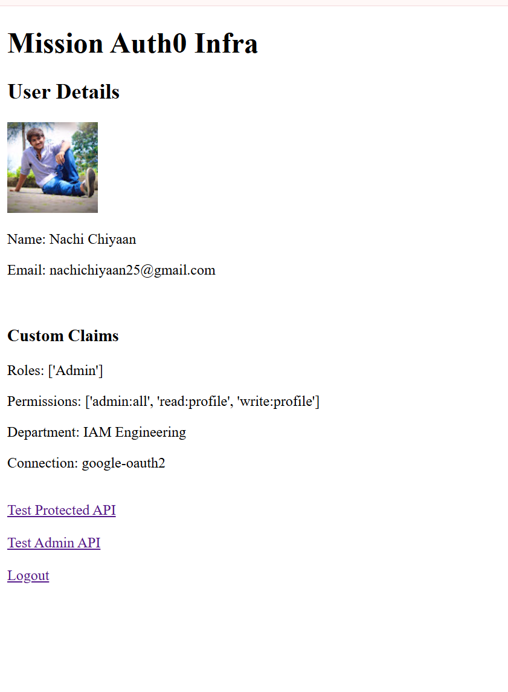

## Auth0 User Roles & Metadata

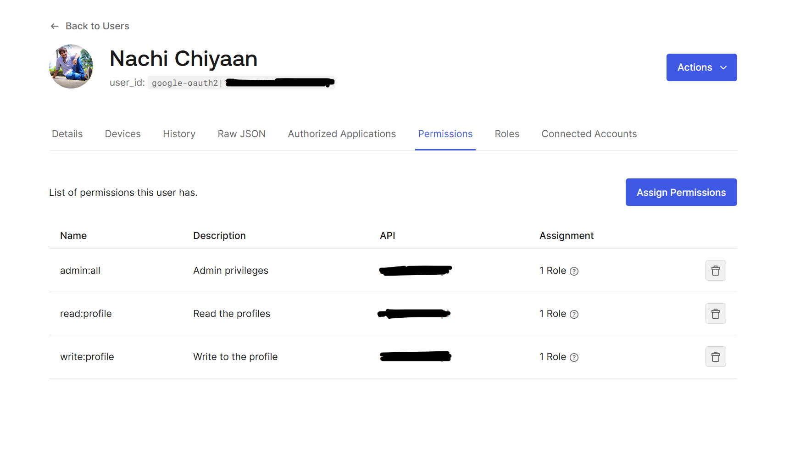

## Protected API Response

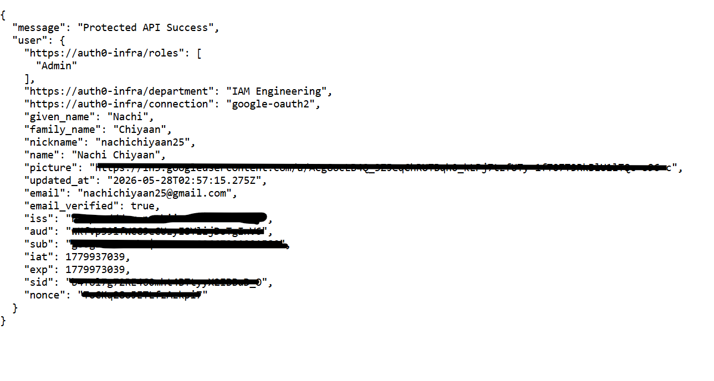

## Bulk Users Provisioning Engine

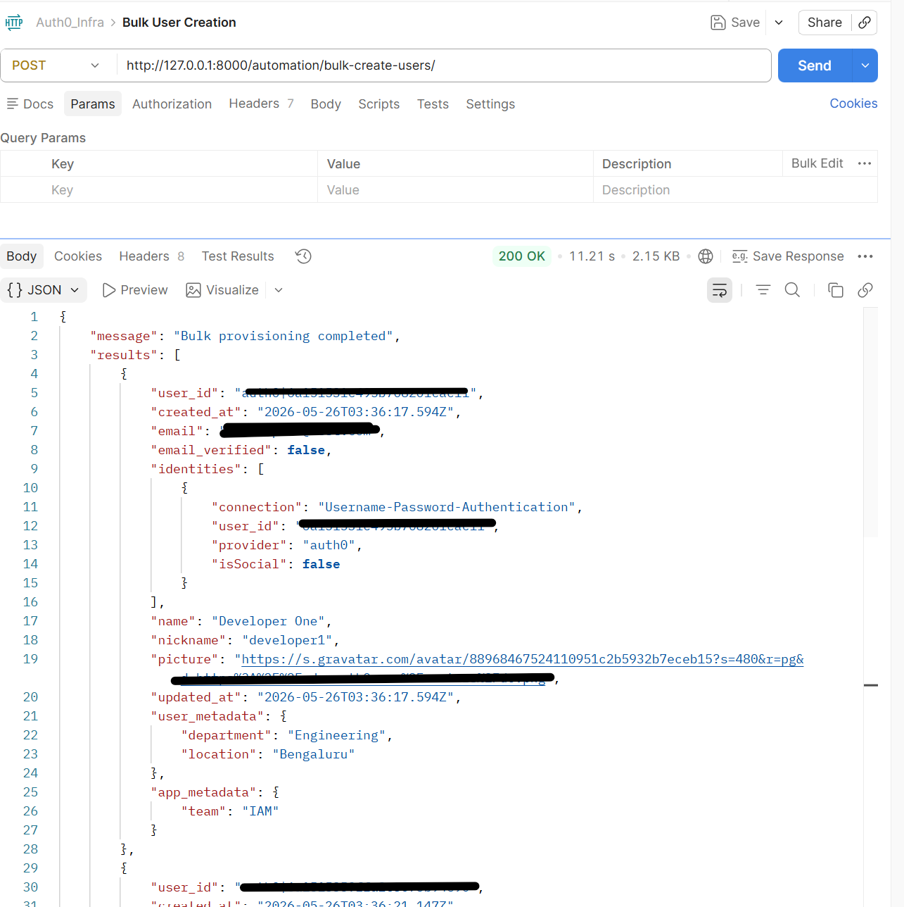

## Dynamic RBAC Role Updates

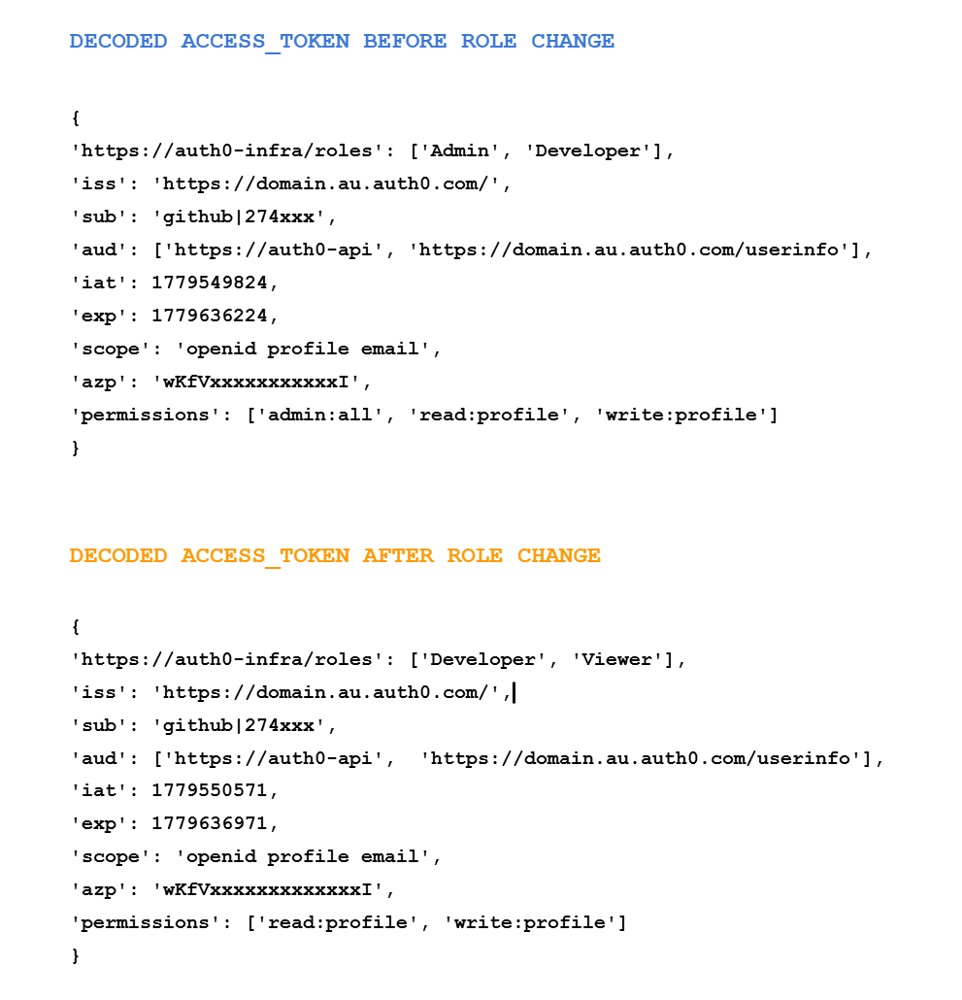

## Custom Claims Injection using Auth0 Actions

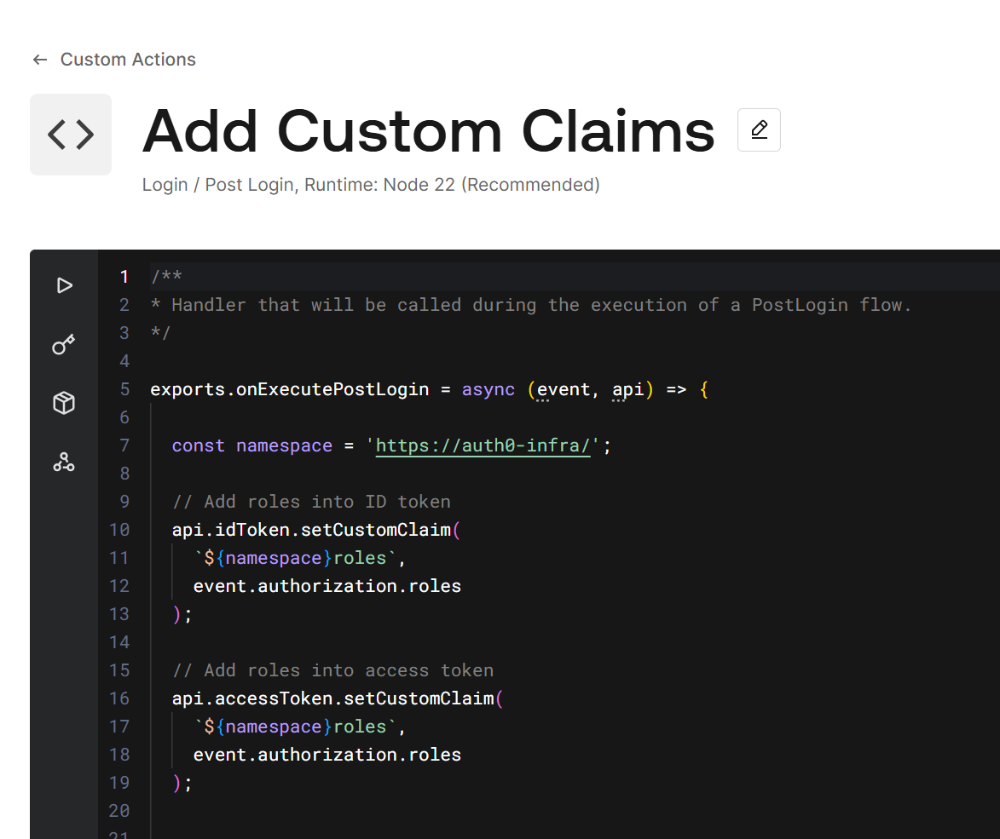

---

# Key Features

## Authentication & Security

* OAuth2/OIDC Authorization Code Flow
* JWT token validation using JWKS public keys
* Secure audience, issuer, and signature validation
* Session-based authentication using Django
* Google and GitHub social login integrations
* Environment-driven deployment configuration

## Authorization & RBAC

* Role-Based Access Control (RBAC)
* Permission-based API protection
* Custom authorization decorators
* Role-aware dashboard rendering
* Dynamic permission enforcement
* Automatic default role assignment for newly authenticated users

## Identity Lifecycle Automation

* Automated user onboarding workflows
* Automated role assignment
* Metadata orchestration using user_metadata and app_metadata
* User blocking and deprovisioning workflows
* Hard user deletion automation
* Just-In-Time (JIT) role provisioning concepts

## Bulk Provisioning Engine

* CSV-based onboarding engine
* Dynamic role mapping
* Idempotent provisioning logic
* Duplicate user reconciliation
* Enterprise-style onboarding orchestration

## Auth0 Management API Automation

* Machine-to-Machine (M2M) authentication
* OAuth2 Client Credentials flow
* User search and metadata updates
* Role assignment and modification
* Identity management automation

## Engineering & DevOps

* Modular Django project architecture
* Environment-based configuration management
* Secure secrets handling using `.env`
* Dockerized cloud-native application deployment
* Multi-container orchestration using Docker Compose
* PostgreSQL-backed persistent storage
* Internal Docker networking & service communication
* Database readiness orchestration using Netcat (`nc`)
* GitHub Actions CI/CD deployment automation
* AWS EC2 cloud deployment
* DockerHub container registry integration
* Git-based version control

---

# Tech Stack

| Category       | Technologies                                        |
| -------------- | --------------------------------------------------- |
| IAM & Identity | Auth0, OAuth2, OpenID Connect (OIDC), JWT, RBAC     |
| Backend        | Python, Django, Django REST Framework               |
| APIs           | REST APIs, Auth0 Management API                     |
| Authentication | Google OAuth, GitHub OAuth                          |
| Security       | JWKS Validation, Authorization Decorators           |
| DevOps         | Git, GitHub, Docker, Docker Compose, GitHub Actions |
| Cloud          | AWS EC2                                             |
| Database       | PostgreSQL, SQLite (Development)                    |
| Automation     | Python Automation Workflows                         |

---

# Cloud-Native Platform Architecture

This platform simulates enterprise IAM and DevOps architecture involving:

* Auth0 as Identity Provider (IdP)
* Django as relying application/backend platform
* OAuth2/OIDC authentication flows
* JWT-based authorization
* JWKS-based token validation
* Auth0 Management API automation
* Role-based access control workflows
* Identity lifecycle orchestration
* Multi-container Docker Compose orchestration
* PostgreSQL-backed session persistence
* DockerHub artifact registry
* AWS EC2 cloud deployment
* GitHub Actions CI/CD automation

Authentication flow:

```text
User
   ↓
Django Application
   ↓
Auth0
   ↓
Social Provider (Google/GitHub)
   ↓
Auth0
   ↓
Django Dashboard
```

Deployment flow:

```text
Developer Push
     ↓
GitHub Repository
     ↓
GitHub Actions CI/CD
     ↓
Docker Image Build
     ↓
DockerHub Registry
     ↓
AWS EC2 Deployment
     ↓
Docker Compose Runtime
     ↓
Django + PostgreSQL Containers
```

---

# Dockerized Runtime & Multi-Container Orchestration

The IAM platform has been fully containerized using Docker and orchestrated using Docker Compose to simulate modern cloud-native enterprise deployment architecture.

The application runs as a multi-container environment consisting of:

* Django IAM application container
* PostgreSQL database container
* Internal Docker networking
* Persistent PostgreSQL storage volumes
* Automated database readiness orchestration

This architecture closely resembles real-world platform engineering and DevOps deployment patterns used in enterprise environments.

---

## Containerized Platform Features

* Multi-container orchestration using Docker Compose
* PostgreSQL-backed persistent session storage
* Internal Docker DNS-based container communication
* Database readiness checks using Netcat (`nc`)
* Automatic database migrations during startup
* Portable and reproducible deployment architecture
* Environment variable injection using `.env`
* Persistent PostgreSQL volumes
* Stateless application container architecture
* Foundation for Kubernetes orchestration & cloud deployments

---

# IAM & DevOps Concepts Implemented

This project explores and implements core enterprise IAM and DevOps concepts including:

* OAuth2 Authorization Code Flow
* OpenID Connect (OIDC)
* JWT Authentication & Validation
* JWKS Public Key Verification
* Role-Based Access Control (RBAC)
* Permission-Based Authorization
* Identity Federation
* Session Management
* Stateful Session Persistence
* User Lifecycle Management
* Onboarding & Deprovisioning
* Bulk Provisioning Workflows
* Identity Metadata Management
* Machine-to-Machine Authentication
* Just-In-Time (JIT) Provisioning
* Auth0 Actions & Custom Claims
* Secure API Authorization
* Containerized Application Runtime
* Multi-Container Orchestration
* Docker Networking & Service Discovery
* Persistent Database Volumes
* Cloud Deployment Automation
* CI/CD Workflows

---

# Multi-Container Architecture

## Services Running

| Service         | Responsibility                     |
| --------------- | ---------------------------------- |
| `django_app`    | Django IAM platform                |
| `postgres_db`   | PostgreSQL database                |
| `postgres_data` | Persistent database storage volume |

---

## Docker Compose Architecture Flow

```text
Browser
   ↓
Django Container (django_app)
   ↓
Internal Docker Network
   ↓
PostgreSQL Container (postgres_db)
   ↓
Persistent Docker Volume (postgres_data)
```

---

# Cloud Deployment & CI/CD Automation

The IAM platform has been fully deployed to AWS EC2 using Docker, Docker Compose, DockerHub, and GitHub Actions CI/CD automation.

The deployment pipeline now supports:

* Automated Docker image builds
* DockerHub image publishing
* Automated EC2 deployments
* GitHub Actions CI/CD workflows
* Elastic IP-based stable public access
* Environment-driven cloud configuration
* Production-style container orchestration
* Persistent PostgreSQL-backed session storage

This architecture now closely resembles real-world cloud-native DevOps deployment patterns used in enterprise environments.

---

## Cloud & CI/CD Features

* Automated deployment on every Git push
* GitHub Actions-based CI/CD workflows
* DockerHub container registry integration
* EC2-hosted cloud-native deployment
* Elastic IP-based stable platform access
* Environment-driven deployment configuration
* Automated container recreation during deployments
* Cloud-ready platform engineering architecture

---

# Cloud Deployment Screenshots

## GitHub Actions CI/CD Pipeline

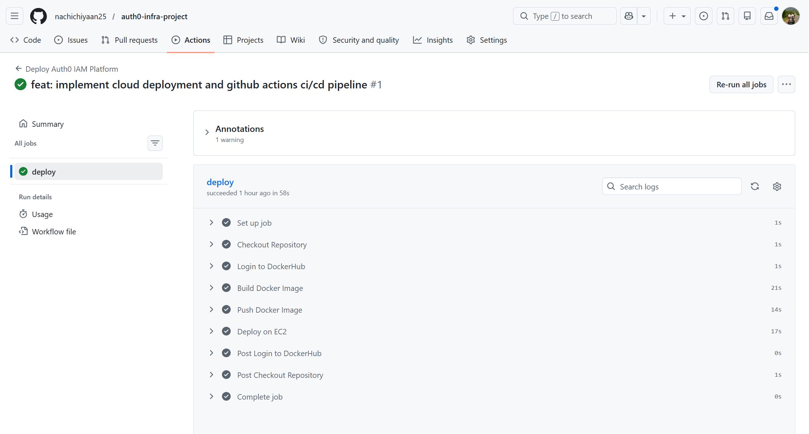

## IAM Platform Running on AWS EC2

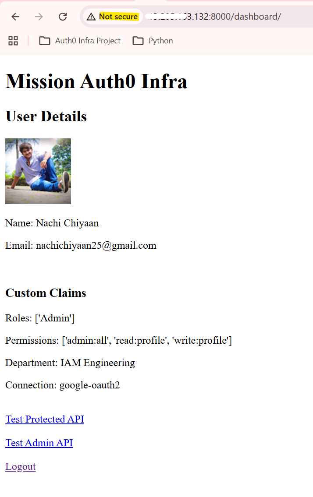

## DockerHub Published Image

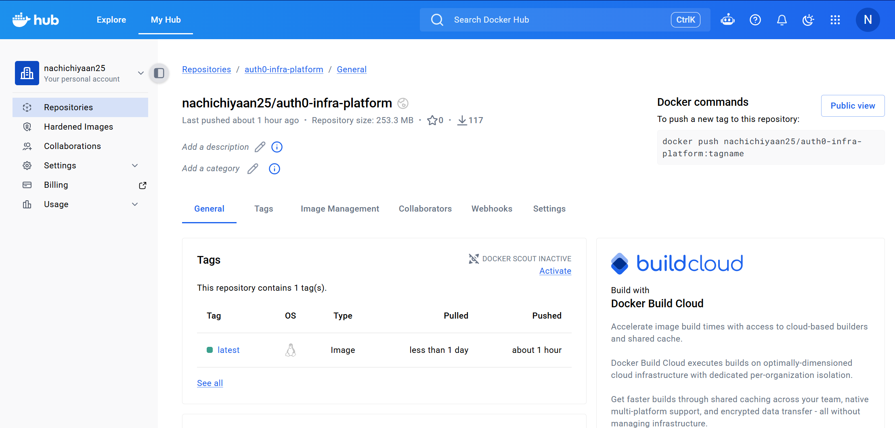

## Running Containers Inside EC2


## Docker Compose Runtime Logs

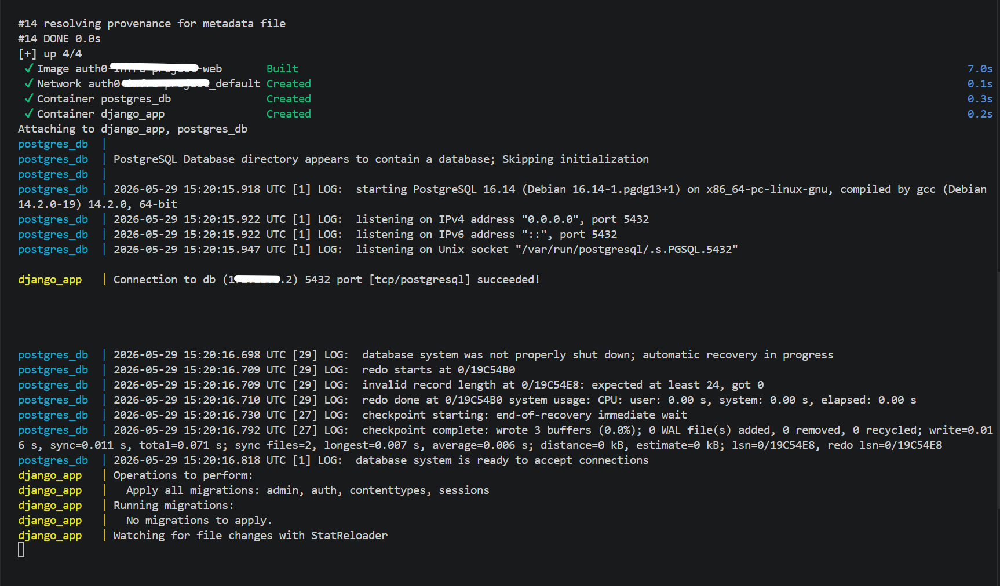

## PostgreSQL Session Persistence

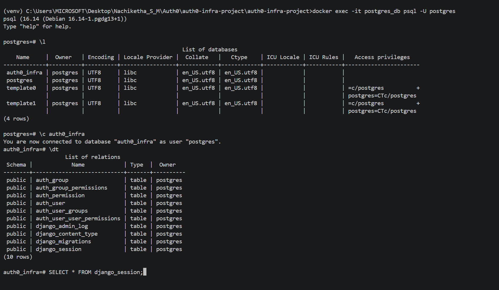

---

# Project Structure

```bash
auth0-infra-project/
│
├── api/                     # Protected APIs
├── authentication/          # JWT validation & authorization logic
├── automation/              # Provisioning & lifecycle automation
├── dashboard/               # Dashboard and frontend logic
├── templates/               # HTML templates
├── sample_data/             # Sample CSV onboarding files
├── screenshots/             # Project screenshots
│
├── .github/
│   └── workflows/
│       └── deploy.yml       # GitHub Actions CI/CD pipeline
│
├── Dockerfile
├── docker-compose.yml
├── .dockerignore
├── .env.example
├── .gitignore
├── requirements.txt
└── manage.py
```

---

# Local Setup Guide

## Clone Repository

```bash
git clone https://github.com/nachichiyaan25/auth0-infra-project.git

cd auth0-infra-project
```

---

## Create Virtual Environment

```bash
python -m venv venv
```

---

## Activate Environment

Linux/macOS:

```bash
source venv/bin/activate
```

Windows:

```bash
venv\Scripts\activate
```

---

## Install Dependencies

```bash
pip install -r requirements.txt
```

---

## Configure Environment Variables

Create `.env` using `.env.example`

---

## Run Django Server

```bash
python manage.py runserver
```

---

# Docker & Docker Compose Setup

## Build Docker Image

```bash
docker build -t auth0-infra-platform .
```

---

## Start Multi-Container Platform

```bash
docker compose up --build
```

---

## Verify Running Containers

```bash
docker ps
```

---

## View Runtime Logs

```bash
docker compose logs
```

---

## Access PostgreSQL Container

```bash
docker exec -it postgres_db psql -U postgres
```

---

## Connect PostgreSQL Database

```sql
\c auth0infra
```

---

## View Django Session Storage

```sql
SELECT * FROM django_session;
```

---

## Stop Multi-Container Platform

```bash
docker compose down
```

---

# AWS EC2 Deployment

## Build & Push Docker Image

```bash
docker build -t auth0-infra-platform .

docker tag auth0-infra-platform nachichiyaan25/auth0-infra-platform:latest

docker push nachichiyaan25/auth0-infra-platform:latest
```

---

## Deploy Containers Inside EC2

```bash
docker compose down

docker compose pull

docker compose up -d
```

---

# GitHub Actions CI/CD Workflow

The CI/CD pipeline automatically:

* Builds latest Docker image
* Pushes image to DockerHub
* Connects to EC2 through SSH
* Pulls latest deployment image
* Restarts containers automatically

Deployment now occurs automatically on every push to the `main` branch.

---

# Future Roadmap

* Terraform infrastructure provisioning
* Kubernetes container orchestration
* NGINX reverse proxy integration
* Production-grade secrets management
* Auth0 Organizations
* SCIM provisioning
* MFA & Adaptive Authentication
* Refresh Token Rotation
* Universal Login customization
* Monitoring & observability stack
* Prometheus & Grafana integration
* Audit logging & reconciliation engine
* Agentic AI integrations for IAM workflows

---

# Author

**S M Nachiketha**

IAM Automation Engineer | Auth0 | Python | Cloud Automation | DevOps

* LinkedIn: https://www.linkedin.com/in/s-m-nachiketha-4b8878196/
* GitHub: https://github.com/nachichiyaan25

---

# License

This project is created for learning, engineering exploration, and IAM automation practice purposes.
