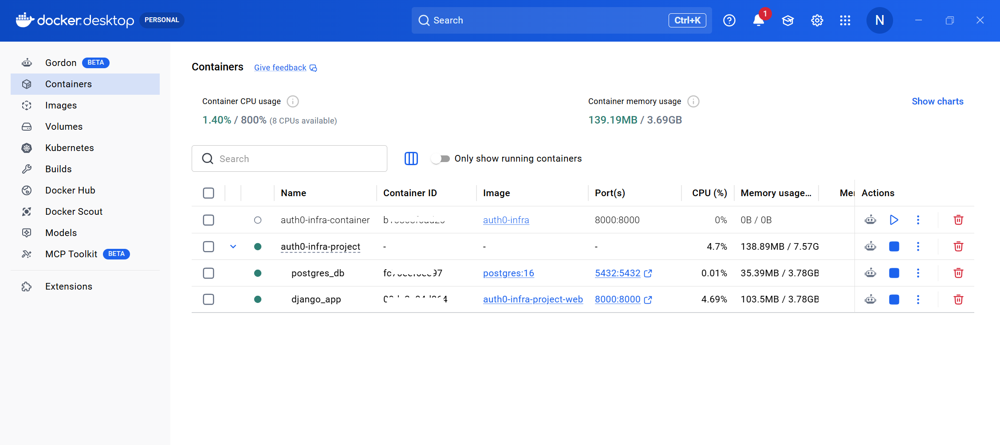
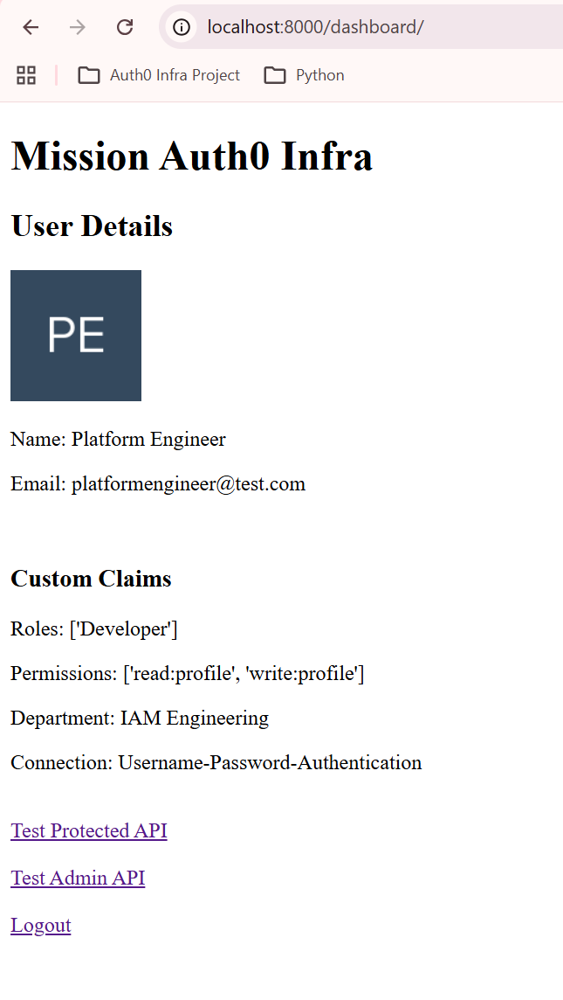

# Auth0 IAM Automation & Identity Engineering Platform


Enterprise-style IAM automation and identity engineering platform built using Auth0, Django, Python, OAuth2/OIDC, JWT validation, RBAC authorization, PostgreSQL, Docker, and cloud-native automation workflows.

This project simulates real-world enterprise IAM systems involving:

* Secure authentication and authorization
* JWT validation using JWKS
* Role-Based Access Control (RBAC)
* User lifecycle automation
* Auth0 Management API integrations
* Bulk onboarding/deprovisioning
* Identity orchestration workflows
* Multi-container cloud-native architecture
* Stateful session persistence
* Platform engineering & DevOps workflows

---

# Dashboard Overview

## IAM Dashboard


## Auth0 User Roles & Metadata


## Protected API Response


## Bulk Users Provisioning Engine


## Dynamic RBAC Role Updates


## Custom Claims Injection using Auth0 Actions


---

# Key Features

## Authentication & Security

* OAuth2/OIDC Authorization Code Flow
* JWT token validation using JWKS public keys
* Secure audience, issuer, and signature validation
* Session-based authentication using Django
* Google and GitHub social login integrations

## Authorization & RBAC

* Role-Based Access Control (RBAC)
* Permission-based API protection
* Custom authorization decorators
* Role-aware dashboard rendering
* Dynamic permission enforcement

## Identity Lifecycle Automation

* Automated user onboarding workflows
* Automated role assignment
* Metadata orchestration using user_metadata and app_metadata
* User blocking and deprovisioning workflows
* Hard user deletion automation

## Bulk Provisioning Engine

* CSV-based onboarding engine
* Dynamic role mapping
* Idempotent provisioning logic
* Duplicate user reconciliation
* Enterprise-style onboarding orchestration

## Auth0 Management API Automation

* Machine-to-Machine (M2M) authentication
* OAuth2 Client Credentials flow
* User search and metadata updates
* Role assignment and modification
* Identity management automation

## Engineering & DevOps

* Modular Django project architecture
* Environment-based configuration management
* Secure secrets handling using `.env`
* Dockerized cloud-native application deployment
* Multi-container orchestration using Docker Compose
* PostgreSQL-backed persistent storage
* Internal Docker networking & service communication
* Database readiness orchestration using Netcat (`nc`)
* Git-based version control
* Cloud-native engineering roadmap

---

# Tech Stack

| Category       | Technologies                                    |
| -------------- | ----------------------------------------------- |
| IAM & Identity | Auth0, OAuth2, OpenID Connect (OIDC), JWT, RBAC |
| Backend        | Python, Django, Django REST Framework           |
| APIs           | REST APIs, Auth0 Management API                 |
| Authentication | Google OAuth, GitHub OAuth                      |
| Security       | JWKS Validation, Authorization Decorators       |
| DevOps         | Git, GitHub, Docker, Docker Compose             |
| Database       | PostgreSQL, SQLite (Development)                |
| Automation     | Python Automation Workflows                     |

---

# Dockerized Runtime & Multi-Container Orchestration

The IAM platform has been fully containerized using Docker and orchestrated using Docker Compose to simulate modern cloud-native enterprise deployment architecture.

The application now runs as a multi-container environment consisting of:

* Django IAM application container
* PostgreSQL database container
* Internal Docker networking
* Persistent PostgreSQL storage volumes
* Automated database readiness orchestration

This architecture closely mirrors real-world platform engineering and DevOps deployment patterns used in enterprise environments.

---

## Containerized Platform Features

* Multi-container orchestration using Docker Compose
* PostgreSQL-backed persistent session storage
* Internal Docker DNS-based container communication
* Database readiness checks using Netcat (`nc`)
* Automatic database migrations during startup
* Portable and reproducible deployment architecture
* Environment variable injection using `.env`
* Persistent PostgreSQL volumes
* Stateless application container architecture
* Foundation for Kubernetes orchestration & cloud deployments

---

# Multi-Container Architecture

## Services Running

| Service         | Responsibility                     |
| --------------- | ---------------------------------- |
| `django_app`    | Django IAM platform                |
| `postgres_db`   | PostgreSQL database                |
| `postgres_data` | Persistent database storage volume |

---

## Docker Compose Architecture Flow

```text
Browser
   ↓
Django Container (django_app)
   ↓
Internal Docker Network
   ↓
PostgreSQL Container (postgres_db)
   ↓
Persistent Docker Volume (postgres_data)
```

---

## Docker Image Build

```bash
docker build -t auth0-infra .
```

---

## Start Multi-Container Platform

```bash
docker compose up --build
```

---

## Verify Running Containers

```bash
docker ps
```

---

## Access Application

```text
http://localhost:8000
```

---

# Multi-Container Runtime Screenshots

## Docker Compose Running Containers



## Django + PostgreSQL Runtime Logs


## PostgreSQL Session Storage Verification


## Application Running Through Multi-Container Architecture



---

# Docker Compose & PostgreSQL Architecture Notes

* Django application runs inside an isolated application container
* PostgreSQL runs as an independent database service container
* Containers communicate internally using Docker DNS-based networking
* `db` acts as the internal hostname for PostgreSQL communication
* PostgreSQL data persists using Docker named volumes
* Django sessions are now stored inside PostgreSQL
* Session persistence continues even after container recreation
* Database readiness checks prevent startup race conditions
* Application architecture now resembles real-world cloud-native platform deployments
* Designed for future Kubernetes, Terraform, and CI/CD integrations

---

# Architecture Overview

This platform simulates enterprise IAM architecture involving:

* Auth0 as Identity Provider (IdP)
* Django as relying application/backend platform
* OAuth2/OIDC authentication flows
* JWT-based authorization
* JWKS-based token validation
* Auth0 Management API automation
* Role-based access control workflows
* Identity lifecycle orchestration
* Multi-container Docker Compose orchestration
* PostgreSQL-backed session persistence
* Internal Docker networking & service communication
* Database readiness orchestration using Netcat

Authentication flow:

User → Django App → Auth0 → Social Provider (Google/GitHub) → Auth0 → Django App

---

# IAM and DevOps Concepts Implemented

This project explores and implements core enterprise IAM and DevOps concepts including:

* OAuth2 Authorization Code Flow
* OpenID Connect (OIDC)
* JWT Authentication & Validation
* JWKS Public Key Verification
* Role-Based Access Control (RBAC)
* Permission-Based Authorization
* Identity Federation
* Session Management
* Stateful Session Persistence
* User Lifecycle Management
* Onboarding & Deprovisioning
* Bulk Provisioning Workflows
* Identity Metadata Management
* Machine-to-Machine Authentication
* Auth0 Actions & Custom Claims
* Secure API Authorization
* Containerized Application Runtime
* Multi-Container Orchestration
* Docker Networking & Service Discovery
* Persistent Database Volumes

---

# Project Structure

```bash
auth0-infra-project/
│
├── api/                     # Protected APIs
├── authentication/          # JWT validation & authorization logic
├── automation/              # Provisioning & lifecycle automation
├── dashboard/               # Dashboard and frontend logic
├── templates/               # HTML templates
├── sample_data/             # Sample CSV onboarding files
├── screenshots/             # Project screenshots
│
├── Dockerfile
├── docker-compose.yml
├── .dockerignore
├── .env.example
├── .gitignore
├── requirements.txt
└── manage.py
```

---

# Local Setup Guide

## Clone Repository

```bash
git clone https://github.com/nachichiyaan25/auth0-infra-project.git
cd auth0-infra-project
```

---

## Create Virtual Environment

```bash
python -m venv venv
```

---

## Activate Environment

Linux/macOS:

```bash
source venv/bin/activate
```

Windows:

```bash
venv\Scripts\activate
```

---

## Install Dependencies

```bash
pip install -r requirements.txt
```

---

## Configure Environment Variables

Create `.env` using `.env.example`

---

## Run Django Server

```bash
python manage.py runserver
```

---

# Docker & Docker Compose Setup Guide

## Build Docker Image

```bash
docker build -t auth0-infra .
```

---

## Start Multi-Container Platform

```bash
docker compose up --build
```

---

## Verify Running Containers

```bash
docker ps
```

---

## View Runtime Logs

```bash
docker compose logs
```

---

## Access PostgreSQL Container

```bash
docker exec -it postgres_db psql -U postgres
```

---

## Connect PostgreSQL Database

```sql
\c auth0infra
```

---

## View Django Session Storage

```sql
SELECT * FROM django_session;
```

---

## Stop Multi-Container Platform

```bash
docker compose down
```

---

## Remove Stopped Containers

```bash
docker container prune
```

---

## Remove Unused Docker Volumes

```bash
docker volume prune
```

---

# Future Roadmap

* AWS EC2 cloud deployment
* DockerHub image publishing
* GitHub Actions CI/CD deployment pipeline
* Infrastructure provisioning using Terraform
* Kubernetes container orchestration
* NGINX reverse proxy integration
* Production-grade secrets management
* Auth0 Organizations
* SCIM provisioning
* MFA & Adaptive Authentication
* Refresh Token Rotation
* Universal Login customization
* Monitoring & observability stack
* Prometheus & Grafana integration
* Cloud deployment on AWS
* Audit logging & reconciliation engine
* Agentic AI integrations for IAM workflows

---

# Author

**S M Nachiketha**

IAM Automation Engineer | Auth0 | Python | Cloud Automation | DevOps

* LinkedIn: https://www.linkedin.com/in/s-m-nachiketha-4b8878196/
* GitHub: https://github.com/nachichiyaan25

---

# License

This project is created for learning, engineering exploration, and IAM automation practice purposes.
